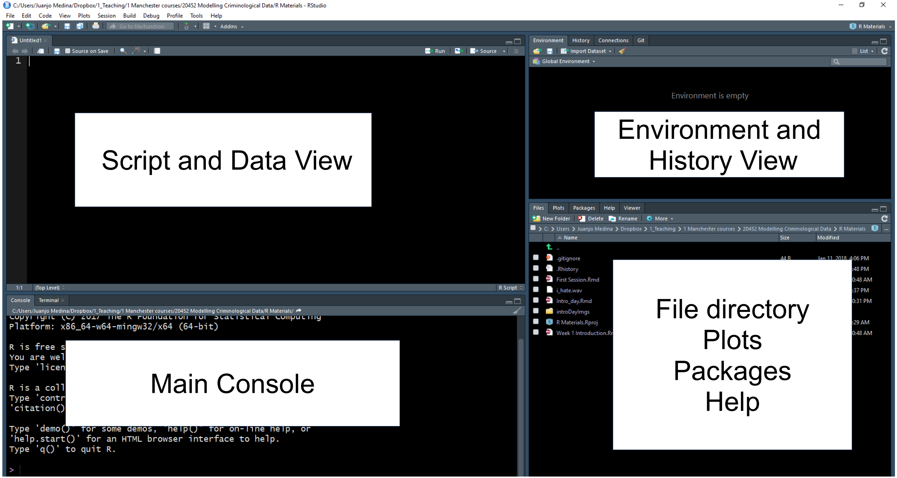
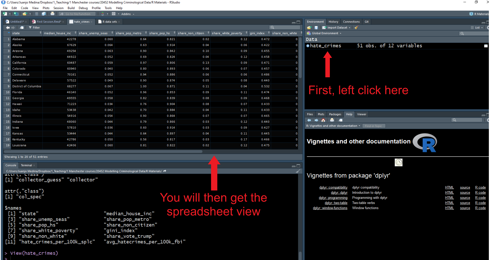
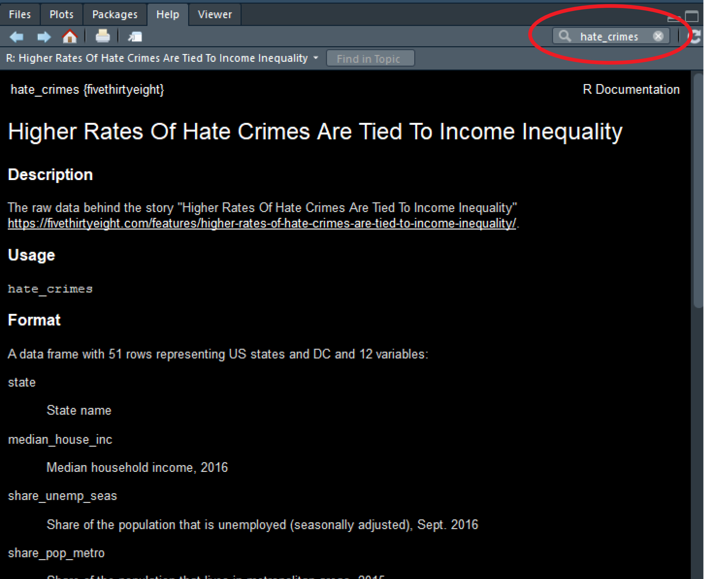

# A first lesson about R

## Install R & RStudio

We recommend that you use your own laptops for this course. This way you get used to working in an environment which you will continue to use after this semester. However, our lab sessions will be held in computer clusters in case you do not have access to a laptop (or something goes wrong...). 

You *don't need to install the software in the computers available in the clusters*, because it is already there. Beware though, the installation may vary a bit across different computer clusters in the University. This, on itself, is another good reason to use your own laptops -for it will provide you with a more stable environment. If you have not already, then please download and install R and R Studio onto your laptops. Otherwise use the cluster machines.

- click [here](https://www.youtube.com/watch?v=eD07NznguA4) for instructions using Windows or
- [here](https://www.youtube.com/watch?v=cX532N_XLIs&list=PLqzoL9-eJTNDw71zWePXyHx3_cm_fMP8S) for instructions using a Mac. 

## Open up and explore RStudio

In this session we will focus in developing basic familiarity with R Studio. You can use R without using R Studio, but R Studio is an app that makes it easier to work with R. 

R Studio is what we call an IDE, an **integrated development environment**. It is a fancy way of saying that it is a cool interface designed to write programming code. Every time you open up R Studio you are in fact starting a R session. R Studio automatically runs R in the background. We will be interacting with R in this course unit via R Studio.

 

When you first open R Studio, you will see (as in the image above) that there are 3 main windows. The bigger one to your left is the console. If you read the text in the console you will see that R Studio is indeed opening R and you can see what version of R you are running. Depending on whether you are using the cluster machines or your own installation this may vary, but don't worry too much about it. R is constantly being updated.


The view in R Studio is structured so that you have 4 open windows in a regular session. Click in the *File* drop down Menu, select *New File*, then *R Script*. You will now see the 4 window areas in display. On each of these areas you can shift between different views and panels. You can also use your mouse to re-size the different windows if that is convenient.



Look for example at the bottom right area. Within this area you can see that there are different tabs, which are associated with different views. You can see in the tabs in this section that there are different views available: *Files*, *Plots*, *Packages*, *Help*, and *Viewer*. The **Files** allow you to see the files in the physical directory that is currently set up as your working environment. You can think of it like a window in Windows Explorer that lets you see the content of a folder. 

In the **plots** panel you will see any data visualisations or graphical displays of data that you produce. We haven't yet produced any, so it is empty at the moment. If you click in **packages** you will see the packages that are currently available in your installation. What is a "package" in this context?

You can think of R as a Lego monster. You can make the monster scarier and more powerful by adding new bits to it. Packages are those bits. They are modules that expand what R can do. There are thousands of them. Which is pretty cool!!! R can do many more things than Excel. That is down to the fact that researchers all over the world write packages that continuously expand the functionality of R. 
You can think of a package as another drop down menu that gets added to you menu tab with loads of new options for doing fancy stuff, only they are not really drop down menus. You need to access their added functionality via programming code. So yeah, R is like Excel or SPSS only with over 10,000 "drop down menus." And all for free.

The other really useful panel in this part of the screen is the **Help** viewer. Here you can access the documentation for the various packages that make up R. Learning how to use this documentation will be essential if you want to be able to get the most from R.

In the diagonally opposite corner, the top left, you should now have an open script window. The **script** is where you write your programming code. A script is nothing but a text file with some code on it. Unlike other programs for data analysis you may have used in the past (Excel, SPSS), you need to interact with R by means of writing down instructions and asking R to evaluate those instructions. R is an *interpreted* programming language: you write instructions (code) that the R engine has to interpret in order to do something. And all the instructions we write can and should be saved in a script, so that you can return later to what you did.

One of the key advantages of doing data analysis this way - with code versus with a point and click interface like Excel or SPSS is that you are producing a written record of every step you take in the analysis. First time around it will take you time to write these instructions, it may be slower than pointing and clicking. And unlike with pointing and clicking you need to know the "words" and "grammar" of this language. 

Luckily you don't need to memorise or know all these words. As with any language the more you practice it, the easier it will become. More often than not you  will be doing a lot of cutting and pasting from chunks of code we will give you. But we will also expect you to develop a basic understanding of what these bits of code do. It is a bit like cooking. At first you will just follow recipes as they are given to you, but as you become more comfortable in your "kitchen" you will feel more comfortable experimenting.

The advantage of doing analysis this way is that once you have written your instructions and saved them in a file, you will be able to share it with others and run it every time you want in a matter of seconds. This creates a *reproducible* record of your analysis: something that your collaborators or someone else anywhere (including your future self, the one that will have forgotten how to do the stuff) could run and get the same results than you did at some point earlier. This makes science more transparent and transparency brings with it many advantages. For example, it makes your research more trustworthy. Don't underestimate how critical this is. **Reproducibility** is becoming a key criteria to assess good quality research. And tools like R allow us to enhance it. You may want to read more about reproducible research [here](http://theconversation.com/the-science-reproducibility-crisis-and-what-can-be-done-about-it-74198).

## Customising the RStudio look

R Studio allows you to customise the way it looks. Working with white backgrounds is not generally a good idea if you care about your eyesight. If you don't want to end up with dry eyes not only it is good you follow the 20-20-20 rule (every 20 minutes look for 20 seconds to an object located 20 feet away from you), but it may also be a good idea to use more eye friendly screen displays. 

Click in the *Tools* menu and select *Global options*. This will open up a pop up window with various options. Select *Appearance*. In this section you can change the font type and size, but also the kind of theme background that R will use in the various windows. I suffer from poor sight, so I often increase the font type. I also use the *Tomorrow Night Bright* theme to prevent my eyes to go too dry from the effort of reading a lightened screen, but you may prefer a different one. You can preview them and then click apply to select the one you like. This will not change your results or analysis. This is just something you may want to do in order to make things look better and healthier for your.

## Getting organised: R Projects

We finished the previous section talking about sharing your analytic code. Let's face it. You would not bring a new partner or somebody that you want to impress to your place before tidying a little bit first, wouldn't you? In the same way, if you know you may have to share your code, if you know you may have guests, you may want to keep your analysis, data, and results tidy. R Studio helps a little bit with that. R Studio helps with this by virtue of something called **R Projects**.

Technically, a R Studio project is just a directory with the name of the project, and a few files and folders created by R Studio for internal purposes. This is where you should hold your scripts, your data, and reports. You can manage this folder with your own operating system manager (eg., Windows Explorer) or through the R Studio file manager (that you access in the bottom right corner set of windows in R Studio).

When a project is reopened, R Studio opens every file and data view that was open when the project was closed last time around. Let's learn how to create a project. Go to the *File* drown menu and select *New Project*.


That will open a dialog box where you ask to specify what kind of directory you want to create. Select new working directory in this dialog box.


Now you get another dialog box (at least you have an older version of R Studio) where you have to specify what kind of project you want to create. Select the first option *New Project*.


Finally, you get to select a name for your project (in the image below I use the code for this course unit, but you can use any sensible name you prefer) and you will need to specify the folder in which to place this directory. If you are using a cluster machine use the P: drive, otherwise select what you prefer in your laptop (preferably not your desktop in Windows machines).


With simple projects a single script file and a data file is all you may have. But with more complex projects, things can rapidly become messy. So you may want to create subdirectories within this project folder. I typically use the following structure in my own work to put all files of a certain type in the same subdirectory:

+ *Scripts and code*: Here I put all the text files with my analytic code, including rmarkdown files which is something we will introduce much later in the semester.

+ *Source data*: Here I put the original data. I tend not to touch this once I have obtained the original data.

+ *Documentation*: This is the subdirectory where I place all the data documentation (e.g., codebooks, questionnaires, etc.)

+ *Modified data*: All analysis involve doing transformations and changing things in the original data files. You don't want to mess up the original data files, so what you should do is create new data files as soon as you start changing your source data. I go so far as to place them in a different subdirectory.

+ *Literature*: Analysis is all about answering research questions. There is always a literature about these questions. I place the relevant literature for the analytic project I am conducting in this subdirectory.

+ *Reports and write up*: Here is where I file all the reports and data visualisations that are associated with my analysis.

If you come to my office, you will see it is a very messy place. But my computer is, in contrast, a very tidy environment. You should aim for your computer workspace to be very organised as well. You can create these subdirectories using Windows Explorer or the Files window in R Studio. Why don't you have a go?

## Talk to your computer

Enough background, let's write some very simple code to talk to your computer. First open a new script within the project you just created. Type the following instructions in the script window. After you are done click in the top right corner where it says *Run* (if you prefer quick shortcuts, you can select the text and then press Ctrl +  Enter):

```{r}
print("I hate computers")
```

Congratulations!!! You just run your first line of R code! Though that was a really mean thing to say to your machine! 

In these handouts (written in html format) you will see grayed boxes with bit of code on it. You can cut and paste this code into your script window and run the code from it to reproduce our results. As we go along we will be covering new bits of code. You should start thinking about creating a file with some of the most useful bits of code we cover so that when you do your work you can just cut and paste from this file rather than having to come back to these handouts.

Sometimes in these documents you will see on them the results of running the code, what you see printed in your console or in your plot viewer. The results will appear enclosed in a box as above.

The R languages uses **functions** to tell the computer what to do. In the R *language* functions are the *verbs*. You can think of functions as predefined commands that somebody has already programmed into R and tell R what to do. Here you learnt your first R function: *print*. All this function does is to ask R to print whatever it is you want in the main console (see the window in the bottom left corner). 

In R, you can pass a number of **arguments** to any function. These arguments control what the function will do in each case. The arguments appear between brackets. Here we passed the text "I hate computers" as an argument. Once you execute the program, by clicking on *Run*, the R engine sends this to the CPU of your machine in the form of binary code and this produces a result. In this case we see that result printed in the main console.

Every R function admits different kind of arguments. Learning R involves not only learning different functions but also learning what are the valid arguments you can pass to each function. If you want to know more about a specific function, move your cursor onto it and press the `F1`-key. The documentation of the function will then appear in the **Help**-viewer.


As indicated above, the window in the bottom left corner is the main **console**.You will see that the words "I hate computers" appear printed there.  If rather than using R Studio you were working directly from R, that's all you would get: the main console where you can write code interactively (rather than all the different windows you see in R Studio). You can write your code directly in the main console and execute it line by line in an interactive fashion. However, we will be running code from scripts, so that you get used to the idea of properly documenting all the steps you take,

## More on packages

Before we described packages as elements that add the functionality of R. What most packages do is they introduce new functions that allow you to ask R to do new different things.

Anybody can write a package, so consequently R packages vary on quality and complexity. You can find packages in different places, as well, from official repositories (which means they have passed a minimum of quality control), something called Git Hub (a webpage where software developers post work in progress), to personal webpages (danger danger!). In early 2017 we passed the 10,000 mark just in the main official repository, so the number of things that can be done with R grows exponentially every day as people keep adding new packages.

When you install R you only install a set of basic packages, not the full 10,000 plus. So if you want to use any of these added packages that are not part of the basic installation you need to first install them. You can see what packages are availabe in your local install by looking at the *packages* tab in the bottom right corner panel. Click there and check. We are going to install a package that is not there so that you see how the installation is done. 


If you just installed R in your laptop you will see a shortish list of packages that constitute the basic installation of R. If you are using one of the machines in the computer cluster this list is a bit longer, because we asked IT to install some of the most commonly used packages. But knowing how to install packages is pretty essential, since you will want to do it very often.

We are going to install a package called "cowsay" to demonstrate the process. In the Packages panel there is an *Install* menu that would open a dialog box and allows you to install packages. Instead we are going to use code to do this. Just cut and paste the code below into your script and then run it:

```{r, eval=FALSE}

install.packages("cowsay")

```

Here we are introducing a new function "install.packages" and what we have passed as an argument is the name of the package that we want to install. This is how we install a package *that is available in the official CRAN repository*. If we wanted to install a package from somewhere else we would have to adapt the code. Later this semester you will see how we install packages from Git Hub.

This line of code (as it is currently written) will install this package in a personal library that will be located in your P: drive if you are using a cluster machine. If you are using a Windows machine this will place this package within a personal library in your Documents folder. Once you install a package is in the machine/location where you install it until you physically delete it. 
The code we have used by default connects to a cloud repository called [CRAN](https://cran.r-project.org/) that has a collection of R packages that meet a minimum set of quality criteria. CRAN is the official repository of all things R. It's a fairly safe place to get packages from. But beware, judging whether a package is good or not requires your input. We will come back to this several times during the semester to help you make wise choices regarding packages. Given that you are connecting to an online repository you will need an internet connection every time you want to install a package.

How do you find out what a package does? You look at the relevant documentation. In the Packages window scroll down until you find the new package we installed listed. Here you will see the name of the package (cowsay), a brief description of what the program is about, and the version you have installed (an indication that a package is a good package is that it has gone through several versions, that means that someone is making sure the package gets regular updates and improvements). The version I have for cowsay is 0.7.0. Yours may be older or newer. It doesn't matter much at this point. 

Click in the name *cowsay*. You will see that R Studio has now brought you to the Help tab. Here is where you find the help files for this package, including all the available documentation.

Every beginner in R will find these help files a bit confusing. But after a while, their format and structure will begin to make sense to you. Click where it says *User guides, package vignettes, and other documentation*. Documentation in R has become much better since people started to write **vignettes** for their packages. They are little tutorials that explain with examples what each package does. Click in the *cowsay::cowsay_tutorial* that you see listed here (the html link). What you will find there is an html file that gives you a detailed tutorial on this package. You don't need to read it now, but remember that this is one way to find help when using R. You will learn to love vignettes.

Let's try to use some of the functions of this package. We will use the "say" function:

```{r, eval=FALSE}
say("I hate computers")
```

You will get an error message telling you that this function could not be found. What happened? Installing a package is only the first step. The next step, when you want to use it in a given session, is to **load** it. 

Think of it as a pair of shoes. You buy it once, but you have to take them from your closet and put them on when you want to use them. Same with packages, you only install once, but need to load it from your library every time you want to use it -within a given session (once loaded it will remain loaded until you finish your session).

To see what packages you currently have **loaded** in your session, you use the `search()` function (you do not need to pass it any arguments in this case).

```{r}
search()
```

If you run this code, you will see that `cowsay` is not in the list of loaded packages. To load a package we use the **library** function. So if we want to load the new package we installed in our machine we would need to use the following code:

```{r}

library("cowsay")

```

Run the `search` function again. You will see now this package is listed. So now we can try using the function "say" again.

```{r}
say("I hate computers")
```

You get a random animal in the console repeating the text we passed as an argument. If we like a different animal we could pass an argument to select it. So, say, we want to have cow rather than a random animal, then we would pass the following arguments to our function.

```{r}
say("I hate computers", "cow")
```

Remember, you only have to install a package that is not already installed once. But if you want to use it in a given session you will have to load it within that session using the `library` function. Once you load it within a session the package will remain loaded until you terminate your session (for example, by closing R Studio).

## Using objects

We have seen how the first argument that the "say" function takes is the text that we want to convert into speech for our given animal. We could write the text directly into the function, but now we are going to do something different. We are going to create an object to store the text.

An **object**? What do I mean? In the same way that everything you do in R you do with functions (your verbs), everything that exist in R is an object. You can think of objects as boxes where you put stuff. In this case we are going to create an object called *my_text* and inside this object we are going to store the text "I hate computers". How do you do this? We will use the code below:

```{r}

my_text <- "I hate computers."

```

This bit of code is simply telling R we are creating a new object with the assigned name ("my_text"). We are creating a box with such name and inside this box we are placing a bit of text ("I hate computers"). The arrow you see is the **assignment operator**. This is an important part of the R language that tells R what we are including inside the object in question. 

Run the code. Look now at the *Environment* window in the right top corner. We see that this object is now listed there. You can think of the Environment as a warehouse where you put stuff in, your different objects. Is there a limit to this environment? Yes, your RAM. R works on your RAM, so you need to be aware that if you use very large objects you will need loads of RAM. But that won't be a problem you will encounter in this course unit.

Once we put things into these boxes or objects we can use them as arguments in our functions. See the example below:

```{r}
say(my_text, "cow")
```

## More on objects 

Isn't this a course on data analysis? Yes, of course, but before we get there, you need to get used to the basics of R and R Studio, which is what we will be doing in these early sessions. Let's go through some of these basics a bit more slowly to ensure you get them and then we will bring some data you can look at.

In Excel you are used to see your data in a spreadsheet format. If you did the prep for this session, you should have reviewed some of the materials we covered in *Making Sense of Criminological Data* last semester. You should be familiar with the notion of a data set, levels of measurement, and tidy data. If you have not. This is your chance to do it in [this link](https://rawgit.com/maczokni/MSCD/master/book/bookdown-demo-master/bookdown-demo-master/docs/week1.html#data-variables-and-observations).

R is considerably more flexible than Excel. Most of the work we do here will use data sets or **dataframes** as they are called in R. But as you have seen earlier you can have *objects* other than data frames in R. These objects can relate to external files or simple textual information ("I hate computers"). This flexibility is a big asset because among other things it allow us to break down data frames or the results from doing analysis on them to its constitutive parts (this will become clearer as we go along).

Technically R is an *Object Oriented language*. Object-oriented programming (OOP) is a programming language model organized around objects rather than "actions" and data rather than logic.

As we have seen earlier, to create an object you have to give it a name, and then use the assignment operator (the `<-` symbol) to assign it some value. 

For example, if we want to create an object that we name "x", and we want it to represent the value of 5, we write:

```{r}
x <- 5
```

We are simply telling R to create a **numeric object**, called `x`, with one element (5) or of length 1. It is numeric because we are putting a number inside this object. The length is 1 because it only has one element on it, the number 5.

You can see the content of the object `x` in the main console either by using the print function we used earlier or by auto-printing, that is, just typing the name of the object and running that as code:

```{r}
x

```

When writing expressions in R is very important you understand that **R is case sensitive**. This could drive you nuts if you are not careful. More often than not if you write an expression asking R to do something and R returns an error message, chances are that you have used lower case when upper case was needed (or vice-versa). So always check for the right spelling. For example, see what happens if I use a capital 'X':

```{r, error = TRUE}
X

```

You will get the following message: `"Error in eval(expr, envir, enclos): object 'X' not found"`. R is telling us that `X` does not exist. There isn't an object `X` (upper case), but there is an object `x` (lower case). Error messages in R are pretty good at telling you exactly what went wrong. 

Remember computers are very literal. They are like dogs. You can tell a dog "sit" and if it has been trained it will sit. But if you tell a dog "would you be so kind as to relax a bit and lay down in the sofa?", it won't have a clue what you are saying and will stare at you like you have gone mad. Error messages are computers ways of telling us "I really want to help you but I don't really understand what you mean" (never take them personal, computers don't hate you).

When you get an error message or implausible results, you want to look back at your code to figure out what is the problem. This process is called **debugging**. There are some proper systematic ways to write code that facilitate debugging, but we won't get into that here. R is very good with automatic error handling at the levels we'll be using it at. Very often the solution will simply involve correcting the spelling.

A handy tip is to cut and paste the error message into Google and find a solution. If anybody had given me a penny for every time I had to do that myself, I would be Bill Gates by now. People make mistakes all the time. It's how we learn. Don't get frustrated, don't get stuck. Instead look for a solution. These days we have Google. We didn't back in the day. Now you have the answer to your frustration within quick reach. Use it to your advantage.

## Vectors

Now that you are a bit more familiar with the idea of an object, we can start talking about a particular type of objects, specifically we are going to discuss **vectors**. 

What is a vector? A vector is simply a set of elements *of the same class* (typically these classes are: character, numeric, integer, or logical -as in True/False). Vectors are the basic data structure in R. 

Typically you will use the `c()` function (c stands for concatenate) to create vectors. The code below exemplifies how to create vectors of different classes (numeric, logical, etc.). Notice how the listed elements (to simplify there are two elements in each vector below) are separated by commas:

```{r}
my_1st_vector <- c(0.5, 0.6) #creates a numeric vector with two elements
my_2nd_vector <- c(1L, 2L) #creates an integer vector
my_3rd_vector <- c(TRUE, FALSE) #creates a logical vector
my_4th_vector <- c(T, F) #creates a logical vector using abbreviations of True and False, but you should avoid this formulation an instead use the full word.
my_5th_vector <- c("a", "b", "c") #creates a character vector
my_6th_vector <- c(1+0i, 2+4i) #creates a complex vector (we won't really use this class)

```

Cut and paste this code into your script and run it. You will see how all these vectors are added to your global environment and stored there.

The beauty of an object oriented statistical language like R is that one you have these objects you can use them as **inputs** in functions, use them in operations, or to create other objects. This makes R very flexible. See some examples below:

```{r}
class(my_1st_vector) #a function to figure out the class of the vector
length(my_1st_vector) #a function to figure out the length of the vector
my_1st_vector + 2 #Add a constant to each element of the vector
my_7th_vector <- my_1st_vector + 1 #Create a new vector that contains the elements of my1stvector plus a constant of 1
my_1st_vector + my_7th_vector #Adds the two vectors and auto-print the results (note how the sum was done)

```

As indicated earlier, when you create objects you will place them in your working memory or workspace. Each R session will be associated to a workspace (called "global environment" in R Studio). In R Studio you can visualise the objects you have created during a session in the **Global Environment** screen. But if you want to produce a list of what's there you can use the `ls()` function (the results you get my differ from the ones below depending on what you actually have in your global environment).

```{r}
ls() #list all objects in your global environment
```

If you want to delete a particular object you can do so using the `rm()` function.

```{r}
rm(x) #remove x from your global environment
```

It is also possibly to remove all objects at once:

```{r}
rm(list = ls()) #remove all objects from your global environment
```

If you mix in a vector elements that are of a different class (for example numerical and logical), R will **coerce** to the minimum common denominator, so that every element in the vector is of the same class. So, for example, if you input a number and a character, it will coerce the vector to be a character vector -see the example below and notice the use of the `class()` function to identify the class of an object. 

```{r}
my_8th_vector <- c(0.5, "a")
class(my_8th_vector) #The class() function will tell us the class of the vector

```

## On comments

In the bits of code above you will have noticed parts that were grayed out. See for example in the last example provided. You can see that after the hash-tag all the text is being grayed out. What is this? What's going on? 

These are **comments**. Comments are simply annotations that R will know is not code (and therefore doesn't attempt to understand and execute). We use the hash-tag symbol to specify to R that what comes after is not programming code, but simply bits of notes that we write to remind ourselves what the code is actually doing. Including these comments will help you to understand your code when you come back to it.

To create a comment you use the hash-tag/ number sign `#` followed by some text. Whenever the R engine sees the number sign it knows that what follows is not code to be executed. You can use this sign to include *annotations* when you are coding. These annotations are a helpful reminder to yourself (and others reading your code) of **what** the code is doing and (even more important) **why** you are doing it. 

It is good practice to often use annotations. You can use these annotations in your code to explain your reasoning and to create "scannable" headings in your code. That way after you save your script you will be able to share it with others or return to it at a later point and understand what you were doing when you first created it -see [here for further details on annotations and in how to save a script when working with the basic R interface](http://www.screenr.com/1VN8).

Just keep in mind: 

+ You need one `#` per line, and anything after that is a comment that is not executed by R.
+ You can use spaces after (its not like a hash-tag on twitter). 

## Factors

An important thing to understand in R is that categorical (ordered, also called ordinal, or unordered, also called nominal) data are typically encoded as **factors**, which are just a special type of vector.  A factor is simply an integer vector that can contain *only predefined values* (this bit is very important), and is used to store categorical data. Factors are treated specially by many data analytic and visualisation functions. This makes sense because they are essentially different from quantitative variables.

Although you can use numbers to represent categories, *using factors with labels is better than using integers to represent categories* because factors are self-describing (having a variable that has values "Male" and "Female" is better than a variable that has values "1" and "2" to represent male and female). When R reads data in other formats (e.g., comma separated), by default it will automatically convert all character variables into factors. If you rather keep these variables as simple character vectors you need to explicitly ask R to do so. We will come back to this next week with some examples.

Factors can also be created with the `factor()` function concatenating a series of *character* elements. You will notice that is printed differently from a simply character vector and that it tells us the levels of the factor (look at the second printed line).

```{r}
the_smiths <- factor(c("Morrisey", "Marr", "Rourke", "Joyce")) #create a new factor
the_smiths #auto-print the factor
#Alternatively for similar result using the as.factor() function
the_smiths_bis <- c("Morrisey", "Marr", "Rourke", "Joyce") #create a character vector
the_smiths_f <- as.factor(the_smiths_bis) #create a factor using a character vector
the_smiths_f #auto-print factor

```

Factors in R can be seen as vectors with a bit more information added. This extra information consists of a record of the distinct values in that vector, called **levels**. If you want to know the levels in a given factor you can use the `levels()` function:

```{r}
levels(the_smiths)

```

Notice that the levels appear printed by alphabetical order. There will be situations when this is not the most convenient order. Later on we will discuss in these tutorials how to reorder your factor levels when you need to.

## Naming conventions for objects in R

You may have noticed the various names I have used to designate objects (`my_1st_vector`, `the_smiths`, etc.). You can use almost any names you want for your objects. Objects in R can have names of any length consisting of letters, numbers, underscores ("_") or the period (".") and should begin with a letter. In addition, when naming objects you need to remember: 

+ *Some names are forbidden*. These include words such as FALSE and TRUE, logical operators, and programming words like Inf, for, else, break, function, and words for special entities like NA and NaN.

+ *You want to use names that do not correspond to a specific function.* We have seen, for example, that there is a function called `print()`, you don't want to call an object "print" to avoid conflicts. To avoid this use nouns instead of verbs for naming your variables and data.

+ *You don't want them to be too long* (or you will regret it every time you need to use that object in your analysis: your fingers will bleed from typing).

+ *You want to make them as intuitive to interpret as possible.*

+ *You want to follow consistent naming conventions.* [R users are terrible about this](http://journal.r-project.org/archive/2012-2/RJournal_2012-2_Baaaath.pdf). But we could make it better if we all aim to follow similar conventions. In these handouts you will see I follow the `underscore_separated` convention -see [here](http://robinlovelace.net/r/2014/07/15/naming-conventions-r.html) for details.

It is also important to remember that R will always treat numbers as numbers. This sounds straightforward, but actually it is important to note. We can name our variables almost anything. EXCEPT they cannot be numbers. Numbers are **protected** by R. 1 will always mean 1. 

If you want, give it a try. Try to create a variable called 12 and assign it the value "twelve". As we did last week, we can assign something a meaning by using the "<-" characters.

```{r, error=TRUE}
12 <- "twelve"
```

You get an error!

## Dataframes

Ok, so now that you understand some of the basic types of objects you can use in R, let's start taking about data frames. One of the most common objects you will work with in this course are **data frames**. Data frames can be created with the `data.frame()` function. 

Data frames are *multiple vectors* of possibly different classes (e.g., numeric, factors), but of the same length (e.g., all vectors, or variables, have the same number of rows). This may sound a bit too technical but it is simply a way of saying that a data frame is what in other programmes for data analysis gets represented as data sets, the tabular spreadsheets you have seen when using Excel.

Let's create a data frame with two variables:

```{r}
#We create a dataframe called mydata.1 with two variables, an integer vector called foo and a logical vector called bar
mydata_1 <- data.frame(foo = 1:4, bar = c(T,T,F,F))
mydata_1

```

Or alternatively for the same result:

```{r}
x <- 1:4
y <- c(T, T, F, F)
mydata_2 <- data.frame (foo = x, bar = y)
mydata_2

```

As you can see in R, as in any other language, there are multiple ways of saying the same thing. Programmers aim to produce code that has been optimised: it is short and quick. It is likely that as you develop your R skills you find increasingly more efficient ways of asking R how to do things. What this means too is that when you go for help, from your peers or us, we may teach you slightly different ways of getting the right result. As long as you get the right result that's what at this point really matters.

These are silly toy examples of data frames. In this course, we will use real data. Next week we will learn in greater detail how to read data into R. But you should also know that R comes with pre-installed data sets. Some packages in fact are nothing but collections of data frames.

Let's have a look at some of them. We are going to look at some data that are part of the *fivethirtyeight* package. This package contains data sets and code behind the stories in [this particular online newspaper](http://fivethirtyeight.com/). This package is not part of the base installation of R, so you will need to install it first. I won't give you the code for it. See if you can figure it out by looking at previous examples.

Done? Ok, now we are going to look at the data sets that are included in this package. Remember first we have to load the package if we want to use it:

```{r}
library("fivethirtyeight")
data(package="fivethirtyeight") #This function will return all the data frames that are available in the named package.
```

Notice that this package has some data sets that relate to stories covered in this journal that had a criminological angle. Let's look for example at the hate_crimes data set. How do you that? First we have to load the data frame into our global environment. To do so use the following code:

```{r}
data("hate_crimes")
```

This function will search among all the *loaded* packages and locate the hate_crimes data set. Notice that it now appears in the global environment, although it also says "promise" next to it. To see the data in full you need to do something to it first. So let's do that.

Every object in R can have **attributes**. These are: names; dimensions (for matrices and arrays: number of rows and columns) and dimensions names; class of object (numeric, character, etc.); length (for a vector this will be the number of elements in the vector); and other user-defined. You can access the attributes of an object using the `attributes()` function. Let's query R for the attributes of this data frame.

```{r}
attributes(hate_crimes)

```

These results printed in the may console may not make too much sense to you at this point. We will return to this next week, so do not worry. 

Go now to the global environment panel and left click on the data frame hate_crimes. This will open the data viewer in the top left section of R Studio. What you get there is a spreadsheet with 12 variables and 51 observations. Each variable in this case is providing you with information (demographics, voting patterns, and hate crime) about each of the US states.  



## Exploring data

Ok, let's now have a quick look at the data. There are so many different ways of producing summary stats for data stored in R that is impossible to cover them all! We will just introduce a few functions that you may find useful for summarising data. Before we do any of that it is important you get a sense for what is available in this data set. Go to the help tab and in the search box input the name of the data frame, this will take you to the documentation for this data frame. Here you can see a list of the available variables.



Let's start with the *mean*. This function takes as an argument the numeric variable for which you want to obtain the mean. Because of the way that R works you cannot simply put the name of the variable you have to tell R as well in which data frame is that variable located. To do that you write the name of the data frame, the dollar sign, and then the name of the variable you want to summarise. If you want to obtain the mean of the variable that gives us the proportion of people that voted for Donald Trump you can use the following expression:

```{r}
mean(hate_crimes$share_vote_trump)

```

Another function you may want to use with numeric variables is `summary()`:

```{r}
summary(hate_crimes$share_vote_trump)
```

This gives you the five number summary (minimum, first quartile, median, third quartile, and maximum, plus the mean and the count of missing values if there are any). 

You don't have to specify a variable you can ask for these summaries from the whole data frame:

```{r}
summary(hate_crimes)
```


There are multiple ways of getting results in R. Particularly for basic and intermediate-level statistical analysis many core functions and packages can give you the answer that you are looking for. For example, there are a variety of packages that allow you to look at summary statistics using functions defined within those packages. You will need to install these packages before you can use them. 

I am only going to introduce one of them here *skimr*. It is neat and is maintained by one of my former stats teachers, the criminologist Elin Waring. You will need to install it before anything else. Use the code you have learnt to do so and then load it. I won't be providing you the code for it, by now you should now how to do this.

```{r, echo=FALSE}
library(skimr)

```

Once you have loaded the *skimr* package you can use it. Its main function is *skim*. Like *summary* for data frames, skim presents results for all the columns and the statistics will depend on the class of the variable. However, the results are displayed and stored in a nicer way -though we won't get into the details of this right now.


```{r, eval=FALSE}
skim(hate_crimes)
```


```{r, echo=FALSE, results="asis"}
skim_with(numeric = list(hist = NULL), ts = list(line_graph = NULL))
skim_with(integer = list(hist = NULL), ts = list(line_graph = NULL))
skim(hate_crimes) %>% skimr::kable()
```

Apart from summary statistics, last semester we discussed a variety of ways to graphically display variables. In week 3 we covered scatterplots, a graphical device to show the relationship between two quantitative variables. I don't know if you remember the amount of point and click you had to do in Excel for getting this done. If not you can review the notes [here](https://rawgit.com/maczokni/MSCD/master/Lesson_3.html#visualising-the-differences-between-groups).

There's also many different ways of producing graphics in R. In this course we rely on a package called *ggplot2*. It is already in the clusters, but if you are using your own laptop will need to install it first and then load it.

```{r}

library(ggplot2)

```

Then we will use one of its functions to create a scatterplot. Don't worry about understanding this code below, we will have a whole session on the ggplot function:

```{r}
ggplot(hate_crimes, aes(x=share_vote_trump, y=avg_hatecrimes_per_100k_fbi)) +
    geom_point(shape=1) +
     geom_smooth(method=lm)
```

What do you think this graphic is telling you? 

## Quitting RStudio

At some point, you will quit your R/R Studio session. I know, hard to visualise, right? Why would you want to do that? Anyhow, when that happens R Studio will ask you a hard question: "Save work space image to bla bla bla/.RData?" What to do? What does that even mean?

If you say "yes" what will happen is that all the objects you have in your environment will be preserved, alongside the *History* (which you can access in the top right set of windows) listing all the functions you have run within your session. So, next time you open this project all will be there. If you think that what is *real* is those objects and that history, well then you may think that's what you want to do.

Truth is what is real is your scripts and the data that your scripts use as inputs. You don't need anything that is in your environment, because you can recreate those things by re-running your scripts. I like keeping things tidy, so when I am asked whether I want to save the image, my answer is always no. Most long time users of R never save the workspace, nor care about saving the history either. Remember what is real is your scripts and the data.

Keep in mind though that you should not then panic if you open your next R Studio session and you don't see any objects in your environment. The good news is you can generate them quickly enough (if you really need them) by re-running your scripts. I would suggest that at this point it may be helpful for you to get into this habit as well. I suspect otherwise you will be in week 9 of the semester and have an environment full of garbage you don't really need.

What is more. I would suggest you go to the Tools drop down menu, select Global Options, and make sure you select "Never" where it says "Save workspace". Then click "Apply". This way you will never be asked to save what is in your global environment when you terminate a session.

 

