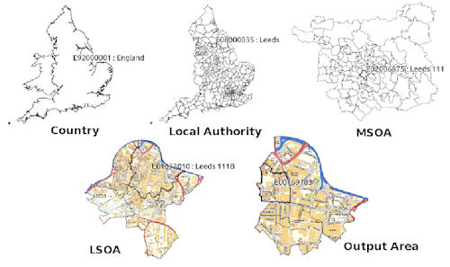
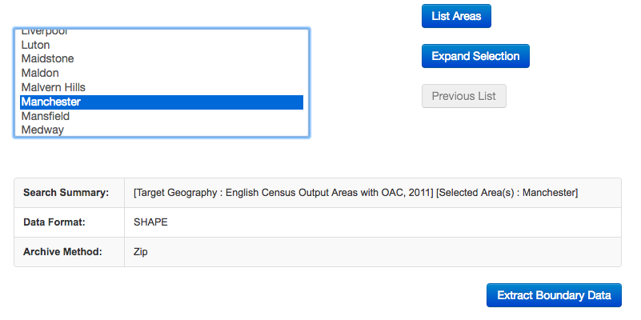
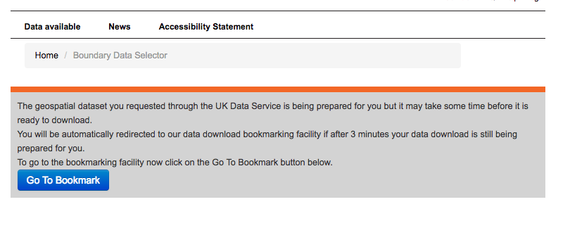
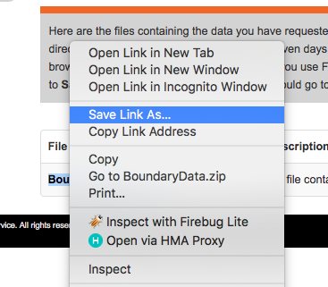
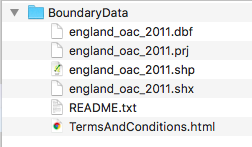
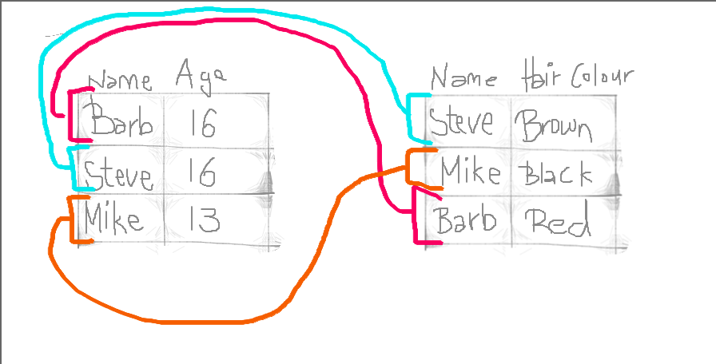

# Making your first maps in R


## A quick introduction of terms

### Geospatial Perspective - The Basics

Geospatial analysis provides a distinct perspective on the world, a unique lens through which to examine events, patterns, and processes that operate on or near the surface of our planet. Ultimately geospatial analysis concerns what happens where, and makes use of geographic information that links features and phenomena on the Earth's surface to their locations. 

We can talk about a few different concepts when it comes to spatial information. These are: 

- Place
- Attributes
- Objects


#### Place

At the center of all spatial analysis is the concept of *place*. People identify with places of various sizes and shapes, from the room with the parcel of land, to the neighbourhood, to the city, the country, the state or the nation state. Places often have names, and people use these to talk about and distinguish names. Names can be official. Places also change continually as people move. The basis of rigorous and precise definition of place is a coordinate system, a set of measurements that allows place to be specified unambiguously and in a way that is meaningful to everyone. 

#### Attributes

Attribute has become the preferred term for any recorded characteristic or property of a place. A place's name is an obvious example of an attribute. But there can be other pieces of information, such as number of crimes in a neighbourhood, or the GDP of a country. Within GIS the term 'attributes' usually refers to records in a data table associated with individual elements in a vector map or cells in a grid (raster or image file). These data behave exactly as data you have encountered in your data analysis courses. The rows represent observations, and the columns represent variables. The variables can be numeric or categorical, and depending on what they are, you can apply different methods to making sense of them. The difference with other kind of data table is that the observations, your rows, correspond to places or locations.

#### Objects

In spatial analysis it is customary to refer to places as objects. These objects can be a whole country, or a road. In forestry, the objects of interest might be trees, and their location will be represented as points. On the other hand, studies of social or economic patterns may need to consider the two-dimensional extent of places, which will therefore be represented as areas. These representations of the world are part of what is called the vector data model: A representation of the world using points, lines, and polygons. Vector models are useful for storing data that have discrete boundaries, such as country borders, land parcels, and streets. This is made up of points, lines, and areas (polygons): 

- Points
    + Points are pairs of coordinates, in latitude/longitude or some other standard system
- Lines
    + Lines are ordered sequences of points connected by straight lines
- Areas (polygons)
    + Areas are ordered rings of points, also connected by straight lines to form polygons. It can contain holes, or be linked with separate islands. 
    


Objects can also be Raster data. Raster data is made up of pixels (or cells), and each pixel has an associated value. Simplifying slightly, a digital photograph is an example of a raster dataset where each pixel value corresponds to a particular colour. In GIS, the pixel values may represent elevation above sea level, or chemical concentrations, or rainfall etc. The key point is that all of this data is represented as a grid of (usually square) cells. 

#### Maps

Historically maps have been the primary means to store and communicate spatial data. Objects and their attributes can be readily depicted, and the human eye can quickly discern patterns and anomalies in a well-designed map. 


#### Map projections

Map projections try to portray the surface of the earth or a portion of the earth on a flat piece of paper or computer screen. A coordinate reference system (CRS) then defines, with the help of coordinates, how the two-dimensional, projected map in your GIS is related to real places on the earth. The decision as to which map projection and coordinate reference system to use, depends on the regional extent of the area you want to work in, on the analysis you want to do and often on the availability of data. 

A traditional method of representing the earth’s shape is the use of globes. When viewed at close range the earth appears to be relatively flat. However when viewed from space, we can see that the earth is relatively spherical. Maps, are representations of reality. They are designed to not only represent features, but also their shape and spatial arrangement. Each map projection has advantages and disadvantages. The best projection for a map depends on the scale of the map, and on the purposes for which it will be used. For your purposes, you just need to understand that essentially there are different ways to flatten out the earth, in order to get it into a 2-dimensional map. 

The process of creating map projections can be visualised by positioning a light source inside a transparent globe on which opaque earth features are placed. Then project the feature outlines onto a two-dimensional flat piece of paper. Different ways of projecting can be produced by surrounding the globe in a cylindrical fashion, as a cone, or even as a flat surface. Each of these methods produces what is called a map projection family. Therefore, there is a family of planar projections, a family of cylindrical projections, and another called conical projections [see figure_projection_families](http://docs.qgis.org/2.8/en/_images/projection_families.png)


With the help of **coordinate reference systems** (CRS) every place on the earth can be specified by a set of three numbers, called coordinates. In general CRS can be divided into **projected coordinate reference systems** (also called Cartesian or rectangular coordinate reference systems) and **geographic coordinate reference systems**.

The use of Geographic Coordinate Reference Systems is very common. They use degrees of latitude and longitude and sometimes also a height value to describe a location on the earth’s surface. The most popular is called **WGS 84**. This is the one you will most likely be using, and if you get your data in latitude and longitude, then this is the CRS you are working in. It is also possible that you will be using a projected CRS. This two-dimensional coordinate reference system is commonly defined by two axes. At right angles to each other, they form a so called XY-plane. The horizontal axis is normally labelled X, and the vertical axis is normally labelled Y. 

Working with data in the UK, on the other hand, you are most likely to be using **British National Grid (BNG)**. The Ordnance Survey National Grid reference system is a system of geographic grid references used in Great Britain, different from using Latitude and Longitude. In this case, points will be defined by "Easting" and "Northing" rather than "Longitude" and "Latitude".  It basically divides the UK into a series of squares, and uses references to these to locate something. The most common usage is the six figure grid reference, employing three digits in each coordinate to determine a 100 m square. For example, the grid reference of the 100 m square containing the summit of Ben Nevis is NN 166 712. Grid references may also be quoted as a pair of numbers: eastings then northings in meters, measured from the southwest corner of the SV square. For example, the grid reference for Sullom Voe oil terminal in the Shetland Islands may be given as HU396753 or 439668,1175316


This will be important later on when we are linking data from different projections, or when you look at your map and you try to figure out why it might look "squished". 

#### Networks

We already mentioned lines that constitute objects of spatial data, such as streets, roads, railroads, etc. Networks constitute one-dimensional structures embedded in two or three dimensions. Discrete point objects may be distributed on the network, representing phenomena such as landmarks, or observation points. Mathematically, a network forms a graph, and many techniques developed for graphs have application to networks. These include various ways of measuring a network's connectivity, or of finding the shortest path between pairs of points on a network. You can have a look at the [lesson on network analysis in the QGIS documentation](https://docs.qgis.org/2.18/en/docs/training_manual/vector_analysis/network_analysis.html)

#### Density estimation

One of the more useful concepts in spatial analysis is density - the density of humans in a crowded city, or the density of retail stores in a shopping centre. Mathematically, the density of some kind of object is calculated by counting the number of such objects in an area, and dividing by the size of the area. To read more about this, I recommend [Silverman, Bernard W. Density estimation for statistics and data analysis. Vol. 26. CRC press, 1986.](https://books.google.co.uk/books?id=e-xsrjsL7WkC&dq=silverman+density+estimation+for+statistics&lr=&source=gbs_navlinks_s)

### Summary

Right so hopefully this gives you a few things to think about. Be sure that you are confident to know about: 

 - Spatial objects - what they are and how they are represented
 - Attributes - the bits of information that belong to your spatial objects
 - Maps and projections - especially what WSG84 and BNG mean, and why it's important that you know what CRS your data have
 
## Getting some spatial data to put on a map

### A first look at basemaps

Maps of the kind we will cover in this course are simply a form of data visualisation. In previous courses you may have learnt about histograms, scatterplots, and other forms of representing data in a two dimensional space. R is pretty good for producing data visualisation and there are three big approaches to producing this within R, which are rooted to particular packages. The oldest one is what people refer to as base R. The oldest R configuration has loads of plotting capabilities and follows a very particular philosophy about how to produce graphs. More modern packages are lattice, for multivariate data visualisation, and ggplot2, which relies in a theoretical model called the grammar of graphics.  

In the same way, there are many different packages that can be used to produce maps, some of which rely on the functionality provided by base R and others that rely on ggplot2 or other external graphical packages. In this course we will play around with several of these R packages to produce maps. Many offer similar functionality, but they all have certain special advantages (and disadvantages). So, in practice you may shift among them depending on what it is that you want to achieve. 

**Leaflet** is one of the most popular open-source JavaScript libraries for interactive maps. It’s used by websites ranging from *The New York Times* and *The Washington Post* to *GitHub* and *Flickr*, as well as GIS specialists like *OpenStreetMap*, *Mapbox*, and *CartoDB*. And lucky for us, there is an R package which makes it easy to integrate and control Leaflet maps in R. It allows to easily produce maps with contextual information from static maps such as GoogleMaps, OpenStreet Maps, or Stamen maps.

We are going to start now with some code. So, it would be a good idea for you to make sure you have your RStudio project open and ready to go. As usual, first you will need to install this package in your machine, something you should know by now. Then load the package using the code below.

```{r}
library(leaflet)
```

You create a Leaflet map with these basic steps:

- Create a map widget by calling leaflet().
- Add layers (i.e., features) to the map by using layer functions (e.g. addTiles, addMarkers,  addPolygons) to modify the map widget.
- Repeat step 2 as desired.
- Print the map widget to display it.

Let's start with the first and last points there, before discussing step 2 (and 3). It's possible to create a map without any arguments at all. You can do this by calling the `leaflet()` function, and adding some background tiles with the `addTiles()` function. Like so: 


```{r}

m <- leaflet() %>%
  addTiles()  # Add default OpenStreetMap map tiles

m  # Print the map

```


And while yepp, you've made a map, it's not a particularly exciting map. 

As the most important characteristic of any map is location, the most important argument of our code is the location argument. You can do this with the `setView()` function. Here you can specify location. Ideally, location is a longitude/latitude pair specifying the center of the map. Here we can choose the longitude and latitude for University of Manchester. If you wonder how we know these, there are many tools (such as [Google Maps](https://support.google.com/maps/answer/18539?co=GENIE.Platform%3DDesktop&hl=en)) for looking up latitude and longitude.  

You could also accompany the coordinates with a  zoom argument, an integer from 3 to 20 specifying how large the spatial extent should be around the center, with 3 being the continent level and 20 being roughly the single building level. Note that many maps do not support that high zoom levels. Find out by modifying the example below, what the maximum zoom level of the default tiles is.

```{r}

m <- leaflet() %>%
  addTiles() %>%  # Add default OpenStreetMap map tiles
  setView(lng=-2.233885, lat=53.466852, zoom = 15)
m  # Print the map, zoom = 15

```


So what you see above is what we can call a **basemap**. The term basemap is seen often in GIS and refers to a collection of GIS data and/or orthorectified imagery that form the background setting for a map. The function of the basemap is to provide background detail necessary to orient the location of the map. Basemaps also add to the aesthetic appeal of a map.

In the lecture today we described *reference maps*. We often may want to use these reference maps as **basemaps** for our thematic maps. They may give us context and help with the interpretation. But what we want to learn in this course is about thematic maps, maps that tell stories and for that we need data. We will look at cool data in the next section, but before just a couple of things about these basemaps. You can see above that you are seeing the *Open Street Map* Basemap. This is one option but there are others.

For example [stamen maps](http://maps.stamen.com/#toner/12/37.7706/-122.3782) are one alternative. If you wanted to use this, you have to specify what sort of tile you add in the `addProviderTiles()` function. Notice that it's different to `addTiles()` because you're getting tiles from an external provider, in this case Stamen. So to get stamen we would pass the argument `providers$Stamen.Toner`. Like so: 


```{r}
m <- leaflet() %>%
  addProviderTiles(providers$Stamen.Toner) %>%  # Add Stamen tile map tiles
  setView(lng=-2.233885, lat=53.466852, zoom = 15)
m  # Print the map, stamen toner

```

Stamen also has other maps, watercolour for example: 

```{r}

m <- leaflet() %>%
  addProviderTiles(providers$Stamen.Watercolor) %>%  # Add default Stamen Watercolor map tiles
  setView(lng=-2.233885, lat=53.466852, zoom = 15)
m  # Print the map

```

You can use other sources such as carto db

```{r}

m <- leaflet() %>%
  addProviderTiles(providers$CartoDB) %>%  # Add CartoDB map tiles
  setView(lng=-2.233885, lat=53.466852, zoom = 15)
m  # Print the map

```

You can use the `View()` function to see all the possible options for the providers to see a list of the types of basemaps you could use with leaflet. Have a go at choosing some of your own! 

```{r, eval = FALSE}

View(providers)

```


### Find some relevant data to show: obtaining data on crime

We can play around with police recorded crime data, which can be downloaded from the [police.uk](https://data.police.uk/data/) website. 

Let's download some data for crime in Manchester. 

To do this, open the [data.police.uk/data](https://data.police.uk/data/) website. 

- In `Date range` just select one month of data. Choose whatever month you like. I will choose November 2017, so if you want to see the same results as will be here, pick that month. 
- In `Force` find `Greater Manchester Police`, and tick the box next to it. 
- In `Data sets` tick `Include crime data`.
- Finally click on `Generate File` button.

This will take you to a download page, where you have to click the `Download now` button. This will open a dialogue to save a .zip file. Navigate to the project directory folder you've created and save it there. Unzip the file. 

```{r, eval=FALSE}
#You can use the unzip function for this. A cool function you may want to use as well is file.choose(). If we pass this function as an argument to unzip(), we will get a pop window where we will be able to select our file using familiar point and click. Ideally, you want to rather write down the path to your file. But sometimes these shortcuts are convenient.

unzip(file.choose())

```

If you look at the *Files* window in the bottom right corner of RStudio you should see now a new subdirectory that contains a .csv file with the data that we need. Since I downloaded the data from November 2017 in my case this subdirectory is called 2017-11.

Before we can use this data we need to read it or import it into R and turn it into a dataframe object. To read in the .csv file, which is the format we just downloaded, the command is `read.csv()`. 

Again there are two ways to read in the data, if you want to open a window where you can manually navigate and open the file, you can pass `file.choose()` argument to the read.csv() function as illustrated earlier. 

```{r, eval=FALSE}
#This code creates a dataframe object called crimes which will include the spreadsheet in the file we have downloaded. In my case, that is 2007-11-greater-manchester-street.csv.

crimes <- read.csv(file.choose())

```

Or, if you know the path to your file, you can hard-code it in there, within quotation marks:

```{r, eval=TRUE}
crimes <- read.csv("data/2017-11-greater-manchester-street.csv")
```

```{r, echo=FALSE, eval = FALSE}
crimes <- read.csv("https://www.dropbox.com/s/f5jwoum9u6c8odc/2017-11-greater-manchester-street.csv?dl=1")
```

You might notice that `crimes` has appeared in your work environment window. It will tell you how many observations (rows - and incidentally the number of recorded crimes in November 2017 within the GMP jurisdiction) and how many variables (columns) your data has.

Let's have a look at the crimes dataframe:

```{r, eval=FALSE}
#This will open the data browser in RStudio
View(crimes)

```

If you rather just want your results in the console, you can use the glimpse() function from the tibble package. This function does just that, it gives you a quick glimpse of the first few cases in the dataframe. Notice that there are two columns (Longitude and Latitude) that provide the require geographical coordinates that we need to plot this data.

```{r}
library(tibble)
glimpse(crimes)

```

### Add a point layer to your basemap

In GIS settings you may have multiple vector data that you want to represent in the same map simultaneously. So creating maps is often a function of adding new layers to an existing map. Before we saw how to generate a basemap with leaflet. Now we are going to add a new layer to that basemap with information about the location of crimes (as indexed in our crime dataframe).

To do that we will use the `addMarkers()` function. Within the  `addMarkers()` command we need to identify where the information is coming from, so we need to pass an argument identifying the dataframe object, and we need to identify how the aesthetics (in short, aes) are going to be defined (in this case, we need to identify the variables that define the location of the points in a two dimensional plane).

```{r}
m <- leaflet() %>%
  addProviderTiles(providers$Stamen.Toner) %>%  
  setView(lng=-2.233885, lat=53.466852, zoom = 15) %>% 
  addCircleMarkers(lng=crimes$Longitude, lat=crimes$Latitude)
m  # Print the map
```

The crime appear as blue dots. 

Keep in mind these are not exact locations, for privacy reasons the data in police.UK add noise to longitude and latitude so that it is harder to identify individuals based on this data. But this gives you an approximate idea of where crime takes place in and around the university area.

Let's get more detailed information even. When you glimpse at the data, you may have noticed that one of the attributes in the dataframe was type of crime, as indexed by the Crime.type variable. We can look at the frequency distribution of this variable using the table() function.

```{r}

table(crimes$Crime.type)

```

This is interesting, but keep in mind that this is data for all types of crimes in Greater Manchester. What if we wanted to differentiate between different types of crime. But instead, we can ask R to use the information from Crime.type to use a different colour for each type of crime. For this, we first need to make an object that creates a list of colours matched to each crime type. For this we use the `colorFactor()` function, and give it two arguments, one is the topo.colors list, which in brackets we put the number of categories we'll need. That's all the possible values that the Crime.type variable can take. To see what this is we can use the `unique()` function: 

```{r}

unique(crimes$Crime.type)

```

We can see that there are 14 possible values, so we will need 14 colours. The second argument is the variable, in this case Crime.type. Like so: 


```{r}

factpal <- colorFactor(topo.colors(14), crimes$Crime.type)
```

Now that we've created this object, we can use it to specify crime type through colour. We add a `color=` argument to the `addCircleMarkers()` function:

```{r}

m <- leaflet(crimes) %>%
  addProviderTiles(providers$Stamen.Toner) %>%  
  setView(lng=-2.233885, lat=53.466852, zoom = 15) %>% 
  addCircleMarkers(lng=crimes$Longitude, lat=crimes$Latitude, color = ~factpal(Crime.type))
m  # Print the map

```


But which colour means which crime type?! To know, we should add a legend. We can do this with the helpfully named `addLegend()` function. 

```{r}

m <- leaflet(crimes) %>%
  addProviderTiles(providers$Stamen.Toner) %>%  
  setView(lng=-2.233885, lat=53.466852, zoom = 15) %>% 
  addCircleMarkers(lng=crimes$Longitude, lat=crimes$Latitude, color = ~factpal(Crime.type)) %>%
  addLegend("bottomright", pal = factpal, values = ~Crime.type,
    title = "Crime types")
m  # Print the map

```


It's not the nicest map, but it's our first one, so that's exciting! We'll refine it more later on. 

### HOMEWORK 1

Think about this visualisation. 
1. How could you characterise the basemap: is it a vector map or a raster image?
2. How could you characterise the layer representing the crimes: is it a vector map or a raster image?
3. Is the resulting visualisation clear? Is it helpful? If you could change anything, what would it be? Write your thoughts up. 

This is going to be your first assignment to be submitted as part of next week. Export the image file into a Word document and write your answers there.


## From dataframes to spatial objects: finding shapefiles

You can get a long way with spatial data stored in data frames, but it makes life easier if they are stored in special spatial objects. In the previous exercise we saw how we can easily display point patterns in ggmap just using data extracted from a dataframe with a longitude and latitude columns. In many instances, when you work with GIS you rely on spatial objects that are a bit more complex in structure and that are stored in a wide variety of proprietary and open source formats. 

In this section you are going to learn how you take one of the most popular data formats for spatial objects, the shapefile, and read it into R. The shapefile was developed by ESRI, the developers and vendors or ArcGIS. And although many other formats have developed since and ESRI no longer holds the same market position it once occupied (though they're still the player to beat), shapefiles continue to be one of the most popular formats you will encounter in your work. You can read more about shapefiles [here](https://en.wikipedia.org/wiki/Shapefile).

We are going to learn here how to obtain shapefiles for British census geographies. In the class today we talked about the idea of neighborhouds and we explained how a good deal of sociological and criminological work traditionally used census geographies as proxies for neighbourhouds. As of today, they still are the geographical subdivisions for which we can obtain a greater number of attribute information (e.g., sociodemographics, etc.).

You can read more about census boundary data [here](https://census.ukdataservice.ac.uk/use-data/guides/boundary-data). "Boundary data are a digitised representation of the underlying geography of the census". Census Geography is often used in research and spatial analysis because it is divided into units based on population counts, created to form comparable units, rather than other administrative boundaries such as wards or police force areas. However depending on your research question and the context for your analysis, you might be using different units. The hierarchy of the census geographies goes from Country to Local Authority to Middle Layer Super Output Area (MSOA) to Lower Layer Super Output Area (LSOA) to Output Area: 



Here we will get some boundaries for Manchester. Let's use the LSOA level. These are geographical regions designed to be more stable over time and consistent in size than existing administrative and political boundaries. LSOAs comprise, on average, 600 households that are combined on the basis of spatial proximity and homogeneity of dwelling type and tenure. 

So to get some boundary data, you can use the UK Data Service website. There is a simple [Boundary Data Selector](https://borders.ukdataservice.ac.uk/bds.html).

When you get to the link, you will see on the top there is some notification to help you with the boundary data selector. If you are feeling unsure at any point, feel free to click on that help to guide you. 

For now, let's focus on the selector options. Here you can choose the country you want to select shapefiles for. We select "England". You can also choose the type of geography we want to use. Here we select "Statistical Building Block", as discussed above. And finally you can select when you want it for. If you are working with historical data, it makes sense to find boundaries that match the timescale for your data. Here we will be dealing with contemporary data, and therefore we want to be able to use the newest available boundary data. 

***

 

Once you have selected these options, click on the "Find" button. That will populate the box below: 

***


***

Here you can select the boundaries we want. As discussed, we want the census lower super output areas. But again, your future choices here will depend on what data you want to be mapping. 

Once you've made your choice, click on "List Areas". This will now populate the box below. We are here concerned with Manchester. However you can select more than one if you want boundaries for more than one area as well. Just hold down "ctrl" to select multiple areas individually, or the shift key to select everything in between. 

***

 

***

Once you've made your decision click on the "Extract Boundary Data" button. You will see the following message: 

***




***

You can bookmark, or just stay on the page and wait. How long you have to wait will depend on how much data you have requested to download. 

When your data is read, you will see the following message: 


***


  


***


You have to right click on the "BoundaryData.zip", and hit Save Target as on a PC or Save Link As on a Mac: 


***


 


***

Navigate to the folder you have created for this analysis, and save the .zip file there. Extract the file contents using whatever you like to use to unzip compressed files. 

```{r, eval = FALSE}
#For example,
unzip("BoundaryData.zip", exdir="BoundaryData")
```

You should end up with a folder called "BoundaryData". Have a look at its contents: 


***




***


So you can see immediately that there are some documentations around the usage of this shapefile, in the readme and the terms and conditions. Have a look at these as they will contain information about how you can use this map. For example, all your maps will have to mention where you got all the data from. So since you got this boundary data from the UKDS, you will have to note the following: 

"Contains National Statistics data © Crown copyright and database right [year]
    Contains OS data © Crown copyright [and database right] (year)"

You can read more about this in the terms and conditions document. 

But then you will also notice that there are 4 files with the same name "england_oac_2011". **It is important that you keep all these files in the same location as each other!** They all contain different bits of information about your shapefile (and they are all needed): 

- .shp — shape format; the feature geometry itself - this is what you see on the map
- .shx — shape index format; a positional index of the feature geometry to allow seeking forwards and backwards quickly
- .dbf — attribute format; columnar attributes for each shape, in dBase IV format. 
- .prj — projection format; the coordinate system and projection information, a plain text file describing the projection using well-known text format

Sometimes there might be more files associated with your shapefile as well, but we will not cover them here. So unlike when you work with spreadsheets and data in tabular form, which typically is just all included in one file; when you work with spatial data, you have to live with the required information living in separate files that need to be stored together. So, being tidy and organised is even more important when you carry out projects that involve spatial data. Please do remember the suggestions we provided last week as to how to organise your RStudio project directories.

## Reading shapefiles into R: the wonderful world of sf objects

Traditionally spatial analysis in R were done using the `sp` package which creates a particular way of storing spatial objects in R. When most packages for spatial data analysis in R and for thematic cartography were first developed `sp` was the only way to work with spatial data in R. There are more than 450 packages rely on `sp`, making it an important part of the R ecosystem. More recently a new package, `sf` (which stands for "simple features"), is revolutionising the way that R does spatial analysis. This new package provides a new way of storing spatial objects in R and most recent R packages for spatial analysis and cartography are using it as the new default. It is easy to transform `sf` objects into `sp` objects, so that those packages that still don't use this new format can be used. But in this course we will emphasise the use of `sf` whenever possible. You can read more about the history of spatial packages and the `sf` package in the first two chapters of [this book](https://geocompr.robinlovelace.net).
 
### **HOMEWORK 2**

Read Section 2.1 of the Geocomputation book linked above. Answer the following questions:
1. What are some strengths/advantages of the sf package?
2. What code do you need to transform a sf object into a sp object.
3  What is simply a sf object?
 
Install `sf` if you don't already have. Then load it.

```{r}
library(sf)
```

**On Mac and Linux a few requirements must be met to install sf. These are described in the package’s README at [github.com/r-spatial/sf](github.com/r-spatial/sf).**

To read in your data, you will need to know the path to where you have saved it. Ideally this will be in your working directory. 

Let's create an object and assign it our shapefile's name:

```{r}
#Remember to use the appropriate pathfile in your case
shp_name <- "data/BoundaryData/england_lsoa_2011.shp"
```


Make sure that this is saved in your working directory, and you have set your working directory. 

Now use the `st_read()` function to read in the shapefile: 

```{r}

manchester_lsoa <- st_read(shp_name)

```

Now you have your spatial data file. You can have a look at what sort of data it contains, the same way you would view a dataframe, with the `View()` function: 

```{r, eval=FALSE}

View(manchester_lsoa)

```

```{r, echo=FALSE}

glimpse(manchester_lsoa)

```

And of course, since it's spatial data, you can finally map it: 

```{r}

plot(manchester_lsoa)

```

This is the main way that we will be creating maps. OK so you see that three maps appeared - any ideas why? Do you know what the three maps correspond to? Discuss.

## Add some data

### Data wrangling with dplyr

Now let's get some crime data to add to this map. We can do this by using the police.uk data we obtained earlier. Have a look again at the information stored in the crimes spreadsheet:

```{r}
glimpse(crimes)
```

You should be able to see that there is a variable, a column in this spreadsheet, called LSOA.code. Yep, that is the unique identifier that is telling us in which lower super output area each crime took place. If only we could use this information to create a new dataset counting the number of criminal events that took place within each of these areas!!!

Ok, here is where you are introduced to the wonderful world of **dplyr**. This is a package for conducting all sorts of operations with data frames. We are not going to cover the full functionality of dplyr (which you can consult in [this tutorial](https://cran.r-project.org/web/packages/dplyr/vignettes/dplyr.html)), but we are going to cover three different very useful elements of dplyr: the select function, the group_by function, and the piping operator.

Load the library:

```{r}
library(dplyr)
```

The select() function provides you with a simple way of subsetting columns from a data frame. So, say we just want to use one variable, LSOA.code, from the crimes dataframe and store it in a new object we could write the following code:

```{r, eval=FALSE}

new_object <- select(crimes, LSOA.code)

```

We can also use the group_by() function for performing group operations. Essentially this function ask R to group cases within categories and then do something with those grouped cases. So, say, we want to count the number of cases within each LSOA, we could use the following code:

```{r, eval = FALSE}
#First we group the cases by LSOA code and stored this organised data into a new object
grouped_crimes <- group_by(new_object, LSOA.code)
#Then we could count the number of cases within each category and use the summarise function to print the results
summarise(grouped_crimes, count=n())
#We could infact create a new dataframe with these results
crime_per_LSOA <- summarise(grouped_crimes, count=n())
```

As you can see we can do what we wanted, create a new dataframe with the required info, but there is a more efficient way of doing this, without so many intermediate steps clogging up our environment with unnecessary objects. That's where the piping operator comes handy. The piping operator is written like `%>%` and it can be read as "and then". Look at the code below:

```{r}
#First we say create a new object called crime_per_lsoa, and then select only the LSOA.code column to exist in this object, and then group this object by the LSOA.code, and then count the number of cases within each category, this is what I want in the new object.
crimes_per_lsoa <- crimes %>%
  group_by(LSOA.code) %>%
  summarise(count=n())
  
```

Essentially we obtain the same results but with more streamlined and elegant code, and not needing additional objects in our environment.

## Join data to spatial object

Notice anything similar between the data from the shapefile and the frequency table data we just created? Do they share a column? 

Yes! You might notice that the `LSOA.code` field in the crimes data matches the values in the `code` field in the spatial data. In theory we could join these two data tables.

So how do we do this? Well what you can do is to link one data set with another.  Data linking is used to bring together information from different sources in order to create a new, richer dataset. This involves identifying and combining information from corresponding records on each of the different source datasets. The records in the resulting linked dataset contain some data from each of the source datasets. Most linking techniques combine records from different datasets if they refer to the same entity (an entity may be a person, organisation, household or even a geographic region.) 

You can merge (combine) rows from one table into another just by pasting them in the first empty cells below the target table—the table grows in size to include the new rows. And if the rows in both tables match up, you can merge columns from one table with another by pasting them in the first empty cells to the right of the table—again, the table grows, this time to include the new columns.

Merging rows is pretty straightforward, but merging columns can be tricky if the rows of one table don't always line up with the rows in the other table. By using `left_join()` from the `dplyr` package, you can avoid some of the alignment problems.

left_join() will return all rows from x, and all columns from x and y. Rows in x with no match in y will have NA values in the new columns. If there are multiple matches between x and y, all combinations of the matches are returned.

So we've already identified that both our crimes data, and the spatial data contain a column with matching values, the codes for the LSOA that each row represents. 


**You need a unique identifier to be present** for each row in all the data sets that you wish to join. This is how R knows what values belong to what row! What you are doing is matching each value from one table to the next, using this unique identified column, that exists in both tables. For example, let's say we have two data sets from some people in Hawkins, Indiana. In one data set we collected information about their age. In another one, we collected information about their hair colour. If we collected some information that is unique to each observation, and this is the *same* in both sets of data, for example their names, then we can link them up, based on this information.  Something like this: 





And by doing so, we produce a final table that contains all values, lined up *correctly* for each individual observation, like this: 


This is all we are doing, when merging tables, is we are making use that we line up the correct value for all the variables, for all our observations. 

## So left_join(), eh?

Well actually there is a [whole family of join functions as part of dplyr](http://stat545.com/bit001_dplyr-cheatsheet.html). But here we use left join, because that way we keep all the rows in x (the left-hand side dataframe), and join to it all the matched columns in y (the right-hand side dataframe). 

So let's join the crimes data to the spatial data, using left_join():

We have to tell lefot_join what are the dataframes we want to join, as well as the names of the columns that contain the matching values in each one. This is "code" in the manchester_lsoa dataframe and "LSOA.code" in the crimes_per_lsoa dataframe. Like so: 

```{r}

manchester_lsoa <- left_join(manchester_lsoa, crimes_per_lsoa, by = c("code"="LSOA.code"))

```

Now if you have a look at the data again, you will see that the column of number of crimes (n) has been added on. 

You can now use this to create a thematic choropleth map

```{r}

plot(manchester_lsoa[4])

```

## Let's make this prettier: a quick glance at tmap

Very quickly, but just to illustrate things can be prettier, we are going to use this data with another package tmap, short for thematic maps. This package also borrows from the ggplot syntax and is specifically designed to make creation of thematic maps more convenient. It takes care of a lot of the styling and aesthetics. This reduces our amount of code significantly. So, look at what we can do with our previous map:

```{r}
library(tmap)
tm_shape(manchester_lsoa) +
  tm_polygons("count", style="quantile", title="Count of crimes in Manchester")
```

And we can even add some interactivity!

```{r}
tmap_mode("view")
last_map()
```

So, this is all for today, next week we will come back to tmap and explain the different arguments that we use when thematic maps. This was just an introduction to some of the things we can do. Next week we will spend a bit of more time discussing how to make good choices when producing maps.
