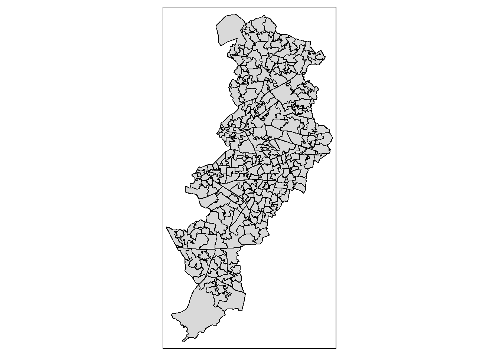
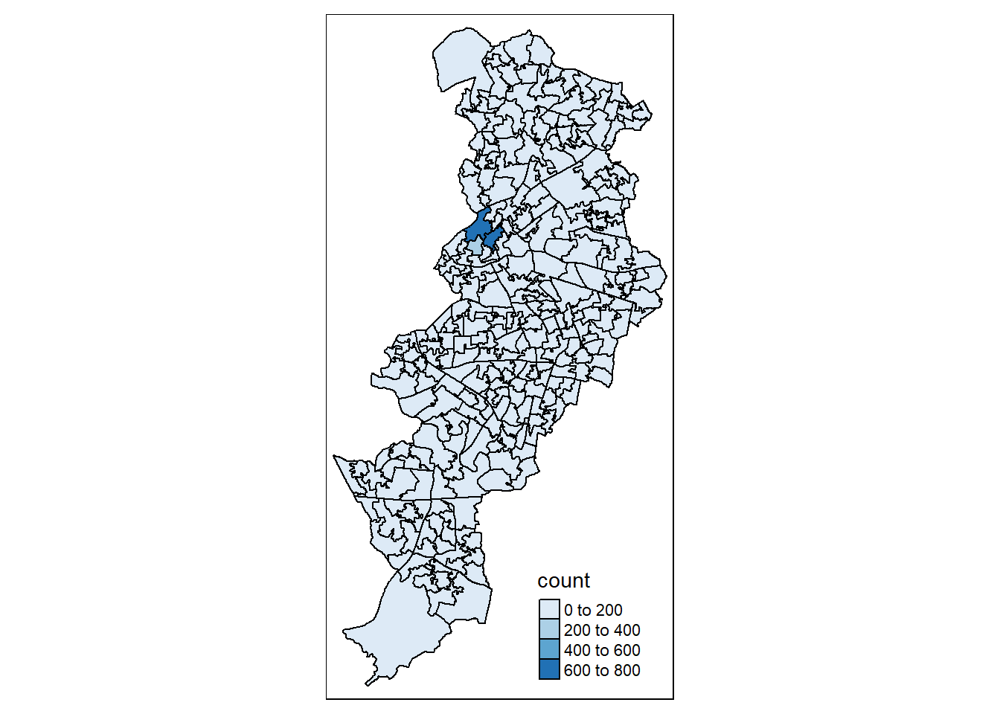
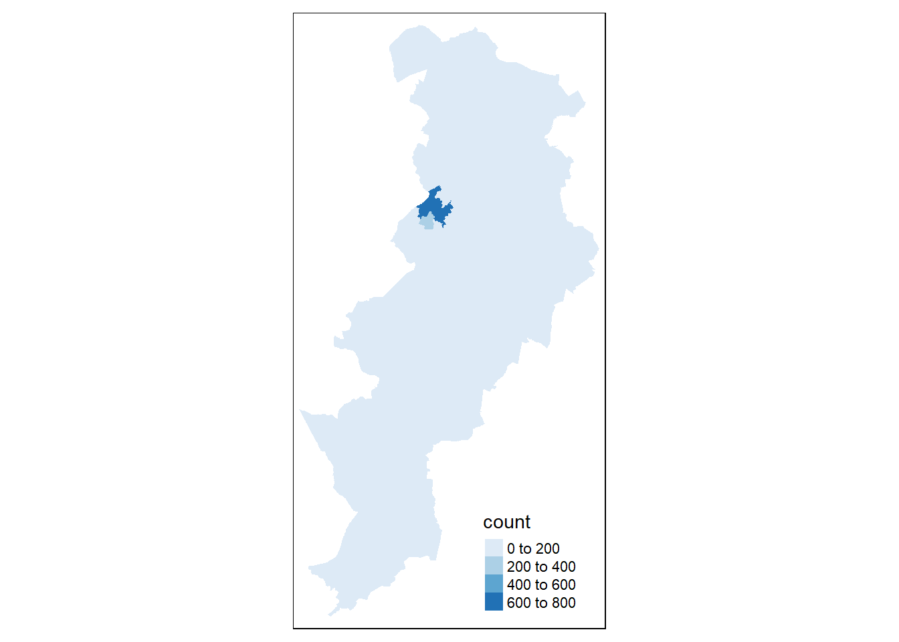
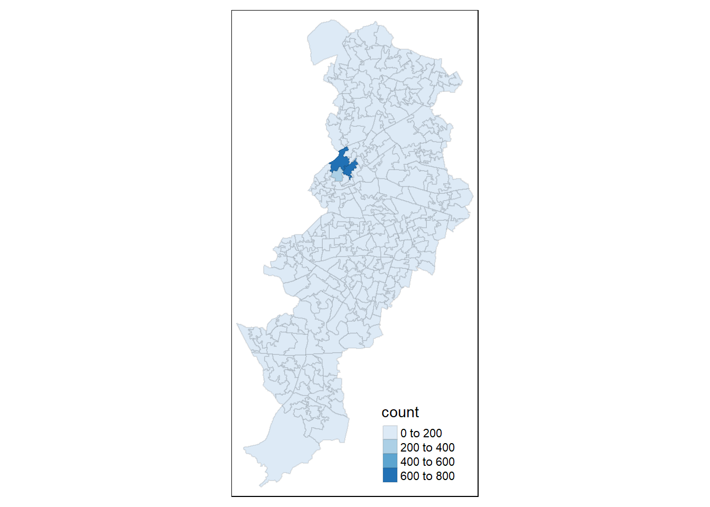
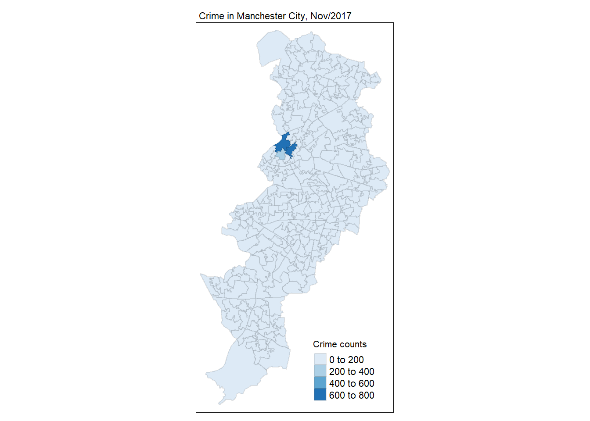
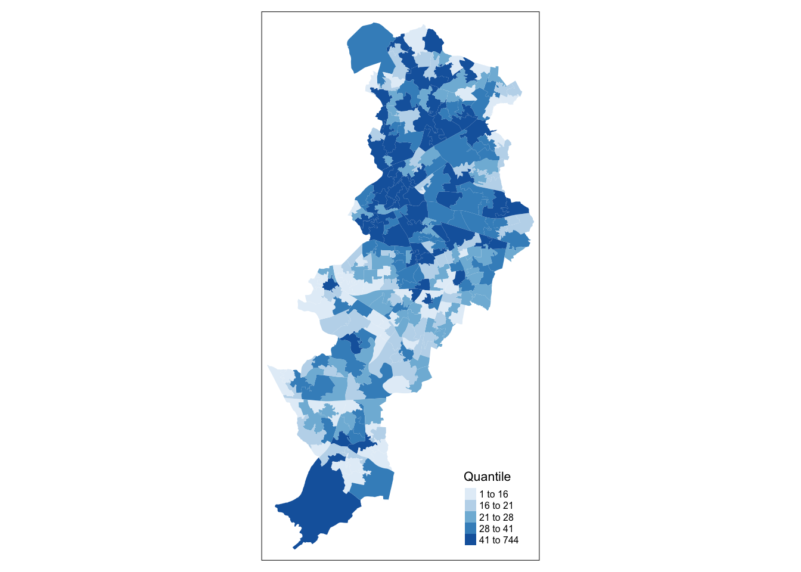
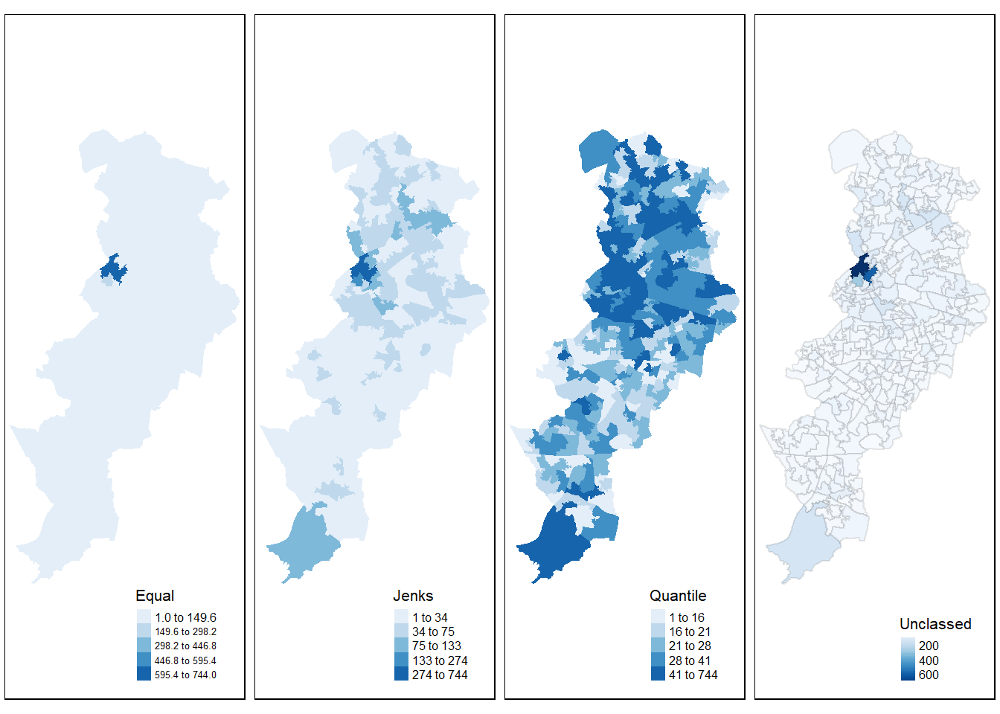
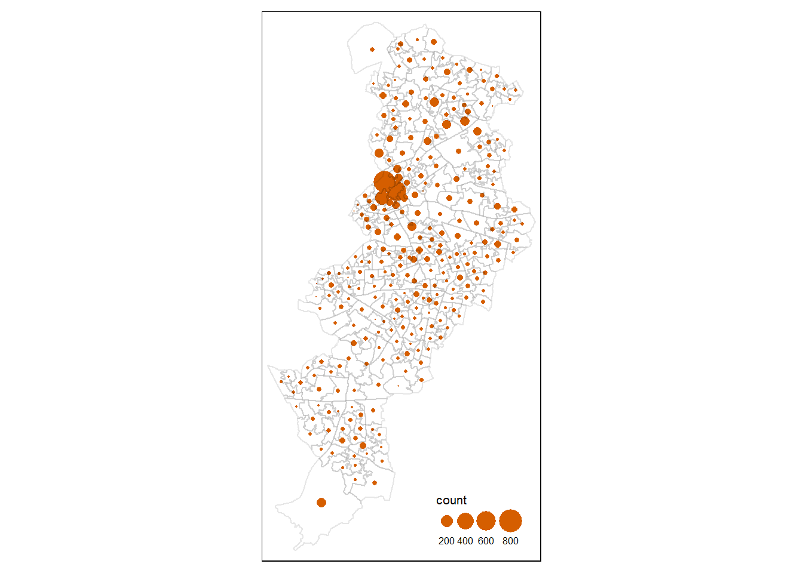

# Thematic maps in R


## Intro and recap

Last week we showed you fairly quickly how to create maps of spatial point patterns using `leaflet` and we also introduced the `tmap` package for thematic maps. Besides doing that we introduced a set of key concepts we hope you have continued studying over the week. We also discussed the `sf` package for storing spatial objects in R. 

This week we will carry on where we left the session last week. In the presentations last week we introduced various kind of thematic maps and in our lecture this week we discuss in detail issues with choropleth maps. So the focus of today's lab is going to be around thematic maps and some of the choices we discussed in our presentation last week and also this week. 

We will also introduce faceting and **small multiples**, which is a format for comparing the geographical distribution of different social phenomena. For this session we will be using the spatial object that you created last week and complement it with additional information from the census. So first of all you will have to rerun the code you used to create the *manchester_lsoa* `sf` object. Apart from doing so, you want to start your session loading the libraries you know for sure you will need:


```r
library(sf)
library(tmap)
library(dplyr)
```

You may not remember all of what you did to generate that file so let's not waste time and just cut and paste from below (but try to remember what each of the lines of code is doing and if you are not clear look at the notes from last week). Imagine you had to do all of this again by pointing and clicking in a graphical user interface rather than just sending the code to the console! As you will see time and time again, code in the end is a much more efficient way of talking to a computer.


```r
crimes <- read.csv("https://raw.githubusercontent.com/maczokni/2018_labs/master/data/2017-11-greater-manchester-street.csv")
#The following assumes you have a subdirectory called BoundaryData in your working directory, otherwise you will need to change to the pathfile where you store your LSOA shapefile
shp_name <- "data/BoundaryData/england_lsoa_2011.shp"
manchester_lsoa <- st_read(shp_name)
```

```
## Reading layer `england_lsoa_2011' from data source `/Users/reka/Dropbox (The University of Manchester)/crimemapping_textbook_bookdown/data/BoundaryData/england_lsoa_2011.shp' using driver `ESRI Shapefile'
## Simple feature collection with 282 features and 3 fields
## geometry type:  POLYGON
## dimension:      XY
## bbox:           xmin: 378833.2 ymin: 382620.6 xmax: 390350.2 ymax: 405357.1
## epsg (SRID):    NA
## proj4string:    +proj=tmerc +lat_0=49 +lon_0=-2 +k=0.9996012717 +x_0=400000 +y_0=-100000 +datum=OSGB36 +units=m +no_defs
```

```r
crimes_per_lsoa <- crimes %>%
  select(LSOA.code) %>%
  group_by(LSOA.code) %>%
  summarise(count=n())
manchester_lsoa <- left_join(manchester_lsoa, crimes_per_lsoa, by = c("code"="LSOA.code"))
```

```
## Warning: Column `code`/`LSOA.code` joining factors with different levels,
## coercing to character vector
```

You may not want to have to go through this process all the time. One thing you could do is to save the *manchester_lsoa* object as a physical file in your machine. You can use the `st_write()` function from the `sf` package to do this. If we want to write into a shapefile format we would do as shown below:


```r
st_write(manchester_lsoa, "data/BoundaryData/manchester_crime_lsoa.shp")
```

Notice how four files have appeared in your working directory, in your "BoundaryData"" subdirectory or whatever you called it. Remember what we said last week about shapefiles, there are a collection of files that need to be kept together.

If you wanted to bring this shapefile back into R at any future point, you would only need to use the `st_read()` function.

Before we carry on, can you tell What is different between *manchester_lsoa.shp* and *manchester_crime_lsoa.shp*? Think about it.

## Creating choropleth maps

The `tmap` package was developed to easily produce thematic maps. It is inspired by the `ggplot2` package and the layered grammar of graphics. It was written by Martjin Tennekes a Dutch data scientist. There are a number of [vignettes in the CRAN repository](https://cran.r-project.org/web/packages/tmap/index.html) and the [GitHub repo for this package](https://github.com/mtennekes/tmap) that you can explore. GitHub is a collaborative website used by software developers and data scientist, also contains a useful *readme* section with additional resources to familiarise yourself with this package. Each map can be plotted as a static map (*plot mode*) and shown interactively (*view mode*) as we briefly saw last week. We will start by focusing on static maps.

Every time you use this package you will need a line of code that specifies the spatial object you will be using. Although originally developed to handle `sp` objects only, it now also has support for `sf` objects. For specifying the spatial object we use the `tm_shape()` function and inside we specify the name of the spatial object we are using. On its own, this will do nothing apparent. No map will be created. We need to add additional functions to specify what we are doing with that spatial object. If you try to run this line on its own, you'll get an error telling you you must "Specify at least one layer after each tm_shape". 


```r
tm_shape(manchester_lsoa)
```

The main plotting method consists of elements that we can add. The first element is the `tm_shape()` function specifying the spatial object, and then we can add a series of elements specifying layers in the visualisation. They can include polygons, symbols, polylines, raster, and text labels as base layers. We will add a polygon using `tm_polygon()`. As noted, with `tmap` you can produce both static and interactive maps. The interactive maps rely on `leaflet`. You can control whether the map is static or interactive with the `tmap_mode()` function. If you want a static map you pass `plot` as an argument, if you want an interactive map you pass `view` as an argument. Let's create a static map first. 


```r
tmap_mode("plot")
```

```
## tmap mode set to plotting
```

```r
tm_shape(manchester_lsoa) + 
  tm_polygons()
```



Given that we are not passing any additional arguments all we are getting is a map with the shape of the geographies that we are representing, the census LSOAs for Manchester city. We can, however, ask R to produce a choropleth map by mapping the values of a variable in our data table using colour.  In tmap we need to denote our variables between quotes. The first argument we pass then would be the name of the variable we want to visualise. If you remember we have a count for crimes ("count"), so let's visualise that by creating a thematic map.


```r
tm_shape(manchester_lsoa) + 
  tm_polygons("count")
```



Notice how this map is different from last week. What do you think the reason for this is? You may remember last week we used one additional argument `style` specifying the classification method we were going to use. If you remember we used quantiles. We will in a second look at how a map of the counts of crime looks different when we use different classification systems. But before we get to that, let's think about aesthetics a bit more. 

We have been using `tm_polygons()` but we can also add the elements of a polygon map using different functions that break down what we represent here. In the map above you see the polygons have a dual representation, the borders are represented by lines and the colour is mapped to the intensity of the quantitative variable we are representing. With darker colours representing more of the variable, the areas with more crimes. Instead of using `tm_polygon()` we can use the related functions `tm_fill()`, for the colour inside the polygons, and `tm_borders()`, for the aesthetics representing the border of the polygons. Say we find the borders distracting and we want to set them to be transparent. In that case we could just use `tm_fill()`.


```r
tm_shape(manchester_lsoa) + 
  tm_fill("count")
```



As you can see here, the look is a bit cleaner. We don't need to get rid of the borders completely. Perhaps we want to make them a bit more translucent. We could do that by adding the border element but making the drawing of the borders less pronounced. 


```r
tm_shape(manchester_lsoa) + 
  tm_fill("count") +
  tm_borders(alpha = 0.1)
```



The alpha parameter that we are inserting within `tm_borders()` controls the transparency of the borders, we can go from 0 (totally transparent) to 1 (not transparent). You can play around with this value and see the results.

Notice in the last few maps we did not have to specify whether we wanted the map to be static or interactive. When you use `tmap`, R will remember the mode you want to use. So once you specify `tmap_mode("plot")`, all the subsequent maps will be static. It is only when you want to change this behaviour that you would need another `tmap_mode` call.

Notice as well that the legend in this map is (a) not very informative and (b) located in a place that is less than optimal, since it covers part of the map. We can add a title within the `tm_fill` to clarify what count is and we can use the `tm_layout()` function to control the appearance of the legend. This later function `tm_layout` allows you to think about many of the more general cosmetics of the map.


```r
tm_shape(manchester_lsoa) + 
  tm_fill("count", title = "Crime counts") +
  tm_borders(alpha = 0.1) +
  tm_layout(main.title = "Crime in Manchester City, Nov/2017", main.title.size = 0.7 ,
            legend.position = c("right", "bottom"), legend.title.size = 0.8)
```



```r
#We are also going to change the current style of the maps by making them more friendly to colour blind people. We can use the tmap_style() function to do so.
current_style <- tmap_style("col_blind")
```

```
## tmap style set to "col_blind"
```

```
## other available styles are: "white", "gray", "natural", "cobalt", "albatross", "beaver", "bw", "classic", "watercolor"
```

## Producing small multiples to compare the effect of different classification systems

For comparing the effects of using different methods we can use small multiples. Small multiples is simply a way of reproducing side by sides similar maps for comparative purposes. To be more precise small multiples are *sets of charts of the same type, with the same scale, presented together at a small size and with minimal detail, usually in a grid of some kind*. The term was at least popularized by Edward Tufte, appearing first in his *Visual Display of Quantitative Information* in 1983.

There are different ways of creating small multiples with `tmap` as you could see in the vignettes for the package, some of which are quicker but a bit more restricted. Here we are going to use `tmap_arrange()`. With `tmap_arrange()` first we need to create the maps we want and then we arrange them together.

Let's make four maps, each one using a different classification method: Equal interval, Natural breaks (Jenks), Quantile, and Unclassed (no classification). You should be familiar with these methods from the reading and lecturing material. If not, please, do make sure you read the material before continuing.

For each map, instead of visualising them one by one, just assign them to a new object. Let's call them *map1*, *map2*, *map3* and *map4*. 

So let's make *map1*. This will create a choropleth map using equal intervals:


```r
map1 <- tm_shape(manchester_lsoa) +                   #use tm_shape function to specify spatial object
  tm_fill("count", style="equal", title = "Equal") +  #use tm_fill to specify variable, classification method, and give the map a title
  tm_layout(legend.position = c("right", "bottom"),   #use tm_layout to make the legend look nice
            legend.title.size = 0.8,
            legend.text.size = 0.5)
```

Now create *map2*, with the jenks method often preferred by geographers:


```r
map2 <- tm_shape(manchester_lsoa) + 
  tm_fill("count", style="jenks", title = "Jenks") +
  tm_layout(legend.position = c("right", "bottom"), 
            legend.title.size = 0.8,
            legend.text.size = 0.5)
```

Now create *map3*, with the quantile method often preferred by epidemiologists:


```r
map3 <- tm_shape(manchester_lsoa) + 
  tm_fill("count", style="quantile", title = "Quantile") +
  tm_layout(legend.position = c("right", "bottom"), 
            legend.title.size = 0.8,
            legend.text.size = 0.5)
```

And finally make *map4*, an unclassed choropleth map, which maps the values of our variable to a smooth gradient.


```r
map4 <- tm_shape(manchester_lsoa) + 
  tm_fill("count", style="cont", title = "Unclassed") +
  tm_borders(alpha=0.1) +
  tm_layout(legend.position = c("right", "bottom"), 
            legend.title.size = 0.8,
            legend.text.size = 0.5)
```

Notice that we are not plotting the maps, we are storing them into R objects (map1 to map4). This way they are saved, and you can call them later, which is what we need in order to plot them together using the `tmap_arrange()` function. 

So if you wanted to map just *map3* for example, all you need to do, is call the map3 object. Like so: 


```r
map3
```



But now we will plot all 4 maps together, arranged using the `tmap_arrange()` function. Like so: 


```r
#And now we deploy tmap_arrange to plot these maps together
tmap_arrange(map1, map2, map3, map4) 
```



### Homework 3.1

*Discuss which of these classification methods gives you the best visualisation of crime in Manchester city. Insert the produced maps in your answer.*

## Using graduated symbols

The literature on thematic cartography highlights how counts, like the ones above, are best represented using graduated symbols rather than choropleth maps. So let's try to go for a more appropriate representation. In `tmap` you can use tm_symbols for this. We will use `tm_borders` to provide some context.


```r
tm_shape(manchester_lsoa) + 
  tm_bubbles("count")
```


First thing you see is that we loose the context (provided by the polygon borders) that we had earlier. The `border.lwd` argument set to NA in the `tm_symbols()` is asking R not to draw a border to the circles. Whereas `tm_borders()` brings back a layer with the borders of the polygons representing the different LSOAs in Manchester city. Notice how I am modifying the transparency of the borders with the alpha parameter.


```r
tm_shape(manchester_lsoa) +                         #use tm_shape function to specify spatial object
  tm_bubbles("count", border.lwd=NA) +              #use tm_bubbles to add the bubble visualisation, but set the 'border.lwd' parameter to NA, meaning no symbol borders are drawn
  tm_borders(alpha=0.1) +                           #add the LSOA border outlines using tm_borders, but set their transparency using the alpha parameter (0 is totally transparent, 1 is not at all)
  tm_layout(legend.position = c("right", "bottom"), #use tm_layout to make the legend look nice
            legend.title.size = 0.8,
            legend.text.size = 0.5)
```



## Bringing additional census data in

Last week you learned how to obtain crime data from the police UK website and you also developed the skills to obtain shapefiles with the boundaries for the UK census geographies. Specifically you learnt how to obtain LSOAs boundaries. Then we taught you how to join these data tables using `dplyr`. If you open your *manchester_lsoa* object you will see that at the moment you only have one field in this dataframe providing you with statistical information. However, there is a great deal of additional information that you could add to these data frame. Given that you are using census geographies you could add to it all kind of socio demographic variables available from the census. 

You may want to watch [this 4 minute video](https://www.youtube.com/watch?v=AzK04BOFd_s#t=17) to get a sense for how to obtain the data. If you don't have headphones make sure you read [this brief tutorial](http://infuse.ukdataservice.ac.uk/help/tutorial.html) before carrying on. We are going to get some data for Manchester city LSOAs. Let me warn you though, the census data portal is one of the closest things to hell you are going to come across on the internet. Using it will be a good reminder of why point and click interfaces can suck the life out of you.  

From the main Infuse portal select the 2011 census data then when queried pick selection by geography:


Expand the local authorities and select Manchester. Expand Manchester and select LSOAs:


At the bottom of the page click in *Add* and then where it says *Next*. Now big tip. Do not press back in your browser. If you need to navigate back once you get to that point use the *previous* button at the bottom of the screen. You will regret it if you don't do this. 

Now you will need to practice navigating the Infuse system to generate a data table that has a number of relevant fields we are going to use today and at a later point this semester. I want you to create a file with information about: the resident population, the workday population, and the number of deprivation households. This will involve some trial and error but you should end up with a selection like the one below:


Once you have those fields click next to get the data and download the file. Unzip them and open the .csv file in Excel. If you view the data in Excel you will notice it is a bit untidy. The first row has no data but the labels for the variable names and the second row has the data for Manchester as a whole. We don't need those rows. Because this data is a bit untidy we are going to use `read_csv()` function from the `readr` package rather than the base `read.csv` function.


