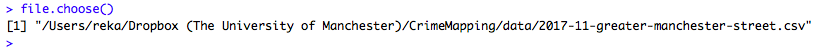
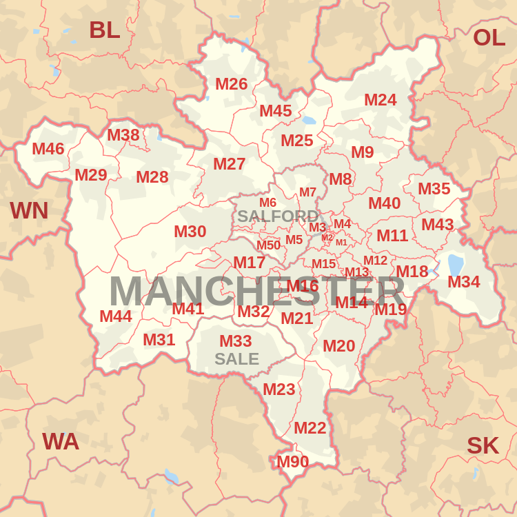
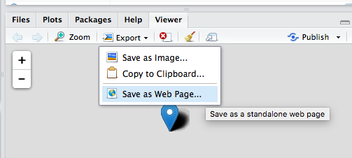

# Performing spatial operations in R

By now you have come a long way in terms of taking your spatial data, and visualising it using maps, and being able to present the values of a variable using thematic maps. You have had some practice in taking data which has a spatial component, and joining it to a shapefile, using the common column, in order to be able to visually demonstrate variation on something, such as the crime rate, across space. 

I hope that you are finding this to be really exciting stuff, and an opportunity to get yourselves accustomed to spatial data. If there is anything you are unsure about, or want to catch up on, please do not hesitate to revisit older material, and ask us questions about it. We build on each week acquiring knowledge umulatively, so don't let yourself get stuck anywhere down the line. But, if you're ready, today we will go a step further, and get your hands dirty with **spatial manipulation of your data**. 

Thus far, our data manipulation exercises were such that you might be familiar with, from your earlier exposures to data analysis. Linking datasets using a common column, calculating a new variable (new column) from values of existing variables, these are all tasks which you can perform on spatial or non-spatial data. However today we will explore some exercises in data manipulation which are specific to *spatial* data analysis. After this session you can truly say you are masters of spatial data manipulation. So let's get started with that!

The main objectives for this session are that by the end you will have:

- used **geocoding** methods to translate postcodes into geographic coordinates 
- made interactive point map with leaflet
- met a new format of spatial shape file called **geojson**
- subset points that are within a certain area using a **spatial operation**
- created new polygons by generating **buffers** around points
- counted the number of points that fall within a polygon (known as **points in polygon**)

These are all very useful tools for the spatial crime analyst, and we will hope to demonstrate this by working through an example project, where you would make use of all of these tools. 

Let's consider the assumption that licenced premises which serve alcohol are associated with increased crimes. We might have some hypotheses about why this may be. 

One theory might be that some of these serve as *crime attractors*. 

> Crime attractors are particular places, areas, neighbourhoods, districts which create well-known criminal opportunities to which strongly motivated, intending criminal offenders are attracted because of the known opportunities for particular types of crime. Examples might include bar districts; prostitution areas; drug markets; large shopping malls, particularly those near major public transit exchanges; large, insecure parking lots in business or commercial areas. The intending offender goes to rough bars looking for fights or other kinds of 'action'. 

On the other hand, it is possible that these areas are *crime generators*. 

> Crime generators are particular areas to which large numbers of people are attracted for reasons unrelated to any particular level of criminal motivation they might have or to any particular crime they might end up committing. Typical examples might include shopping precincts; entertainment districts; office concentrations; or sports stadiums. 

(If you are interested further in crime attractors vs crime generators I recommend a read of [Brantingham, P., & Brantingham, P. (1995). Criminality of place. European journal on criminal policy and research, 3(3), 5-26.](https://link.springer.com/content/pdf/10.1007/BF02242925.pdf))


It's possible that some licensed premises attract crimes, due to their reputation. However it is also possible that some of them are simply located in areas that are busy, attracts lots of people for lots of reasons, and crimes occurr as a result of an abundance of opportunities instead. 

In any case, what we want to do is to examine whether certain outlets have more crimes near them than others. We can do this using open data, some R code, and the spatial operations discussed above. So let's get to it!


## Getting some (more) data

Manchester City Council have an [Open Data Catalogue](http://open.manchester.gov.uk/open/homepage/3/manchester_open_data_catalogue) on their website, which you can use to browse through what sorts of data they release to the public. There are a some more and some less interesting data sets made available here. It's not quite as impressive as the open data from some of the cities in the US such as [New York](https://opendata.cityofnewyork.us/) or [Dallas ](https://www.dallasopendata.com/) but we'll take it. 


One interesting data set, especially for our questions about the different alcohol outlets is the [Licensed Premises](http://www.manchester.gov.uk/open/downloads/file/169/licensed_premises) data set. This details all the currently active licenced premises in Manchester. You can see there is a link to download now. 


As always, there are a few ways you can download this data set. On the manual side of things, you can simply right click on the download link from the website, save it to your computer, and read it in from there, by specifying the file path. Remember, if you save it in your *working directory*, then you just need to specify the file name, as the working directory folder is where R will first look for this file. If however you've saved this elsewhere, you will need to work out the file path. 


*Note* my favourite shortcut to finding the file path is to simply run the `file.choose()` function, and use the popup window to navigate to the file. When you open this file through the popup window, if you're not assigning this to an object, it will simply print out the filepath to your console window. Like so: 





You can then copy and paste this path to whatever fuction you are assigning it to, to read in your data. 


### Reading data in from the web


But, programmers are lazy, and the whole point of using code-based interfaces is that we get to avoid doing unneccessary work, like point-and-click downloading of files. And when data exists online in a suitable format, we can tell R to read the data in from the web directly, and cut out the middle man (that being ourseves in our pointing-and-clicking activity). 


How can we do this? Well think about what we do when we read in a file. We say, hello R, i would like to create a new object please and I will call this new object `my_data`. We do this by typing the name we are giving the object and the assignment function `<-`. Right? Then on the right hand side of the assignment function, there is the value that we are assigning the variable. So it could be a bit of text (such as when you're creating a `shp_name` object and you pass it the string `"path to my file"`), or it could be some function, for example when you read a csv file with the `read.csv()` function. 


So if we're reading a csv, we also need to specity *where* to read the csv from. Where should R look to find this data? This is where normally you are putting in the path to your file, right? Something like: 


```{r, eval=FALSE}

my_data <- read.csv("path to my file here")

```


Well what if your data does not live on your laptop or PC? Well, if there is a way that R can still access this data just by following a path, then this approach will still work! So how can we apply this to getting the Licensed Premises data from the web? 


You know when you right click on the link, and select "Save As..." or whatever you click on to save? You could, also select "Copy Link Address". This just copies the webpage where this data is stored. Give it a go! Copy the address, and then paste it into your browser. It will take you to a blank page where a forced download of the data will begin. So what if you pasted this into the `read.csv()` function? 


```{r, eval=FALSE}

my_data <- read.csv("www.data.com/the_data_i_want")

```


Well in this case, the my_data object would be assigned the value returned from the read.csv() function reading in the file from the url you provided. File path is no mysterious thing, file path is simply the *path* to the *file* you want to read. If this is a website, then so be it. 


So without dragging this on any further, let's read in the licensed premises data directly from the web: 


```{r}
lic_prem <- read.csv("http://www.manchester.gov.uk/open/download/downloads/id/169/licensed_premises.csv")
```


You can always check if this worked by looking to your global environment on the righ hand side and seeing if this 'lic_prem' object has appeared. If it has, you should see it has `r I(nrow(lic_prem))` observations (rows), and `r I(ncol(lic_prem))` variables (columns). 


Let's have a look at what this data set looks like. You can use the `View()` function for this: 


```{r, eval=FALSE}
View(lic_prem)
```


We can see there are some interesting and perhaps less interesting columns in there. There are quite a lot of venues in this list as well. Let's think about subsetting them.  Let's say we're interested in city centre manchester. We can see that there is a column for postcodes. We know (from our local domain knowledge) That city centre postcodes are M1-M4. So let's start by subsetting the data to include these. 


### Subsetting using pattern matching

We could use spatial operations here, and geocode all the postcodes at this point, then use a spatial file of city centre to select only the points contained in this area. The only reason we're not doing this is because the geocode function takes a bit of time to geocode each address. It would only be about 10 - 15 minutes, but we don't want to leave you sitting around in the lab for this long, so instead we will try to subset the data using pattern matching in text. In particular we will be using the `grepl()` function. This function takes a **pattern** and looks for it in some text. If it finds the pattern, it returns TRUE, and if it does not, it returns FALSE. So you have to pass two parameters to the `grepl()` function, one of them being the pattern that you want it to look for, and the other being the object in which to search. 

So for example, if we have an object that is some text, and we want to find if it contains the letter "a", we would pass those inside the grepl() function, which would tell us TRUE (yes it's there) or FALSE (no it's not there):


```{r}
some_text <- "this is some text that has some letter 'a's"

grepl("a", some_text)

```


You can see this returns TRUE, because there is at least one occurrence of the letter a. If there wasn't, we'd get FALSE: 


```{r}
some_text <- "this is some text tht hs some letters"

grepl("a", some_text)

```


So we can use this, to select all the cases where we find the pattern "M1 " in the postcode. *NOTICE* the space in our search pattern. It's not "M1" it's "M1 ". Can you guess why?


Well, M1 will be found in M1 but also in M13, which is the University of Manchester's postcode, and not the part of city centre in which we are interested. 


So let's subset our data by creating a new object `city_centre_prems`, and using the piping (`%>%`) and `filter()` functions from the `dplyr` package:


```{r}
#remember to load dplyr package if you haven't already: 
library(dplyr)

#then create the city_centre_prems object:
city_centre_prems <- lic_prem %>%
  filter(grepl("M1 ", POSTCODE) )

```


Now we only have `r I(nrow(city_centre_prems))` observations (see your global environment), which is a much more manageable number. 


### Geocoding from an address


Great OK so we have this list of licensed premises, and we have their address, which is clearly *some* sort of spatial information, but how would you put this on a map? 


Any ideas? 


We can use the `geocode()` function from the `ggmap` package to turn our addresses into mappable coordinates. `geocode()` geocodes a location (find latitude and longitude) using either (1) the [Data Science Toolkit](http://www.datasciencetoolkit.org/about) or (2) Google Maps. Note that when using Google you are agreeing to the Google Maps API Terms of Service at [https://developers.google.com/maps/terms](https://developers.google.com/maps/terms) (this link is also loaded when you load the ggmap package). One of the conditions of using Google API to geocode your points is that you *have to* display them using a Google basemap for example! Also, to use the Google Maps API you need to get an API key, which we won't be messing around with today. Instead, we will use the Data Science Toolkit approach. 


We can, at the most basic, geocode the postcode. This will put all the establisments to the centroid of the postcode. Postcodes are used in the United Kingdom as alphanumeric codes, that were devised by Royal Mail. A full postcode is known as a "postcode unit" and designates an area with a number of addresses or a single major delivery point. [You can search the Royal Mail for information on post codes here.](https://www.royalmail.com/business/search/google/POSTCODE). 

Here is a map of the postcode areas in Greater Manchester: 




Now the centroid of the post code area represents the central point of the shapefile. For example, here you can see some polygons with their centroids illustrated by points: 


This is not quite as precise as geocoding the actual address, and we will return to this in the homework, but let's just stick with this approach for now.


So `geocode()` will help us get the coordinates for the relevant post code centroid. First though, we have to specify in the address *where* our postcode is. Just like when you mail a postcard (people still do this, right?), you have to specify what country you want it to go to first, and then specify the postcode and address. So we will create a new variable (column) in our dataframe that pastes together the postcode with a suffix to specify our country, in this case ", UK". To do this, we use the `paste()` function. `paste()` just *pastes* together two or more text values, separating them by whatever separator you want. For example, if I wanted to have people's name displayed in different names I could use paste in this way: 

```{r}

firstname <- "Kurt"
lastname <- "Cobain"

#this way will paste lastname and firstname, and separate them by a comma
paste(lastname, firstname, sep = ",")

#this way will paste firstname then lastname, and separate them by a space
paste(firstname, lastname, sep = " ")
```


So in the same vein, we will now create a new column, call it `postcodes2` and use the paste function to put together the postcode with the ", UK" suffix. We want them to be separated by *nothing* so we use `sep = ""`. (note, if you are separating by nothing, you could use the `paste0()` function, you can read about this uising the help function if you want)

```{r}
city_centre_prems$postcodes2 <- paste(city_centre_prems$POSTCODE, ", UK", sep="")
```


Now we can use this new column to geocode our addresses. I mentioned that the `geocode()` function is part of the `ggmap` package. This means we have to load up this package to use this function: 


```{r}
library(ggmap)
```


Now we can use `geocode()`. To use this, you have to specify **what** you want to geocode (in this case our newly created column of postcode2) and also the method. I mentioned above you can use Google or the Data Science Toolkit. Google puts a restriction on the number of geocodes you can perform in a day, so I normally use dsk, but both have advantages and limitations, so read up on this if you're interested. But for now, I'm sticking to dsk. 

So let's create a new column, call it `postcode_coords`, use the geocode function to populate it with values: 


```{r, warning=FALSE, message=FALSE, quietly=TRUE}

city_centre_prems$postcode_coords <- geocode(city_centre_prems$postcodes2, source = 'dsk')

```


Be patient, this will take a while, each postcode has to be referenced against their database and the relevant  coordinates extracted. For each point you will see a note appear in red, and while R is working you will see the red stop sign on the top right corner of the Console window: 


Also think about how incredibly fast and easy this actually is, if you consider a potential alternative where you have to manualy find some coordinates for each address. That sounds pretty awful, doesn't it? Compared to that, setting the `geocode()` function running, and stepping away to make a cup of tea is really a pretty excellend alternative, no? 


**Note** there might be a chance that you're getting an error telling you that you are over the geocode limit allowed by Google. This appears to be [a bug that has been flagged](https://github.com/dkahle/ggmap/issues/150). There is a workaround, to pass some phoney credentials as part of the `geocode()` function. [This stackoverflow discussion](https://stackoverflow.com/questions/42282492/ggmap-dsk-rate-limit/42604188#42604188) is where I found this. So if you're experiencing this issue, try running the below: 


```{r}

city_centre_prems$postcode_coords <- geocode(city_centre_prems$postcodes2, client = "123", signature = "123", output = 'latlon', source = 'dsk')

```


Hopefully now you should be getting your points individually gecoded. 

Right so hopefully that is done now, and you can have a look at your data again to see what this new column looks like. Remember you can use the `View()` function to make your data appear in this screen.

```{r, eval=FALSE}
View(city_centre_prems)
```


You will see that we have some coordinates. Woohoo! Let's "flatten" them out, so we can use them to map. While some approaches to mapping can deal with the coordinates as one variable, when we use leaflet, we are expected to provide separate latitude and longitude columns. So let's create them here by extracting first the longitude, then the latitude fmor the coords object.  


```{r}
city_centre_prems$longitude <- city_centre_prems$postcode_coords$lon
city_centre_prems$latitude <- city_centre_prems$postcode_coords$lat
```


And now we have a column called `longitude` for longitude and a column called `latitude` for latitude. Neat!

## Making interactive maps with leaflet 


Thus far we have explored a few approaches to making maps. We made great use of the *tmaps* package for example in the past few weeks. 


As we saw in earlier sessions, [Leaflet](http://leafletjs.com/) is one way to easily make some neat maps. It is the leading open-source JavaScript library for mobile-friendly interactive maps. It is very most popular, used by websites ranging from The New York Times and The Washington Post to GitHub and Flickr, as well as GIS specialists like OpenStreetMap, Mapbox, and CartoDB, some of who's names you'll recognise from the various basemaps we played with in previous labs.


In this section of the lab we will learn how to make really flashy looking maps using leaflet. 

If you haven't already, you will need to have installed the following packages to follow along:

```{r, eval=FALSE}
install.packages("leaflet") #for mapping
install.packages("RColorBrewer") #for getting nice colours for your maps
```


Once you have them installed, load them up with the `library()` function:

### Making a map

To make a map, just load the leaflet library:

```{r}
library(leaflet)
```

You then create a map with this simple bit of code:

```{r}
m <- leaflet() %>%
  addTiles()  
```


And just print it:
```{r}
m  
```

This should all be familiar from earlier. 

### Adding some content:

You might of course want to add some content to your map. 

## Adding points manually:

You can add a point manually:

```{r}
m <- leaflet() %>%
  addTiles()  %>% 
  addMarkers(lng=-2.230899, lat=53.464987, popup="You are here")
m  
```


Or many points manually, with some popup text as well:


```{r}

latitudes = c(53.464987, 53.472726, 53.466649) 
longitudes = c(-2.230899, -2.245481, -2.243421) 
popups = c("You are here", "Here is another point", "Here is another point") 
df = data.frame(latitudes, longitudes, popups)      

m <- leaflet(data = df) %>%
  addTiles()  %>%  
  addMarkers(lng=~longitudes, lat=~latitudes, popup=~popups)
m  
```


### Adding data from elsewhere

Last time around we added crime data to our map.  In this case, we want to be mapping our licensed premises in the city centre, right? So let's do this: 

```{r}
m <- leaflet(data = city_centre_prems) %>%
  addProviderTiles("Stamen.Toner") %>% 
  addMarkers(lng=~longitude, lat=~latitude, popup=~as.character(PREMISESNAME), label = ~as.character(PREMISESNAME))
m  
```


Should be looking familiar as well.  Now let's say you wanted to save this map. You can do this by clicking on the export button at the top of the plot viewer, and choose the *Save as Webpage* option saving this as a .html file: 



Then you can open this file with any type of web browser (safari, firefox, chrome) and share your map that way. You can send this to your friends not on this course, and make them jealous of your fancy map making skills.


One thing you might have noticed is that we still have some points that are not in Manchester. This should illustrate that the pattern matching approach is really just a work-around. Instead, what we really should be doing to subset our data spatially is to use spatial operations. So now we'll learn how to do some of these in the next section. 


## Spatial operations

Spatial operations are a vital part of geocomputation. Spatial objects can be modified in a multitude of ways based on their location and shape. For a comprehensive overview of spatial operations in R I would recommend the relevant chatper [Chapter 4: Spatial Operations](https://geocompr.robinlovelace.net/spatial-operations.html) from the project of Robin Lovelace and Jakub Nowosad, [Geocomputation with R](https://geocompr.robinlovelace.net/spatial-operations.html). 


> Spatial operations differ from non-spatial operations in some ways. To illustrate the point, imagine you are researching road safety. Spatial joins can be used to find road speed limits related with administrative zones, even when no zone ID is provided. But this raises the question: should the road completely fall inside a zone for its values to be joined? Or is simply crossing or being within a certain distance sufficent? When posing such questions it becomes apparent that spatial operations differ substantially from attribute operations on data frames: the type of spatial relationship between objects must be considered. 

- [(Lovelace & Nowosad, 2018)](https://geocompr.robinlovelace.net/spatial-operations.html)


So you can see we can do exciting spatial operations with our spatial data, which we cannot with the non-spatial stuff. 


For our spatial operations we will be using functions that belong to the `sf` package. So make sure you have this loaded up: 

```{r}
library(sf)
```

### Coordinate reference systems revisited

One important note before we begin to do this brings us back to some of the learning from the second session on map projections and coordinate reference systems, like we discussed in the lecture today. We spoke about all the ways of flattening out the earth, and ways of making sense what that means for the maps, and also how to be able to point to specific locations within these. The latter refers to the **Coordinate Reference System** or CRS the most common ones we will use are **WGS 84** and **British National Grid**. 


So why are we talking about this? 


***It is important to note that spatial operations that use two spatial objects rely on both objects having the same coordinate reference system***


If we are looking to carry out operations that involve two different spatial objects, they need to have the same CRS!!! Funky weird things happen when this condition is not met, so beware!


So how do we know what CRS our spatial objects are? Well the `sf` package contains a handy function called `st_crs()` which let's us check. All you need to pass into the brackets of this function is the name of the object you want to know the CRS of. 


So let's check what is the CRS of our licenced premises:


```{r}
st_crs(city_centre_prems)
```


You can see that we get the CRS returned as `NA`. Can you think of why? Have we made this into a spatial object? Or is this merely a dataframe with a latitude and longitude column? The answer is really in the question here. 


So we need to convert this to a sf object, or a spatial object, and make sure that R knows that the latitude and the longitude columns are, in fact, coordinates. 

In the `st_as_sf()` function we specify what we are transforming (the name of our dataframe), the column names that have the coordinates in them (longitude and latitude), the CRS we are using (4326 is the code for WGS 84, which is the CRS that uses latitude and longitude coordinates (remember BNG uses Easting and Northing)), and finally *agr*, the attribute-geometry-relationship, specifies for each non-geometry attribute column how it relates to the geometry, and can have one of following values: "constant", "aggregate", "identity". "constant" is used for attributes that are constant throughout the geometry (e.g. land use), "aggregate" where the attribute is an aggregate value over the geometry (e.g. population density or population count), "identity" when the attributes uniquely identifies the geometry of particular "thing", such as a building ID or a city name. The default value, NA_agr_, implies we don't know.

```{r}

cc_spatial = st_as_sf(city_centre_prems, coords = c("longitude", "latitude"), 
                 crs = 4326, agr = "constant")

```


Now let's check the CRS of this spatial version of our licensed premises: 


```{r}
st_crs(cc_spatial)
```


We can now see that we have this coordinate system as WGS 84. We need to then make sure that any other spatial object with which we want to perform spatial operations is also in the same CRS. 


### Meet a new format of shapefile: geojson

**GeoJSON** is an open standard format designed for representing simple geographical features, along with their non-spatial attributes. It is based on JSON, the JavaScript Object Notation. It is a format for encoding a variety of geographic data structures.

Geometries are shapes. All simple geometries in GeoJSON consist of a type and a collection of coordinates. The features include points (therefore addresses and locations), line strings (therefore streets, highways and boundaries), polygons (countries, provinces, tracts of land), and multi-part collections of these types. GeoJSON features need not represent entities of the physical world only; mobile routing and navigation apps, for example, might describe their service coverage using GeoJSON.

To tinker with GeoJSON and see how it relates to geographical features, try [geojson.io](geojson.io), a tool that shows code and visual representation in two panes.


Let's read in a geoJSON spatial file, again from the web. This particular geojson represents the wards of Greater Manchester. 


```{r}
manchester_ward <- st_read("https://raw.githubusercontent.com/RUMgroup/Spatial-data-in-R/master/rumgroup/data/wards.geojson")

```


Let's select only the city centre ward, using the `filter()` function from dplyr


```{r}
city_centre <- manchester_ward %>%
  filter(wd16nm == "City Centre")

```


Let's see how this looks, using the `plot()` function: 


```{r}
plot(st_geometry(city_centre))

```


Now we could use this to make sure that our points included in `cc_spatial` are in fact only licensed premises in the city centre. This will be your first spatial operation. Excited? Let's do this!


### Subset points to those within a polygon


So we have our polygon, our spatial file of the city centre ward. We now want to subset our point data, the cc_spatial data, which has points representing licensed premises. 


First things first, we check whether they have the same crs. 


```{r}

st_crs(city_centre) == st_crs(cc_spatial)

```


Uh oh! They do not! So what can we do? Well we already know that cc_spatial is in WGS 84, because we made it so a little bit earlier. What about this new city_centre polygon?


```{r}

st_crs(city_centre) 
```


Aha, the key is in the `27700`. This code in fact stands for.... British National Grid...! 

So what can we do? We can **transform** our spatial object. Yepp, we can convert between CRS. 


So let's do this now. To do this, we can use the `st_transform()` function. 

```{r}

cc_WGS84 <- st_transform(city_centre, 4326)

```

Let's check that it worked: 

```{r}

st_crs(cc_WGS84) 
```


Looking good. Triple double check: 

```{r}

st_crs(cc_WGS84) == st_crs(cc_spatial)
```


YAY!


Now we can move on to our spatial operation, where we select only those points within the city centre polygon. To do this, we can use the st_intersects() function: 


```{r}

# intersection
cc_intersects <- st_intersects(cc_WGS84, cc_spatial)
# subsetting
cc_intersects <- cc_spatial[unlist(cc_intersects),]

```


have a look at this new `cc_intersects` object in your environment. How many observations does it have? Is this now fewer than the previous `cc_spatial` object? Why do you think this is? 


(hint: you're removing everything that is outside the city centre polygon)


We can plot this too to have a look: 


```{r}

# plot
plot(st_geometry(cc_WGS84), border="#aaaaaa")
plot(st_geometry(cc_intersects), col = "red", add=T)

```


COOL, we have successfully performed our first spatial operation, we managed to subset our points data set to include only those points which are inside the polgon for city centre. See how this was much easier, and more reliable than the hacky workaround using pattern matching? Yay!


### Spatial operations two: building buffers


Right, but what we want to do really to go back to our original question. We want to know about crime in and around out areas of interest, in this case our licensed premises. But how can we count this? 


Well first we will need crime data. Let's use the same data set from last week. I'm not going over the detail of how to read this in, if you forgot, go back to the notes from last week. 


```{r}

crimes <- read.csv("data/2017-11-greater-manchester-street.csv")


```


Now let's make sure again that R is aware that this is a spatial set of points, and that the columns 

```{r}

crimes_spatial = st_as_sf(crimes, coords = c("Longitude", "Latitude"), 
                 crs = 4326, agr = "constant")

```


Notice that in this case the columns are spelled with upper case "L". You should always familiarise yourself with your data set to make sure you are using the relevant column names. You can see just the column names using the `names()` function like so :


```{r}

names(crimes)
```


Or you can have a look at the first 6 lines of your dataframe with the `head()` function: 


```{r}

head(crimes)


```


Or you can view, with the `View()` function. 


Now, we have our points that are crimes, right? Well... How do we connect them to our points that are licensed premises? 


One approach is to build a buffer around our licensed premises, and say that we will count all the crimes which fall within a specific radius of this licensed premise. What should this radius be? Well this is where your domain knowledge as criminologist comes in. How far away would you consdier a crime to still be related to this pub? 400 meters? 500 meters? 900 meters? 1 km? What do you think? This is again one of them *it depends* questions. Whatever buffer you choose you should justify, and make sure that you can defend when someone might ask about it, as the further your reach obviously the more crimes you will include, and these might alter your results. 


So, let's say we are interested in all crimes that occur within 400 meters of each licensed premise. We chose 400m here as this is the recommended distance for accessible bus stop guidance, so basically as far as people should walk to get to a bus stop ([TfL, 2008](http://content.tfl.gov.uk/accessibile-bus-stop-design-guidance.pdf)). So in this case, we want to take our points, which represent the licensed premises, and build buffers of 400 meters around them. 


You can do with the `st_buffer()` function: 


```{r}

prem_buffer <- st_buffer(cc_intersects, 1)


```


You should get a warning here, like I did above. This message indicates that sf assumes a distance value is given in degrees. This is because we have lat/long data (WSG 48)


One quick fix to avoid this message, is to convert to BNG:


```{r}

prem_BNG <- st_transform(cc_intersects, 27700)

```


Now we can try again, with meters


```{r}

prem_buffer <- st_buffer(prem_BNG, 400)


```


Let's see how that looks: 

```{r}

plot(st_geometry(prem_buffer))
plot(st_geometry(prem_BNG), add = T)
```


That should look nice and squiggly. But also it looks like there is *quite* a lot of overlap here. Should we maybe consider smaller buffers? Let's look at 100 meter buffers: 


```{r}

prem_buffer_100 <- st_buffer(prem_BNG, 100)
plot(st_geometry(prem_buffer_100))
plot(st_geometry(prem_BNG), add = T)


```


Still quite a bit of overlap, but this is possibly down to all the licensed premises being very densely close together in the city centre. 

Well now let's have a look at our crimes. I think it might make sense (again using domain knowledge) to restrict the analysis to violent crime. So let's do this: 


```{r}

violent_spatial <- crimes_spatial %>%
  filter(Crime.type=="Violence and sexual offences")

```


Now, remember the CRS is WGS 48 here, so we will need to convert our buffer layer back to this: 


```{r}

buffer_WGS84 <- st_transform(prem_buffer_100, 4326)


```

Now let's just have a look:

```{r}
plot(st_geometry(buffer_WGS84))
plot(st_geometry(violent_spatial), add = T)
```


OKAY, so some crimes fall inside some buffers, others not so much. Well, let's get to our last spatial operation of the day, the famous points in polygon, to get to answering which licensed premises have the most violent crimes near them. 


### Points in Polygon

When you have a polygon layer and a point layer - and want to know how many or which of the points fall within the bounds of each polygon, you can use this method of analysis. In computational geometry, the point-in-polygon (PIP) problem asks whether a given point in the plane lies inside, outside, or on the boundary of a polygon. As you can see, this is quite relevant to our problem, wanting to count how many crimes (points) fall within 100 meters of our licensed premises (our buffer polygons). 


```{r}
crimes_per_prem <- violent_spatial %>% 
  st_join(buffer_WGS84, ., left = FALSE) %>% 
  count(PREMISESNAME)
```


You now have a new dataframe, `crimes_per_prem` which has a column for the name of the premises, a column for the number of violend crimes that fall within the buffer, and a column for the geometry. 


Take a moment to look at this table. Use the View() function. Which premises have the most violent crimes? Are you surprised? 


Now as a final step, let's plot this, going back to leaflet. We can shade by the number of crimes within the buffer, and include a little popup label with the name of the establishment: 


```{r}
pal <- colorBin("RdPu", domain = crimes_per_prem$n, bins = 5, pretty = TRUE)
leaflet(crimes_per_prem) %>% 
  addTiles() %>% 
  addPolygons(fillColor = ~pal(n), fillOpacity = 0.8,
              weight = 1, opacity = 1, color = "black",
              label = ~as.character(PREMISESNAME)) %>% 
  addLegend(pal = pal, values = ~n, opacity = 0.7, 
            title = 'Violend crimes', position = "bottomleft") 
```


It's not the neatest of maps, with all these overlaps, but we can talk about prettifying maps another day. You've done enough today. 

## Recap


Today we learned to: 

- use **geocoding** methods to translate postcodes into geographic coordinates 
- make interactive point map with leaflet
- about a new format of spatial shape file called **geojson**
- subset points that are within a certain area using a **spatial operation**
- create new polygons by generating **buffers** around points
- count the number of points that fall within a polygon (known as **points in polygon**)


## Homework

In the homework you will now apply your learning to a new problem. To do so, please complete the following tasks: 

### **Geocode the addresses:** 
Use the geocode function to geocode, but this time pass the actual address values, rather than just the post code. 

You can geocode from addresses. For example, if we want to geocode the location of [Shoryu ramen](https://www.shoryuramen.com/stores/76-manchester), we could use the address to do so:

```{r}
geocode("1 Piccadilly, Manchester M1 1RG", source = "dsk")
```

You can see that this is slightly different than the postcode centroid: 

```{r}
geocode("M1 1RG", source = 'dsk')
```


- **1) Discuss why you think the geocode for the address is different than the geocode for the postcode**
- **2) Geocode the address for all the city centre licensed premises**
- **3) Did this work OK? Do you have any geocoded to weird locations? Why do you think this might be?**
- **4) Fix (or at describe how you would fix) any issues with geocoding that you identified above**


Make sure you think a little bit about this. Not only do you have to consider what variable to pass to the `geocode()` function, but also whether that's enough information to get the relevant coordinates. 


```{r, echo=FALSE, eval=FALSE, message=FALSE, warning=FALSE}

city_centre_prems$postcode_coords2 <- geocode(paste(city_centre_prems$LOCATIONTEXT, ", UK", sep=""), source = 'dsk')

city_centre_prems$longitude2 <- city_centre_prems$postcode_coords2$lon
city_centre_prems$latitude2 <- city_centre_prems$postcode_coords2$lat

m <- leaflet(data = city_centre_prems) %>%
  addProviderTiles("Stamen.Toner") %>% 
  addCircleMarkers(lng=~longitude, lat=~latitude, popup=~as.character(PREMISESNAME), label = ~as.character(PREMISESNAME), radius = 2, color = "red") %>% 
  addCircleMarkers(lng=~longitude2, lat=~latitude2, popup=~as.character(PREMISESNAME), label = ~as.character(PREMISESNAME), radius = 2, color = "blue")
m  

city_centre_prems$postcode_coords3 <- geocode(paste(city_centre_prems$LOCATIONTEXT, ", ", city_centre_prems$POSTCODE, ", UK", sep=""), source = 'dsk')

city_centre_prems$longitude3 <- city_centre_prems$postcode_coords3$lon
city_centre_prems$latitude3 <- city_centre_prems$postcode_coords3$lat

m <- leaflet(data = city_centre_prems) %>%
  addProviderTiles("Stamen.Toner") %>% 
  addCircleMarkers(lng=~longitude, lat=~latitude, popup=~as.character(PREMISESNAME), label = ~as.character(PREMISESNAME), radius = 2, color = "#a6cee3") %>%
  addCircleMarkers(lng=~longitude2, lat=~latitude2, popup=~as.character(PREMISESNAME), label = ~as.character(PREMISESNAME), radius = 2, color = "#1f78b4")%>%
  addCircleMarkers(lng=~longitude3, lat=~latitude3, popup=~as.character(PREMISESNAME), label = ~as.character(PREMISESNAME), radius = 2, color = "#b2df8a") %>% 
  addLegend("topleft", 
  colors =c("#a6cee3",  "#1f78b4", "#b2df8a"),
  labels= c("postcode", "address","both"),
  title= "Geocoding approach",
  opacity = 1)
m  

```


