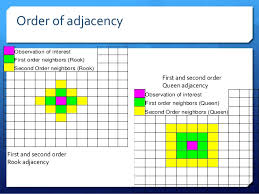

# Week 6 : Spatial autocorrelation

This session we begin to ...

```{r, message=FALSE, warning=FALSE}
library(sf)
library(tmap)
library(dplyr)
library(sp)
library(spdep)
```

## Get data

So, let's start by getting some data. We are going to take some of the data from past weeks. In getting the data ready you will have one more opportunity to practice how to read data into R but also how to perform some basic spatial checks, transformations and operations. It may seem like you have already done some of this stuff. But that's the point: to force you to practice. The more you do this stuff, the easier it will be and -trust us- eventually things will click and become second nature. First let's get the LSOA boundary data.

```{r}
shp_name <- "data/BoundaryData/england_lsoa_2011.shp"
manchester_lsoa <- st_read(shp_name)

```

Now check the coordinate system.

```{r}
st_crs(manchester_lsoa)
```

There is no EPSG code assigned, but notice the datum is given for BNG. Let's address this.

```{r}
lsoa_WGS84 <- st_transform(manchester_lsoa, 4326)
st_crs(lsoa_WGS84)
plot(st_geometry(lsoa_WGS84))
rm(manchester_lsoa)
```

Let's add the burglary data from Greater Manchester. We have practiced this code in previous sessions so we won't go over it on detail again, but try to remember and understand what each line of code rather than blindly cut and paste. If you don't understand what each of these lines of codes is doing call us out.

```{r}
#Read into R
crimes <- read.csv("https://raw.githubusercontent.com/jjmedinaariza/CrimeMapping/master/gmpcrime.csv")
#Filter out to select burglary
burglary <- filter(crimes, crime_type == "Burglary")
#Transform into spatial object
burglary_spatial = st_as_sf(burglary, coords = c("long", "lat"), 
                 crs = 4326, agr = "constant")
#Remove redundant non spatial burglary object
rm(burglary)
rm(crimes)
#Select burglaries that intersect with the Manchester city LSOA map.
bur_mc <- st_intersects(lsoa_WGS84, burglary_spatial)
bur_mc <- burglary_spatial[unlist(bur_mc),]
#Check results
plot(st_geometry(bur_mc))
#Remove redundant objects
rm(burglary_spatial)
```

We have the burglaries, let's now count how many burglaries there is within each LSOA polygon. This is a point in polygon operation that we cover a couple of weeks ago. If the code or the notion does not make much sense to you make sure you review the relevant session from week 4.

```{r}
#Point in polygon spatial operation
burglaries_per_lsoa <- bur_mc %>% 
  st_join(lsoa_WGS84, ., left = FALSE) %>% 
  count(code)
#Let's rename the column with the count of burglaries (n) into something more meaningful
burglaries_per_lsoa <- rename(burglaries_per_lsoa, burglary = n)
#Plot with tmap
tm_shape(burglaries_per_lsoa) + 
  tm_fill("burglary", style = "quantile", palette = "Reds") +
  tm_borders(alpha = 0.1) +
  tm_layout(main.title = "Burglary counts", main.title.size = 0.7 ,
            legend.position = c("right", "bottom"), legend.title.size = 0.8)
```

Do you see any patterns? Are burglaries randomly spread around the map? Or would you say that areas that are closer to each other tend to be more alike? Is there evidence of clustering? Do burglaries seem to appear in certain pockets of the map? In this session we are going to discuss ways in which you can quantify the answer to this question. We will discuss measures of global spatial autocorrelation, which essentially aim to answer the degree to which areas that are near each other tend to be more alike. We say global because we are interested in the degree of clustering not on the location of the clusters. Later we will also cover techniques to identify local clusters of autocorrelation, but for now we will focus in quantifying whether areas are (on average) alike their neighbours.


## What is a neighbour?

Previously I asked whether areas are alike their neighbours or to areas that are close. But what is a neighbour? Or what do we mean by close? How can one define a set of neighbours for each area? If we want to know if what we measure in a particular area is similar to what happens on its neighbouring areas, we need to establish what we mean by a neighbour. 

There are various ways of defining a neighbour. We can say that two areas are neighbours if they share boundaries, if they are next to each other. In this case we talk of neighbours by **contiguity**. By contiguous you can, at the same time, mean all areas that share common boundaries (what we call contiguity using the **rook** criteria, like in chess) or areas that share common boundaries and common *corners*, that is, that have any point in common (and we call this contiguity using the **queen** criteria). 

When defining neighbours by contiguity we may also specify the *order* of contiguity. **First order contiguity** means that we are focusing on areas immediately contiguous. **Second order** means that we consider neighbours only those areas that are immediately contiguous to our first order neighbours (only the yellow areas in the figure below) and you could go on and on. Look at the graphic below for clarification:



[Source](https://www.slideshare.net/CoreySparks/spatial-statistics-presentation-texas-am-census-rdc) 

Alternatively we may define neighbours **by distance**. You can consider neighbours those areas that distant-wise are close to each other (regardless of whether boundaries are shared). In other words, areas will be defined as neighbours if they are within a specified radius.

In sum, adjacency is an important concept in some spatial analysis. In some cases objects are considered ajacent when they “touch”, e.g. neighboring countries. Contiguity measures tend to be more common when studying areas. It can also be based on distance. This is the most common approach when analyzing point data, but can also be relevant when studying areas.

You will come across the term **spatial weight matrix** at some point or, using mathematical notation, W. Essentially the spatial weight matrix is a n by n matrix with ones and zeroes (in the case of contiguity based definitions) identifying if any two observations are neighbours. So you can think of the spatial weight matrix as the new data table that we are constructing with our definition of neighbours, whichever this is.

How do you build such a matrix with R? Well, let's turn to that. But to make things a bit simpler, let's focus not on the whole of Manchester, but just in the LSOAs within the city centre. We will use familiar code to clip the spatial object with the counts of burglaries to only those that intersect with the City Centre ward. Again, we have covered this code elsewhere, so we won't explain here in detail. But don't just cut and paste, if there is anything in this code you don't fully understand you are expected to ask us.

```{r}
#Read a geojson file with Manchester wards
manchester_ward <- st_read("https://raw.githubusercontent.com/RUMgroup/Spatial-data-in-R/master/rumgroup/data/wards.geojson")
#Create a new object that only has the city centre ward
df1 <- manchester_ward %>%
  filter(wd16nm == "City Centre")
#Change coordinate systems
cc_ward <- st_transform(df1, 4326)
#Check if they match those of the imd_gm object
st_crs(cc_ward) == st_crs(burglaries_per_lsoa)
#Get rid of objects we no longer need
rm(manchester_ward)
rm(df1)
#Intersect
cc_intersects <- st_intersects(cc_ward, burglaries_per_lsoa)
cc_burglary <- burglaries_per_lsoa[unlist(cc_intersects),]
#Plot with tmap
tmap_mode("view")
tm_shape(cc_burglary) + 
  tm_fill("burglary", style = "quantile", palette = "Reds", id="code") +
  tm_borders() +
  tm_layout(main.title = "Burglary counts", main.title.size = 0.7 ,
            legend.position = c("right", "top"), legend.title.size = 0.8)

```

So now we have a new spatial object cc_burglary with the 23 LSOA units that compose the City Centre of Manchester. By focusing in a smaller subset of areas we can understand perhaps a bit better what comes next. But again we carry on. Do you perceive here some degree of spatial autocorrelation?

### Homework 1

*The id argument in the tm_fill ensures that when you click over any of the areas you get not only the count of burglaries in that LSOA (the quantity we are mapping) gets displayed within a bubble, but you also get to see the code that identifies that LSOA.*

*Move your cursor over the LSOA covering Beswick. You will see this area had 58 burglaries in 2017 and that the LSOA identifier is E01033688. Using the rook criteria identify the first order neighbors of this LSOA. List their identifiers. Are things different if we use the queen criteria? If so, how does it change? Now. Think and think hard about what the lecture by Luc Anseling discussed. Have you identified all the neighbours of this area? (there are multiple ways of answering this question, just make sure you reason your answer).*

## Creating a list of neighbours

It would be very, very tedious having to identify the neighbours of all the areas in our study area in the way we have done in homework 1. That's why we love computers. We can automate tedious work so that they do it and we have more time to do fun stuff. We can use code to get the computer to establish what areas are next to each other (if we are using a contiguity based definition of being a neighbour).

We have already discussed how sf is new kid in town and although package developers are quickly trying to adapt their packages to work with sf, many of the existing spatial packages still expect sp objects. So to illustrate the concepts in this week session we are first going to turn our sf object into sp.

```{r}
#Before we do that I want to turn the factor identifiying the LSOAs into a character vector (since I will need this later on)
cc_burglary$lsoa_code <- as.character(cc_burglary$code)
#We coerce the sf object into a new sp object that we are calling bur_ccsp (remember names are arbitrary)
bur_ccsp <- as(cc_burglary, "Spatial")

```

In order to identify neighbours we will use the *poly2nb()* function from the *spdep* package that we loaded at the beginning of our session. The *spdep* package provides basic functions for building neighbour lists and spatial weights, tests for spatial autocorrelation for areal data like Moran's I, and functions for fitting spatial regression models. 

This function builds a neigbours list based on regions with contiguous boundaries. If you look at the documentation you will see that you can pass a "queen" argument that takes TRUE or FALSE as options.If you do not specify this argument the default is set to true, that is, if you don't specify queen = FALSE this function will return a list of first order neighbours using the Queen criteria.

```{r}

w <- poly2nb(bur_ccsp, row.names=bur_ccsp$lsoa_code)
class(w)
```

This has created a nb, neighbour list object. We can get some idea of what's there if we ask for a summary.

```{r}
summary(w)
```

This is basically telling us that using this criteria each LSOA polygon has an average of 4.3 neighbours (when we just focus on the city centre) and that all areas have some neighbours (there is no islands). The link number distribution gives you the number of links (neighbours) per area. So here we have 3 polygons with 2 neighbours, 3 with 3, 6 with 4, and so on. The summary function here also identifies the areas sitting at both extreme of the distribution.

For more details we can look at the structure of w.

```{r}
str(w)
```

We can graphically represent the links using the following code:

```{r}
#We first plot the boundaries
plot(bur_ccsp, col='gray', border='blue', lwd=2)
#Then we use the coordinates function to obtain the coordinates of the polygon centroids
xy <- coordinates(bur_ccsp)
#Then we draw lines between the polygons centroids for neighbours that are listed as linked in w
plot(w, xy, col='red', lwd=2, add=TRUE)
```

## Generating the weight matrix

We can transform w into a spatial weights matrix. A spatial weights matrix reflects the intensity of the geographic relationship between observations. For this we use the *spdep* function *nb2mat()*.

```{r}
wm <- nb2mat(w, style='B')
wm
```

This matrix has values of 0 or 1 indicating whether the elements listed in the rows are adjacent (using our definition, which in this case was the Queen criteria) with each other. The diagonal is full of zeroes. An area cannot be a neighbour of itself. So, if you look at the first two and the second column you see a 1. That means that the LSOA with the code E01005065 is a neighbour of the second LSOA (as listed in the rows) which is E01005066. You will zeroes for many of the other columns because this LSOA only has 4 neighbours.

### Homework 2
*Looking at this matrix identify the other 3 neigbours of E01005065*

In many computations we will see that the matrix is row standardised. We can obtain a row standardise matrix changing the code:

```{r}
wm_rs <- nb2mat(w, style='W')
wm_rs
```

Row standardisation of a matrix ensure that the sum of the rows adds up to 1. So, for example, if you have four neighbours and that has to add up to 4, you need to divide 1 by 4, which gives you 0.25. So in the columns for a polygon with 4 neighbours you will see 0.25 in the column representing each of the neighbours.

## Compute Moran's I

The most well known measure of spatial autocorrelation is the Moran's I. It was developed by Patrick Alfred Pierce Moran, an Australian statistician. You can find the formula and some explanation in [the wikepedia article](https://en.wikipedia.org/wiki/Moran's_I). The video lecture by Luc Anselin covers an explanation of Moran's I. We strongly recommend you watch the video. You can also find helpful [this link](https://pro.arcgis.com/en/pro-app/tool-reference/spatial-statistics/h-how-spatial-autocorrelation-moran-s-i-spatial-st.htm) if things are still unclear. The formula you see may look intimidating but it is nothing but the formula for standard correlation expanded to incorporate the spatial weight matrix.

Before we can use the functions from spdep to compute the global Moran's I we need to create a ‘listw’ type spatial weights object (instead of the matrix we used above). To get the same value as above we use “style=’B’” to use binary (TRUE/FALSE) distance weights.

(try row standardising)

```{r}
ww <-  nb2listw(w, style='B')
ww
```

Now we can use the moran function. Have a look at ?moran. The function is defined as ‘moran(y, ww, n, Szero(ww))’. Note the odd arguments n and S0. I think they are odd, because “ww” has that information. Anyway, we supply them and it works. There probably are cases where it makes sense to use other values.

```{r}
moran(bur_ccsp$burglary, ww, n=length(ww$neighbours), S0=Szero(ww))
```

So the Moran's I here is 0.12, which is not very large. But still. We can now run a test of statistical significance for this statistic. 

The Spatial Autocorrelation (Global Moran's I) tool is an inferential statistic, which means that the results of the analysis are always interpreted within the context of its null hypothesis. For the Global Moran's I statistic, the null hypothesis states that the attribute being analyzed is randomly distributed among the features in your study area; said another way, the spatial processes promoting the observed pattern of values is random chance. Imagine that you could pick up the values for the attribute you are analyzing and throw them down onto your features, letting each value fall where it may. This process (picking up and throwing down the values) is an example of a random chance spatial process. When the p-value returned by this tool is statistically significant, you can reject the null hypothesis. 

In some software you can use statistical tests invoking asymptotic theory, but the only appropriate way of doing these tests is by using a Monte Carlo procedure. The way Monte Carlo works is that the values of burglary are randomly assigned to the polygons, and the Moran’s I is computed. This is repeated several times to establish a distribution of expected values. The observed value of Moran’s I is then compared with the simulated distribution to see how likely it is that the observed values could be considered a random draw.

If confused, watch [this quick video](https://www.youtube.com/watch?v=5nM5e2_1OQ0) on monte carlo simulations. 

We use the function `moran.mc()` to run a permutation test for Moran's I statistic calculated by using some number of random permutations of our numeric vector, for the given spatial weighting scheme, to establish the rank of the observed statistic in relation to the simulated values.

We need to specify our variable of interest (burglary), the listw object we created earlier (ww), and the number of permutations we want to run (here we choose 99).

```{r}
set.seed(1234) # The seed number you choose is the starting point used in the generation of a sequence of random numbers, which is why (provided you use the same pseudo-random number generator) you'll obtain the same results given the same seed number. 
burg_moranmc_results <- moran.mc(bur_ccsp$burglary, ww, nsim=99)
burg_moranmc_results
```

So, the probability of observing this Moran's I if the null hypothis was true is `r I(burg_moranmc_results$p.value)`. This is higher than our alpha level of 0.05. In this case, we can conclude that there isn't a significant global spatial autocorrelation.

We can make a “Moran scatter plot” to visualize spatial autocorrelation. Note the row standardisation of the weights matrix.

```{r}
rwm <- mat2listw(wm, style='W')
# Checking if rows add up to 1 (they should)
mat <- listw2mat(rwm)
#This code is simply adding each row to see if we get one when we add their values up, we are only displaying the first 15 rows in the matrix
apply(mat, 1, sum)[1:15]
```

Now we can plot:

```{r}
moran.plot(bur_ccsp$burglary, rwm)
```

The X axis represents the values of our burglary variable in each unit (each LSOA) and the Y axis represents a spatial lag of this variable. A spatial lag in this context is simply the average value of the burglary count in the areas that are considered neighours of each LSOA. So we are plotting the value of burglary against the average value of burglary in the neighbours. And you can see the correlation is almost flat here. As with any correlation measure, you could get **positive spatial autocorrelation**, that would mean that as you move further to the right in the X axis you have higher levels of burglary in the surrounding area. This is what we see here. But the correlation is fairly low and as we saw is not statistically significant. You can also obtain **negative spatial autocorrelation**. That is, that would mean that areas with high level of crime *tend* (it's all about the global average effect!) to be surrounded by areas with low levels of crime. This is clearly not what we see here.

It is very important to understand that global statistics like the spatial autocorrelation (Global Moran's I) tool assess the overall pattern and trend of your data. They are most effective when the spatial pattern is consistent across the study area. In other words, you may have clusters (local pockets of autocorrelation), without having clustering (global autocorrelation). This may happen if the sign of the clusters negate each other.


But don't just take our word for how important this is, or how it's commonly applied in criminological research. Instead, now that you've gone through on how to do this, and have begun to get a sense of understanding, read the following paper on [https://link.springer.com/article/10.1023/A:1007592124641](https://link.springer.com/article/10.1023/A:1007592124641) where the authors make use of Moran's I to explain spatial characteristics of homicide. You will likely see this in other papers as well, and now you will know what it means and why it's important. 


### Homework 3 (Optional Practice)

*You know what is coming, don't you? Yes, you need to compute the Moran's I for burglary again. But this time, you need to do it for the whole of Manchester city. I won't mark you down if you don't try this. But why wouldn't you?*
