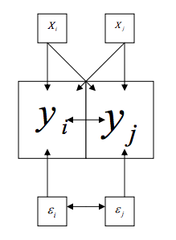
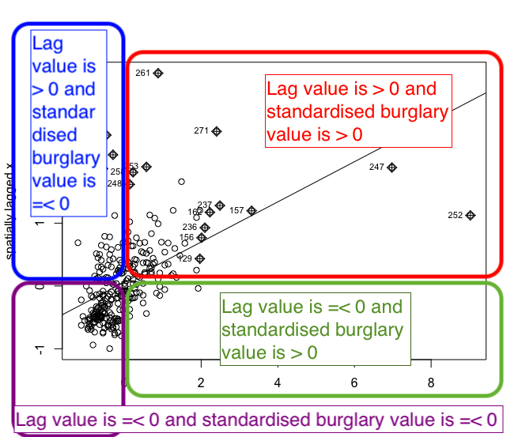

# Week 7 {-}


## Prelude

Last week we learned about global measures of spatial association, in particular the Moran's I statistic, which provide a mechanism to make inferences about a population from a sample. While this is useful for us to be able to assess quantitatively whether crime events cluster in a non-random manner, in the words of [Jerry Ratcliffe](https://pdfs.semanticscholar.org/26d2/356618cd759d04348f1e51c8209b0175bfce.pdf) "this simply explains what most criminal justice students learn in their earliest classes." For example, consider the study of robberies in Philadelphia:


Aggregated to the police districts, this returns a global Moran’s I value (range 1 to 1) of 0.56, which suggests that police sectors with high robbery counts adjoin sectors that also have high robbery counts, and low crime sectors are often neighbors of other low crime sectors, something that should hardly be surprising given the above map [(Ratcliffe, Jerry. "Crime mapping: spatial and temporal challenges." Handbook of quantitative criminology. Springer, New York, NY, 2010. 5-24.)](https://pdfs.semanticscholar.org/26d2/356618cd759d04348f1e51c8209b0175bfce.pdf). 


In today's session we will learn about local indicators of spatial association (LISA) and show how they allow for the decomposition of global indicators, such as Moran's I, into the contribution of each observation. The LISA statistics serve two purposes. On one hand, they may be interpreted as indicators of local pockets of nonstationarity, or hot spots. On the other hand, they may be used to assess the influence of individual locations on the magnitude of the global statistic and to identify “outliers” [(Anselin, Luc. "Local indicators of spatial association—LISA." Geographical analysis 27.2 (1995): 93-115.)](http://onlinelibrary.wiley.com/doi/10.1111/j.1538-4632.1995.tb00338.x/full). 


These are the packages we will use: 

```{r, message=FALSE, warning=FALSE}
library(tmap)
library(dplyr)
library(sp)
library(sf)
library(spdep)
```


## Get data and built the weight matrix

For this week we will be going back to the data from last week about burglary in Manchester city. Below is the code to build this. This is code we have already used and covered in previous sessions. If any of this is confusing, or you need a reminder just refer to last week's notes!


Get the boundary data:


```{r}

shp_name <- "data/BoundaryData/england_lsoa_2011.shp"
manchester_lsoa <- st_read(shp_name)

```


Transform the *CRS* to WGS84:


```{r}
lsoa_WGS84 <- st_transform(manchester_lsoa, 4326)

```


Read the crimes data into R:

```{r}
crimes <- read.csv("https://raw.githubusercontent.com/jjmedinaariza/CrimeMapping/master/gmpcrime.csv")


```

Subset the data:Filter out to select burglary:

```{r}
burglary <- filter(crimes, crime_type == "Burglary")

```


Of course this is just a dataframe, and not (yet) a spatial object. To map, we must first transform into spatial object:

```{r}
burglary_spatial <- st_as_sf(burglary, coords = c("long", "lat"), 
                 crs = 4326,                                            #set the CRS to WGS84
                 agr = "constant")                                      #the 'agr' attribute-geometry-relationship, specifies for each non-geometry attribute column how it relates to the geometry. "constant" is used for attributes that are constant throughout the geometry (e.g. land use)


```


Now we want to select burglaries inside Manchester City. We can use `st_intersects()` to select those that intersect with the Manchester city LSOA map.

```{r}

#intersets
bur_m <- st_intersects(lsoa_WGS84, burglary_spatial)

#subsetting
bur_m <- burglary_spatial[unlist(bur_m),]

```


Count the number of crimes in each LSOA by using the point in polygon spatial operation. 

(remember this might take a while, it's checking every single crime point, which you can see is over 400,000 points!)


```{r}
burglaries_per_lsoa <- bur_m %>% 
  st_join(lsoa_WGS84, ., left = FALSE) %>% 
  count(code)
```


You can see the column with the count of burglaries is called 'n'. (You can View() your data or use the names() function to check what your variables are called). This is not great variable naming, so let's rename n into something more meaningful:

```{r}
burglaries_per_lsoa <- rename(burglaries_per_lsoa, burglary = n)
```


Now that's all our data wrangling done. Woo!


Let's remove all the dataframes and objects we've read in but no longer need, now that we have arrived at our final dataset, `burglaries_per_lsoa`. 

```{r}

#Remove redundant objects
rm(burglary_spatial)
rm(manchester_lsoa)
#Remove redundant non spatial burglary objects
rm(burglary)
rm(crimes)

```


And finally, let's see our map! Plot with tmap:

```{r}
tm_shape(burglaries_per_lsoa) + 
  tm_fill("burglary", style = "quantile", palette = "Reds") +
  tm_borders(alpha = 0.1) +
  tm_layout(main.title = "Burglary counts", main.title.size = 0.7 ,
            legend.position = c("right", "bottom"), legend.title.size = 0.8)

```

Now that we have the data we need to coerce our newly created sf object into sp and then generate the wieght matrix. Again, what we do here is stuff we cover last week. In fact, if you did the optional homework you will also have run this code.

```{r}
#Coerce sf into sp
burglary_m <- as(burglaries_per_lsoa, "Spatial")
#Generate list of neighbours using the Queen criteria
w <- poly2nb(burglary_m, row.names=burglary_m$lsoa_code)
#Generate list with weights using row standardisation
ww <-  nb2listw(w, style='W')

```

## Generating and visualising the LISA measures

The first step before we can generate the LISA map is to compute the local Moran's I. The initial part of the video presentation by Luc Anselin that we expected you to watch explains the formula and logic underpinning these computations and we won't reiterate here that detail. But at least a a general reminder:

*"global tests for spatial autocorrelation introduced last week are calculated from the local relationship between the values observed at a spatial entity and its neighbours, for the neighbourhood definition chosen. Because of this, we can break global measures down into their components, and by extension, construct localised tests intended to detect **'clusters'** -observations with very similar neighbours- and"* **spatial outliers** *"observations with very different neighbours"* (Bivand et al. 201)

Let's first look at the Moran's scatterplot:

```{r}
moran.plot(burglary_m$burglary, ww)
```

Notice how the plot is split in 4 quadrants. The top right corner belongs to areas that have high level of burglary and are surrounded by other areas that have above the average level of burglary. This are the high-high locations that Luc Anselin referred to. The bottom left corner belongs to the low-low areas. These are areas with low level of burglary and surrounded by areas with below average levels of burglary. Both the high-high and low-low represent clusters. A high-high cluster is what you may refer to as a hot spot. And the low-low clusters represent cold spots. In the opposite diagonal we have *spatial outliers*. They are not outliers in the standard sense, extreme observations, they are outliers in that they are surrounded by areas that are very unlike them. So you could have high-low spatial outliers, areas with high levels of burglary and low levels of surrounding burglary, or low-high spatial outliers, areas that have themselves low levels of burglary (or whatever else we are mapping) and that are surrounded by areas with above average levels of burglary.

You can also see here that the positive spatial autocorrelation is more noticeable when we focus on the whole of Manchester city, unlike what we observed when only looked at Manchester city. You can check this running the global Moran's I.

```{r}
moran(burglary_m$burglary, ww, n=length(ww$neighbours), S0=Szero(ww))
moran.mc(burglary_m$burglary, ww, nsim=99999)
```

You can see that the global Moran's is 0.32 and that is highly significant. There is indeed global spatial autocorrelation. Knowing this we can try to decompose this, figure out what is driving this global measure.

To compute the local Moran we can use a function from the *spdep* package.

```{r}
locm_bm <- localmoran(burglary_m$burglary, ww)
summary(locm_bm)
```

The first column provides the summary statistic for the local moran statistic. Being local you will have one for each of the areas. The last column gives you a p value for this statistic. In order to produce the LISA map we need to do some previous work. First we are going to create some new variables that we are going to need:


First we scale the variable of interest. When we scale burglary what we are doing is re-scaling the values so that the mean is zero. See an explanation of what this does [here](http://www.gastonsanchez.com/visually-enforced/how-to/2014/01/15/Center-data-in-R/). 

We use `scale()`, which is a generic function whose default method centers and/or scales the variable. Here centering is done by subtracting the mean (omitting NAs) the corresponding columns, and scaling is done by dividing the (centered) variable by their standard deviations:

```{r}
#scale the variable of interest and save it to a new column
burglary_m$S_burglary <- scale(burglary_m$burglary) %>% as.vector()
```


We've also added `as.vector()` to the end, because 


Now we also want to account for the spatial dependence of our values. Remember how we keep saying about "The First Law of Geography", according to [Waldo Tobler](https://en.wikipedia.org/wiki/Waldo_R._Tobler), is "everything is related to everything else, but near things are more related than distant things."


So what do we mean by this spatial dependence? When a value observed in one location depends on the values observed at neighboring locations, there is a **spatial dependence**. And spatial data may show spatial dependence in the variables and error terms.


*Why should spatial dependence occur?* There are two reasons commonly given. First, data collection of observations associated with spatial units may reflect measurement error. This happens when the boundaries for which information is collected do not accurately reflect the nature of the underlying process generating the sample data. A second reason for spatial dependence is that the spatial dimension of a social or economic characteristic may be an important aspect of the phenomenon. For example, based on the premise that location and distance are important forces at work, regional science theory relies on notions of spatial interaction and diffusion effects, hierarchies of place and spatial spillovers. 


There are two types of dependence, spatial error and spatial lag. Here we focus on spatial lag. 


**Spatial lag** is when the dependent variable y in place i is affected by the independent variables in both place i and j. 




This will be important to keep in mind when considering spatial regression. With spatial lag in ordinary least square regression, the assumption of uncorrelated error terms is violated, becasuse near things will have associated error terms. Similarly, the assumption of independent observations is also violated, as the observations are influenced by the other observations near them. As a result, the estimates are biased and inefficient. Spatial lag is suggestive of a possible diffusion process – events in one place predict an increased likelihood of similar events in neighboring places. 


So to be able to account for the spatial lag in our model, we must create a variable to account for this. We can do this with the `lag.listw()` function. Remember from last week: a spatial lag in this context is simply the average value of the burglary count in the areas that are considered neighours of each LSOA. So we are plotting the value of burglary against the average value of burglary in the neighbours. 


For this we need our listw object, which is the `ww` object created earlier, when we generated the list with weights using row standardisation. We then pass this listw object into the `lag.listw()` function, which computes  the spatial lag of a numeric vector using a listw sparse representation of a spatial weights matrix. 


```{r}
#create a spatial lag variable and save it to a new column
burglary_m$lag_s_burglary <- lag.listw(ww, burglary_m$S_burglary)
```


Make sure to check the summaries to ensure nothing weird is going on


```{r}

summary(burglary_m$S_burglary)
summary(burglary_m$lag_s_burglary)
```

We can create a Moran scatter plot so that you see that nothing has changed apart from the scale in wich we are using the variables. The observations that are influential are higlighted in the plot as you can see.

```{r}
x <- burglary_m$S_burglary
y <- burglary_m$lag_s_burglary
xx <- data_frame(x,y)
moran.plot(x, ww)
```

We are now going to create a new variable to identify the quadrant in which each observation falls within the Moran Scatter plot, so that we can tell apart the high-high, low-low, high-low, and low-high areas. We will only identify those that are significant according to the p value that was provided by the local moran function.


Before we get started, let's quickly review the tools we will use. 

All our data is in this `burglary_m` dataframe. This has a variable for the LSOA code (`code`), a variable for the number of burglaries (`burglary`), and then also the two variables we created, the scaled measure of burglary (`S_burglary`), and the spatial lag measure (`lag_s_burglary`).


We also have our `locm_bm` object, which we created with the `localmoran()` function, that has calculated a variety of measures for each of our observations, which we explored with the `summary()` function. You can see (if you scroll up) that the 5th element in this object is the p-value ("Pr(z > 0)"). To call the nth element of an object, you can use the square brackets after its name. So to return the nth column of thing, you can use `thing[,n]`. Again this should not be new to you, as we've been doing this sort of thing for a while. 


So the data we need for each observation, in order to identify whether it belongs to the high-high, low-low, high-low, or low-high quadrants are the standardised burglary score, the spatial lag score, and the p-value. 


Essentially all we'll be doing, is assigning a variable values based on where in the plot it is. So for example, if it's in the upper right, it is high-high, and has values larger than 0 for both the burglary and the spatial lag values.  It it's in the upper left, it's low-hih, and has a value larger than 0 for the spatial lag value, but lower than 0 on the burglary value. And so on, and so on. Here's an image to illustrate: 





So let's first initialise this variable. In this instance we are creating a new column in the `burglary_m` dataframe and calling it `quad_sig`. 


We are using the `mutate()` function from the tidyverse package to create our new variable, just as we have in previous labs. 

We also use nested ifelse() statements. Nested ifelse() just means that it's an ifelse() inside and ifelse() statement. To help us with these sorts of situations is the `ifelse()` function. We saw this with the previous exercises, but I'll describe it brielfy again. It allows us to conditionally assign some value to some variable. The structure of the function is so that you have to pass it a condition, then a value to assign if the condition is true, and then another value if the condition is false. You are basically using this function to say: "if this condition is true, do first thing, else, do the second thing". It would look something like this:


```{r, eval=FALSE}

dataframe$new_variable <- ifelse(dataframe$some_numeric_var < 100, "smaller than 100", "not smaller than 100")

```

When nesting these, all you do is put another condition to check in the "thing to do if false", so it checks all conditions. So in the first instance we check if the value for burglary is greater than zero, and the value for the lag is greater than zero, and the p-value is smaller than our threshol of 0.05. If it is, then this should belong to the "high-high" group. If any one of these conditions is not met, then we move into the 'thing to do if false' section, where we now check agains another set of criteria, and so on and so on. If none of these are met, we assign it the non-significant value: 


```{r}
burglary_m <- st_as_sf(burglary_m) %>% 
  mutate(quad_sig = ifelse(burglary_m$S_burglary > 0 & 
                                         burglary_m$lag_s_burglary > 0 & 
                                         locm_bm[,5] <= 0.05, 
                     "high-high",
                     ifelse(burglary_m$S_burglary <= 0 & 
                              burglary_m$lag_s_burglary <= 0 & 
                              locm_bm[,5] <= 0.05, 
                     "low-low", 
                     ifelse(burglary_m$S_burglary > 0 & 
                              burglary_m$lag_s_burglary <= 0 & 
                              locm_bm[,5] <= 0.05, 
                     "high-low",
                     ifelse(burglary_m$S_burglary <= 0 & 
                              burglary_m$lag_s_burglary > 0 & 
                              locm_bm[,5] <= 0.05,
                     "low-high", 
                     "non-significant")))))
```


(Note we had to wrap our data in a `st_as_sf()` function, to covert back to sf object). 


Now we can have a look at what this returns us: 

```{r}

table(burglary_m$quad_sig)

```

This looks like a lot of non-significant results. We want to be sure this isn't an artefact of our code but is true, we can check how many values are under 0.05:


```{r}

nrow(locm_bm[locm_bm[,5] <= 0.05,])

```


We can see that only 23 areas have p-values under 0.05 threshold. So this is in line with our results, and we can rest assured. 


Well, this is exciting, but where are these regions?

Let's put 'em on a map, just simply, using quick thematic map (`qtm()`): 


```{r}

qtm(burglary_m, fill="quad_sig", fill.title="LISA")


```


Very nice!


So how do we interpret these results? Well keep in mind: 

- The LISA value for each location is determined from its individual contribution to the global Moran's I calculation.
- Whether or not this value is statistically significant is assessed by comparing the actual value to the value calculated for the same location by randomly reassigning the data among all the areal units and recalculating the values each time (the Monte Carlo simulation approach discussed earlier).


So essentially this map now tells us that there was statistically significant moderate clustering in burglaries in Manchester.  When reporting your results, report at least the Moran’s I test value and the p value.  So, for this test, you should report Moran’s I = 0.32, p < .001. Including the LISA cluster map is also a great way of showing how the attribute is actually clustering.  


