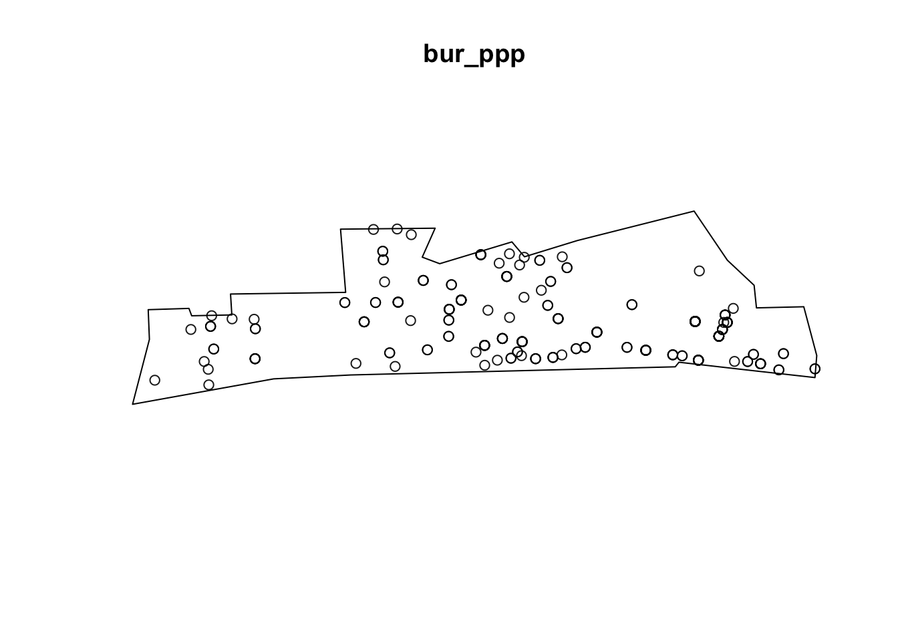
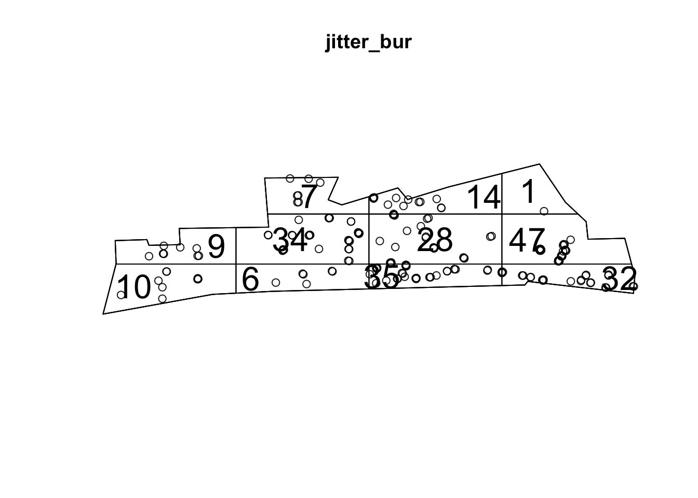
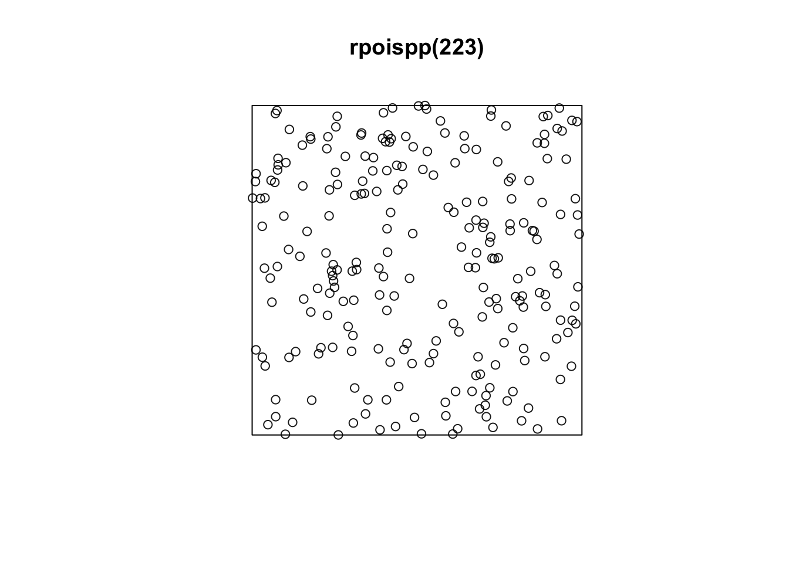
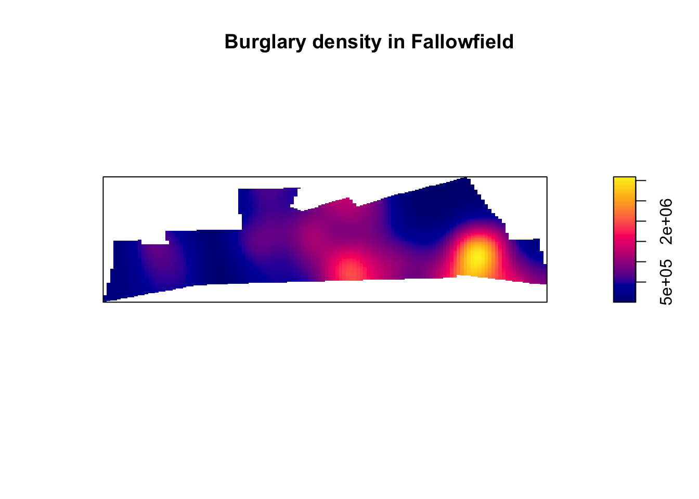
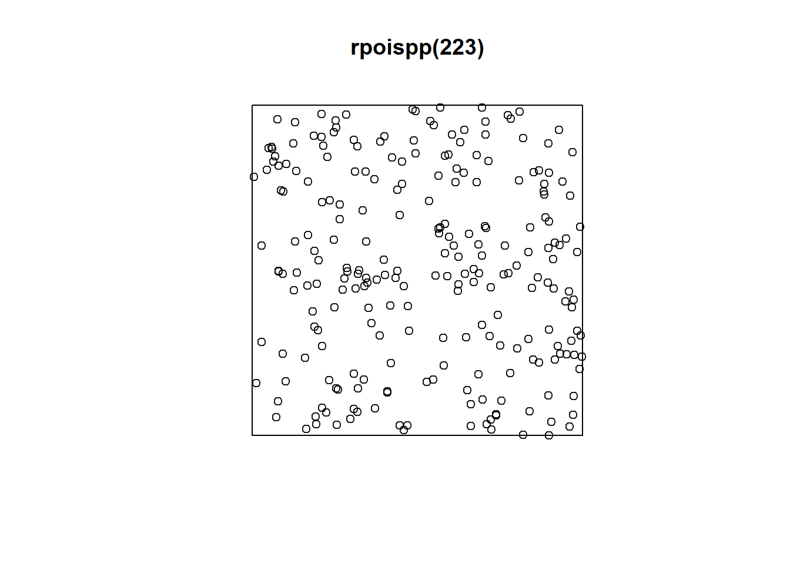

# Studying spatial point patterns


## What we'll do today

We have now covered quite a bit. You've learnt about spatial objects and various formats in which they come and are stored by R, how to produce maps using a variety of packages, and also provided you with a brief introduction to common spatial operations. In what remains of the semester we are going to shift the emphasis and start focusing a bit more on spatial statistics. First we will focus on techniques that are used to explore and analyse points in a geographical space and in subsequent sessions we will cover techniques that are used to analyse spatial data when our unit of analysis are polygons (e.g., postal code areas, census areas, police beats, etc).

We will introduce a new R package called **spatstat**, that was developed for spatial point pattern analysis and modelling. It was written by Adrian Baddeley and Rolf Turner. There is a [webpage](http://spatstat.org) dedicated to this package. The [thickest book](https://www.crcpress.com/Spatial-Point-Patterns-Methodology-and-Applications-with-R/Baddeley-Rubak-Turner/p/book/9781482210200) in my library, at 810 pages, is dedicated to this package. So as you can imagine the theory and practice of spatial pattern analysis is something one could devote an entire course to. You can get a pdf document used in a course the authors of this package develop [here](https://research.csiro.au/software/wp-content/uploads/sites/6/2015/02/Rspatialcourse_CMIS_PDF-Standard.pdf). In our course we are only going to provide you with an introductory practical entry into this field of techniques. If this package is not installed in your machine, make sure you install it before we carry on.


```r
library(sf)
library(tmap)
library(dplyr)
library(spatstat)
```

## Getting the data

We will using the crime data from Greater Manchester police we have been using so far. Let's focus on burglary in the Fallowfield area. The code below has already been explained and used in previous sessions, so we won't go over the detail again. But rather than cut and paste automatically, try to remember what each line of code is doing.

By the way, the police data for Manchester we have used in previous sessions correspond to only one month of the year. Here we are using a full year worth of data, so the data import will take a bit longer.


```r
#Read a geojson file with Manchester wards
manchester_ward <- st_read("https://raw.githubusercontent.com/RUMgroup/Spatial-data-in-R/master/rumgroup/data/wards.geojson")
```

```
## Reading layer `OGRGeoJSON' from data source `https://raw.githubusercontent.com/RUMgroup/Spatial-data-in-R/master/rumgroup/data/wards.geojson' using driver `GeoJSON'
## Simple feature collection with 215 features and 12 fields
## geometry type:  POLYGON
## dimension:      XY
## bbox:           xmin: 351664 ymin: 381168.6 xmax: 406087.5 ymax: 421039.8
## epsg (SRID):    27700
## proj4string:    +proj=tmerc +lat_0=49 +lon_0=-2 +k=0.9996012717 +x_0=400000 +y_0=-100000 +ellps=airy +towgs84=446.448,-125.157,542.06,0.15,0.247,0.842,-20.489 +units=m +no_defs
```

```r
#Create a new object that only has the city centre ward
df1 <- manchester_ward %>%
  filter(wd16nm == "Fallowfield")
#Change coordinate systems
fallowfield <- st_transform(df1, 4326)
#Get rid of objects we no longer need
rm(manchester_ward)
rm(df1)

#Read Greater Manchester police data
crimes <- read.csv("https://raw.githubusercontent.com/jjmedinaariza/CrimeMapping/master/gmpcrime.csv")
burglary <- filter(crimes, crime_type == "Burglary")

#Transform the dataframe with crime information into a sf object
burglary_spatial = st_as_sf(burglary, coords = c("long", "lat"), 
                 crs = 4326, agr = "constant")

#Select only the crimes that take place within the space defined by the Ward boundaries
# intersection
bur_fal <- st_intersects(fallowfield, burglary_spatial)
```

```
## although coordinates are longitude/latitude, st_intersects assumes that they are planar
```

```r
# subsetting
bur_fal <- burglary_spatial[unlist(bur_fal),]
rm(crimes)
rm(burglary)

#Let's see the results
tm_shape(fallowfield) + 
  tm_fill() +
  tm_shape(bur_fal) +
  tm_dots()
```


In the point pattern analysis literature each point is often referred to as an **event** and these events can have **marks**, attributes or characteristics that are also encoded in the data. In our spatial object one of these *marks* is the type of crime (altough in this case it's of little interest since we have filtered on it).

## Getting the data into spatstat: the problem with duplicates

So let's start using spatstat.The first thing we need to do is to transform our sf object into a **ppp** object which is how spatstat likes to store its point patterns. Unfortunately, spatstat and many other packages for analysis of spatial data precede sf, so the transformation is a bit awkard. Also before we do that, it is important to realise that a point pattern is defined as a series of events in a given area, or window, of observation. It is therefore extremely important to precisely define this window. In *spatstat* the function *owin()* is used to set the observation window. However, the standard function takes the coordinates of a rectangle or of a polygon from a matrix, and therefore it may be a bit tricky to use. Luckily the package *maptools* provides a way to transform a SpatialPolygons into an object of class owin, using the function as.owin 


```r
#First we transform our Falllowfield polygon into a sp object
fallowfield_sp <-as(fallowfield, "Spatial")
#Then we use the as.owin function to define the window
window <- maptools::as.owin.SpatialPolygons(fallowfield_sp)
#Check that this worked
class(window)
```

```
## [1] "owin"
```

```r
window
```

```
## window: polygonal boundary
## enclosing rectangle: [-2.2581074, -2.2141921] x [53.43904, 53.45145] units
```

Now that we have created the window as an owin object let's get the points:


```r
#First we will extract the coordinates from our sf point data into a matrix
sf_bur_fal_coords <- matrix(unlist(bur_fal$geometry), ncol = 2, byrow = T)
#Then we use the ppp function to create the object using the information from our matrix and the window that we created
bur_ppp <- ppp(x = sf_bur_fal_coords[,1], y = sf_bur_fal_coords[,2],
                   window = window, check = T)
```

```
## Warning: data contain duplicated points
```

```r
plot(bur_ppp)
```


Notice the warning message about duplicates. In spatial point pattern analysis an issue of significance is the presence of duplicates. The statistical methodology used for spatial point pattern processes is based largely on the assumption that processes are simple, that is, that the points cannot be coincident. That assumption may be unreasonable in many contexts (for example, the literature on repeat victimisation indeed suggests that we should expect the same households to be at a higher risk of being hit again). Even so the point (no pun intended) is that "when the data has coincidence points, some statistical procedures will be severely affected. So it is always strongly advisable to check for duplicate points and to decide on a strategy for dealing with them if they are present" (Baddeley et al., 2016: 60).

We can check the duplication in a ppp object with the following syntax:


```r
any(duplicated(bur_ppp))
```

```
## [1] TRUE
```

To count the number of coincidence points we use the multiplicity() function. This will return a vector of integers, with one entry for each observation in our dataset, giving the number of points that are identical to the point in question (including itself).


```r
multiplicity(bur_ppp)
```

If you want to know how many locations have more than one event you can use:


```r
sum(multiplicity(bur_ppp) > 1)
```

```
## [1] 190
```

That's quite something. 190 points out of 223 here share coordinates.


```r
tm_shape(fallowfield) + 
  tm_fill() +
  tm_shape(bur_fal) +
  tm_dots(alpha=0.4, size=1)
```



In the case of crime, as we have hinted some of this may be linked to the nature of crime itself. Hint: repeat victimisation. However, this pattern of duplication is fairly obvious across all crime categories in the police.uk website and, although I have not explored this in detail, I strongly suspect it is a function of the anonimisation process used to create these maps. The coordinates provided in the open data are not the exact locations of crimes, but they come from a list of points generated for purposes of data publication. You can see the details [here](https://data.police.uk/about/#anonymisation). This process is likely inflating the amount of duplication we observe. So keep in mind when analysing and working with this data that it is not the same as working with the real locations.

What to do about duplicates in spatial point pattern analysis is not always clear. You could simply delete the duplicates, but of course that may ignore issues such as repeat victimisation. You could also use jittering, which will add a small perturbation to the duplicate points so that they do not occupy the exact same space. Which again, may ignore things like repeat victimisation. Another alternative is to make each point "unique" and then attach the multiplicites of the points to the patterns as *marks*, as attributes of the points. Then you would need analytical techniques that take into account these marks.

If you were to be doing this for real you would want access to the real thing, not this public version of the data and then go for the second solution suggested above. We don't have access to the source data, so for the sake of simplicity and so that we can illustrate how spatstat works we will add some jittering to the data. The first argument for the function is the object, retry asks whether we want the algorithm to have another go if the jittering places a point outside the window (we want this so that we don't loose points), and the drop argument is used to ensure we get a ppp object as a result of running this function.


```r
jitter_bur <- rjitter(bur_ppp, retry=TRUE, nsim=1, drop=TRUE)
plot(jitter_bur)
```


Notice the difference with the original plot. Can you see how the circumferences do not overlap perfectly now?

## Inspecting our data with spatstat

This package supports all kind of exploratory point pattern analysis. One example of this is quadrant counting. One could divide the window of observation into quadrants and count the number of points into each of these quadrants. For example, if we want four quadrants along the X axis and 3 along the Y axis we could used those parameters in the quadratcount() function. Then we just use standard plotting functions from R base.


```r
Q <- quadratcount(jitter_bur, nx = 4, ny = 3)
plot(jitter_bur)
plot(Q, add = TRUE, cex = 2)
```



In the video lectures by Luc Anselin would were exposed to the notion of complete spatial randomness (CSR). When we look at a point pattern process the first step in the process is whether it has been generated in a random manner. Under CSR, points are independent of each other and have the same propensity to be found at any location. We can generate data that conform to complete spatial randomness using the *rpoispp()* function. The r at the beginning is used to denote we are simulating data (you will this is common in R) and we are using a Poisson point process. Let's generate 223 points in a random manner:


```r
plot(rpoispp(223))
```



You will notice that the points in a homogeneous Poisson process are not ‘uniformly spread’: there are empty gaps and clusters of points. Run the previous command a few times. You will see the map generated is different each time.

In classical literature, the homogeneous Poisson process (CSR) is usually taken as the appropriate ‘null’ model for a point pattern. Our basic task in analysing a point pattern is to find evidence against CSR. We can run a Chi Square test to check this. So, for example:


```r
quadrat.test(jitter_bur, nx = 3, ny = 2)
```

```
## 
## 	Chi-squared test of CSR using quadrat counts
## 	Pearson X2 statistic
## 
## data:  jitter_bur
## X2 = 113.09, df = 5, p-value < 2.2e-16
## alternative hypothesis: two.sided
## 
## Quadrats: 6 tiles (irregular windows)
```

Observing the results we see that the p value is well below convential standards for rejection of the null hypothesis. Observing data as the one we have for burglary in Fallowfield would be extremely rare if the null hypothesis was true. We can then conclude that the burglary data is not randomly distributed in the observed space. But no cop nor criminologist would really question this. We do know that crime is not randomly distributed in space. 

## Density estimates

In the presentations by Luc Anselin and the recommended reading materials we introduced the notion of density maps. Kernel density estimation involves applying a function (known as a “kernel”) to each data point, which averages the location of that point with respect to the location of other data points. 


```r
ds <- density(jitter_bur)
class(ds)
```

```
## [1] "im"
```

```r
plot(ds, main='Burglary density in Fallowfield')
```



The density function is estimating a kernel density estimate. Density is nothing but the number of points per unit area. This method computes the intensity continuously across the study area and the object return is a raster image. To perform this analysis in R we need to define the bandwidth of the density estimation, which basically determines the area of influence of the estimation. There is no general rule to determine the correct bandwidth; generally speaking if h is too small the estimate is too noisy, while if h is too high the estimate may miss crucial elements of the point pattern due to oversmoothing (Scott, 2009). 

The key argument to pass to the density method for point patterm objects is sigma=, which determines the bandwidth of the kernel. In spatstat the functions bw.diggle, bw.ppl, and bw.scott can be used to estimate the bandwidth according to difference methods. The helpfiles recommend the use of the first two. These functions run algorithms that aim to select an appropriate bandwith.


```r
bw.diggle(jitter_bur)
```

```
##        sigma 
## 4.249614e-05
```

```r
bw.ppl(jitter_bur)
```

```
##        sigma 
## 0.0003976453
```

```r
bw.scott(jitter_bur)
```

```
##      sigma.x      sigma.y 
## 0.0040705902 0.0008410683
```

You can see the Diggle algorithm gives you the narrower bandwith. We can test how they work with our dataset using the following code:


```r
par(mfrow=c(2,2))
plot(density.ppp(jitter_bur, sigma = bw.diggle(jitter_bur),edge=T),
     main = paste("h = 0.000003"))

plot(density.ppp(jitter_bur, sigma = bw.ppl(jitter_bur),edge=T),
     main=paste("h =0.0005"))

plot(density.ppp(jitter_bur, sigma = bw.scott(jitter_bur)[2],edge=T),
     main=paste("h = 0.0008"))

plot(density.ppp(jitter_bur, sigma = bw.scott(jitter_bur)[1],edge=T),
     main=paste("h = 0.004"))
```



Baddeley et (2016) suggest the use of the bw.ppl algorithm because in their experience it tends to produce the more appropriate values when the pattern consists predominantly of tight clusters. But they also insist that to detect a single tight cluster in the midst of random noise the bw.diggle method seems to work best.

## Adding some context

Often it is convenient to use a basemap to provide context. In order to do that we first need to turn the image object generated by the spatstat package into a raster object, a more generic format for raster image used in R. 

```r
library(raster)
```

```
## Loading required package: sp
```

```
## 
## Attaching package: 'raster'
```

```
## The following objects are masked from 'package:spatstat':
## 
##     area, rotate, shift
```

```
## The following object is masked from 'package:nlme':
## 
##     getData
```

```
## The following object is masked from 'package:dplyr':
## 
##     select
```

```r
dmap1 <- density.ppp(jitter_bur, sigma = bw.ppl(jitter_bur),edge=T)
r1 <- raster(dmap1)
#remove very low density values
r1[r1 < 0.0001 ] <- NA
class(r1)
```

```
## [1] "RasterLayer"
## attr(,"package")
## [1] "raster"
```

Now that we have the raster we can add it to a basemap. 

Two-dimensional RasterLayer objects (from the raster package) can be turned into images and added to Leaflet maps using the addRasterImage function.

The addRasterImage function works by projecting the RasterLayer object to EPSG:3857 and encoding each cell to an RGBA color, to produce a PNG image. That image is then embedded in the map widget.

It’s important that the RasterLayer object is tagged with a proper coordinate reference system. Many raster files contain this information, but some do not. Here is how you’d tag a raster layer object “r” which contains WGS84 data:


```r
library(leaflet)

#make sure we have right CRS. We need the sp package for setting CRS to this raster: 
library(sp)
crs(r1) <- sp::CRS("+proj=longlat +ellps=WGS84 +datum=WGS84 +no_defs")

#we also create a colour palet
pal <- colorNumeric(c("#0C2C84", "#41B6C4", "#FFFFCC"), values(r1),
  na.color = "transparent")

#and then make map!
leaflet() %>% 
  setView(lng = -2.225814, lat = 53.441315, zoom = 14) %>% 
  addTiles() %>%
  addRasterImage(r1, colors = pal, opacity = 0.8) %>%
  addLegend(pal = pal, values = values(r1),
    title = "Burglary map")
```

<!--html_preserve--><div id="htmlwidget-9a03ed1482eb4b48d945" style="width:672px;height:480px;" class="leaflet html-widget"></div>
<script type="application/json" data-for="htmlwidget-9a03ed1482eb4b48d945">{"x":{"options":{"crs":{"crsClass":"L.CRS.EPSG3857","code":null,"proj4def":null,"projectedBounds":null,"options":{}}},"setView":[[53.441315,-2.225814],14,[]],"calls":[{"method":"addTiles","args":["//{s}.tile.openstreetmap.org/{z}/{x}/{y}.png",null,null,{"minZoom":0,"maxZoom":18,"tileSize":256,"subdomains":"abc","errorTileUrl":"","tms":false,"noWrap":false,"zoomOffset":0,"zoomReverse":false,"opacity":1,"zIndex":1,"detectRetina":false,"attribution":"&copy; <a href=\"http://openstreetmap.org\">OpenStreetMap<\/a> contributors, <a href=\"http://creativecommons.org/licenses/by-sa/2.0/\">CC-BY-SA<\/a>"}]},{"method":"addRasterImage","args":["data:image/png;base64,iVBORw0KGgoAAAANSUhEUgAAAIAAAACACAYAAADDPmHLAAAgAElEQVR4nO1926s0WZbXb+0dkXm+S3VVtdXtaNuOlELDSDuOPdoo6iA4iA++DP4B6tMIPgjS3vrVnumeYdQRZARB32QexDfxWfCCouOlUFAYEKdbume66ar6qr5zMiP2Wj6sy94RGXlOZp5z6jtZ31mQ55IZGbFjr/s1SETwCK8vpFe9gEd4tfBIAK85PBLAaw6PBPCawyMBvObwSACvOTwSwGsOjwTwmsMjAbzm8EgArzl0r3oBdw1f/BO/JMO2YLstGAtDBHjx3tfpVa/rocKDJoA3vvyNSFQQAX2X8fRZj36dMW4Lhk1Bv87o1h14ZJSRQaTHOnxakP/Gl78h93EvD1YFtMgPEAEXAY/2O/5ncOFXsMpPBnwvFvfklvCgJcAcRABmRikEZoEwUIqARoawAATYj08N3AfSWzgfAhBAYByfGMwqAYgZpejnRARK+venAe4b+cADVgFzEJgEEEEpohJAoIRQ9CVir1e9WIPbIPCTQD5wThIASgTMQCIxLhcIEwpkIv2VEF7ZMj8x5N0FnI0EAKBqYIZcFpUG7UvYDn4FcBfIv+4cd01cZyYBBBBlc3X3aCL2iU1KvCIJcE6c73BWBAAogomAlEhtACjXEwEsABgQVoL48L9/cjGAz9wR8j9pIjovFQDj/ERIXUJKFb9qEJpRKLi1Bvj8T37r4DO89eM/J+fqfZ4dAQDK/TknpEwgUuSL2QfsdsItKOCdr3xT6MCdeecr3xSiM8U+zpAAiICUCblPyDnBN18gQQS30f+f/Ymfl0SERITf8dVfuPZMn/vKNyWREiHdgQg4VPzfpZo4QwIgpJSQu4TU0STuH0QAOUkF/MhXf0FUxaiaoXQ9Uj3wlJQCFuGhG4bnRwBQCZC6hJRT3XzT+y76j931H/uZXxEiQrxuIABXEykpERDOMwh9Zl6AIpuIlAiyIQqAp4LoBOb/6td+VeCivHntg9/5R39RCAhicTUQhHhGcFYSwCIA1RNItIOoY/f/j/zVfyYoDEdoaqUAEX7Pn/p7k1O++6f/vlCyz1FVxbkagmdFAAGKrdj4JRV8SO78S3/uHwpvC3hkiEgQluPSLhPwe3/6lyUlcz+N4z0g9Umj/65si7MigNDufuvknHf89n/+D39LeCgomxG8relkarHe/P3uT/+y0IzoVBoRkhuNtyCDV2UsnpkNIJEPCF9vvwG+Fz73k98SiKAMjHI1AiyQIiDQIjf/vj/zDzTAkM3ga9hmIjXuyQaIRNdpzs21cFYSADBj38K9kGkWsIXrOGqzHcEiGEfGeDlivBpRRjUjQ7xX+mryDWLv+QUFILVFUrpHNeBxhnu4wNkRAKwmgItm/a4L+iwRgb8nApSRMW4KxstR7QBIGH+tOylc6w/U26yndUMwjMc7vVk3NWqw6a7Pf3YEIFBxzYXBzBH8mcOSZRAE4YUlI2O8GjFelZAAE4PSYwssk1e8L3qRlAiUGzVwlzB3TZvz34XdcGY2QK0LVMsdlvufAs026cV7X6d2s6K6qAiGbQGz2gMiUD0PgIpfT8U/FwElRkpWj4iGO80zuMkTXELYId4KkUYb+R6MgPMiAKmIKyMHdy7tChFF1dByhTFQmDEOHCK+chqBxC8IlTgsoCIopMerIUpVAtzA/qdyaximiUDs5sndUcFZqQDlXEFhJYAychR/NJ6hBXR2Reb0XAJmswNGRrEmEiLSPEPWE7QVR6XYNU0NBCLcDTwhH3AjYRj3J7Mz7lrFnBUBAF4XKChjUxw6OybZpqlRVneMZidSYlIC4KJITYmQ+oTcJ001e6lZ8ZcRwAxug5friECNzGnO4dDvHgIPlgD26kYT+2EEtuwPzxZariAh4gQuDZxLww5wBJubR5nQ9Rldn0GJQv9rNTKjWPWx+5+iZUn3UoLmLm4bmr5rb/C8bACY6BY1xEDTjXeJn1JCl7VauHDxMkIQaKI//VwkouIVVmyyzqBMSJsRwpVIdP+l2gkE+5zvrRLZ78ml/2vvBgJN0cd8ww0xOQpGzD93Q6pBnJ6nniuCPDkhrzPyqpEA7gmwuo/V8EOVEEXuRwzYfV2H/duogbOTAO5/CWQxLJIIyF1C12cN1A3FDClEFXGR6fmEBOLVxomQ+gyAggCEnbv1OCWyZEQhwOgxiXu852Vn59ZwlhIA8NDobvCFrF6w6zNSl2ralijctZZwJH7Y9wkq/js9TruRpsytNYlGIOYdeGfSXSMpcC/3QwNnSwAtV1cJqQSRO0JeNSrAkJ9zrSFoZUe7yXFy97ibPIAAUZKeOq1GEtZu5cJTd/QuIEIRUtexLxZ0qho4WwKY5+7r+6SlYlYy5sGdbJIhp12pAWAW9mV9zTjfjTH3MiipdCjMkSu4a/Dkl3c83fUlzs8GQBOta1wjR6gnZ6KmzwggZQ3wiAhobNJ9DYRBt2VI0ZkD82bTtl7QbQrmabbwTsHyFnAD9LUOBTcwqd/bd4D+USuJczJ3jhdcQksQDYyyGS3hVL2NXU+iBhTUO7if+4xKZ8a9ENn5qQCKH434nxp11XJX7BG8kthDqlgIqIiliItmCDdaIxBBnyZP4F+UmX6+Ly/Q2+JvOv8pdsDZSgBgj9ttyRsZWX+b2xiFpLkSQZlpAs8KDlcaACqWcXRCSQ3nS4j9+3P/4378z3twAx40AbQBmx2Yu26GJvGQ7VAswSNxUBsmppGmmTXj5nFkpE0B7Dz6XU/7Yhr8+QSIQGJxhPuwMh40AQC74Vv34tU6FtPPjpim0GPgKQc7HST1EnKuWT3/WAQohTFuS6SdAUSY2A1ACDQX4RLmCLSEBjvGnrNg1X3YmA+aAFofX1O1NakzqQtNZA0hrscFRAVltAoei+j5sV2XUMaEcZQJeSkBqJEY1jeq7vcGELUxag7guJtqfh/4VQFOang5BB40ASRnl2aTwxBD1e/JQ7alqgAi5WYWILlRyILUJXRr/WwYCgqjkQJa/Oui34nO29D92lGV5MGfAzHjwaqK/MNF+n2ZGQ+aANztYtYdc1csJVcNsMCOIoi5iu4R3AyOotDXqdNcP4+MzdW46w4y6swhNIUYuqA4TjOER+r+xnUNe+6WmD1CkCzCJ0oA7qa0uf6560IEdDlhtcq4uOgwDAVE0zBsTgneAaydwsqVo1UIFVZzibmJoxumcp+QVxllYKS0rdcFqq5lgpAOowq9jwZ50riAR9x/S8DMCLV1KgRd3kI93BkBnOKDXvedlDRyx0Uwmk72kG7KpIERi/t3qwxhYLtV7ATync2o+tB5ldE969FdjcgpgagsRIXV6vb0crKkj8M0/HzEbROQEpBTAsC3mmRCph4JtzMQH2QgqMbbfQpIzel7SJfs/dzrrODcJ60AgnsDnkFrEJcIed0pAVx0oFwxGRnCmWyOvEETdGprCg6+J3tpRFIjk0spiUPP5WtzF/iU8wAPlQAsFx/Zu3jfRX6KbpzcJ3RrLeFyXS2excOUa5MXezzpkVa5yQzW36BdZvLrhydyYjewF6ukTong5I7i8EqqneSLPFYSvxICOKQSlrzZIgWZhwRIxkGuJvI6I/Upkj+R2YsYUDNVZJWRVjVTCEe+u5hzkFYgSKztkD6AnXtyGyY3fQQ3nMNjHC0TEKhWCh9Qkn4dPFgvQG+8ScDYm8GBRropJ6Q+x8AoYIGDzVZIqwTqyAoJ6meAchNDQDK1qzXg1Fr7tulNccmhhlwQQEfgciABmWQSEu1VIESVcI77qAbvsXBnEmAnL39nJ579SXXjAQBN6nefLkxkksIqfVHaMi+jB+ekYCZTJ14PaKnYyCk0HHzovbpqo5QOaiePzGNCrM25v8tKSO4Gn6pN7kwCqP6UGnql27kn4brNKzIwS4uGT7Z/XZTUWMyrDADgbQEPZRIdTB7ihcSF3IWMmL8Lh9DBy0mlvbCA0OsPrwjWAJdJs2ZKmrC6vb49x+733REAVSPJF3+qexI+dsOlYaRFVA/RJs4W8t0nit1YTOYu8tWIsinh2rlo9hp/Xb9tqNQuZKHGq4huoFlS6Y7AdX/OajPUxJb+31vNI4+MNPADkAC+EeIRO8BZ5uit8WzbKNGx4xzjkT5m1qjdwODI/Nla0NCdG19dAnUJUhjlcsS4KZHsmUwHs2+34Wa23yRKdL4e91IKH0jo0hLUDd8xouz7jH6Vo4kVALouoV93SB1hAMweOoX/jyCAm55Zk5JvTq2aCeQfuS5B+2QQFcqpFdPN8wG8x5+Hxgpq9sKNyZRV78rIGF8OOhSikQBTT0BFu8CHUTsxUOQUlDs1q1hKEz649r5cevG1EktXoAS2ftJh9bRHejlgtAKV3Cf0TzSOwcWJtd5362Xd1H28QwC3aTJIRGALn6pV7U71Eac0LmHrxHWqd/cJQPTniQjKtmDMpKlfiEme6SmJEJY/b20qSMNRelBzH66jRUIdAbYuSwIltysKg4aI615/a2ZPtA+82AuknL5+Y42LN9egnLC5HFEKa+va0x6UCGVbQvqeooUmBHCrRkNxUSpIPj2TBUzLCZN913LDq2i5bbRkdV1C12tRZxmqBBhHBm3aAQ/UnGn35GwVP+NQKhIa9o3UbyJzrSqiwiAsAuqs/WxMNVl0w/7493nk6bUXgAjoVxlPPnuBix95DsqEy/evIBsNZ/fPeoCA4WW+Vv8v5V9aOFgF3HSLXqLtnTMpabaOWI7WTr5R+rdyW9dpxK8MDNk2EsAMIB8U4ca1zM4HEa30HYpKjbHm8p3opoEjMnvG7UJNFXslUMraQZQHBqVpVjG8SJmvQ7mf0DSZ7oFEhH7dYf3bn2H97psQEfTf+QhlZHSWzwAB+YMNlqKXc9hHCIfHAW6ggDpgsdbNHxrtmoPm5auYJNKET3+hMX/451H+5ZKi8eXn5zTO5ZgHIDVfINOizvC/59KkcQkpJ0VEk4OY7tV0Hc7sattI2DZLiHMPoL/osPrCc/yud9/A6gvP0T/pdF9XCflpj/xspRHQU10AHCUBCG//wZ+T9brDG29fYPV8he3HA15+cAUQYX3RqaVKtQxbhMMYPBa8vCuiZ6uM7kkfRo9zbLHJHSk3hlx7HhiCi4AH1lcz5AEmPZgqRy6Fht1o90bRlEjDytZ+5hxPtlcuDSdekGgaGGD9fc22JCJ0Tzp0X3wDf/LzGb/64g10TzqkDzWglZ/1gPUx7ouALsHcmD9IAgRBu7GxtMvG6QQ1om4zOq1ypS0ykSZ8npgEMIvHiaSWblUJQLPzcTHEj1V9SHuOGPuiN7vEVGEPCOKhFRQ5hbpZ7UCHqRSwqOJNNf6k5+8uOnzp7Q4//k7Cl97ulACyEd6zTl/97CIHQGt/HaYCqIolFzc0p4DGBSOqiZyTJ2hK3XAi6NSOddZwLpGJT2+aqD7fjsYxhGlcoTQeRF12G3SS5muLy9pRFYgrOvdn0gheptm9uyEo9fr7gAhI64wffZbw7puEH32WkNad5j5WGfS0R3rSmwS6bsXXw4EqgCL06bP00WTDWlcpFp8I0toAJ8QCfOui36+3OgA/QOJXiN9F/W8I5rEpE4trWMmYXTVUltCu97JjM+xWBdf4AKEUHVBB7TobZrl+S1TCvLUivPOE8NbKGlI9+/lUUUd5YW7MEXAQAYQb3SQeyETC3GLXL1RP4DbDE2VCBdhRPS0CxX7v8f5MBUzbvfzD6gtgQtTzc8VXxIhp0B7CIBS3V8xlxVCQCk17+vyeDmQIv+1kSMhdQnrSgZ71kIG9cvZkOFwFpJoGdQoIG7mJz4chZJLiOh/50KdhC9RQE58OunBEmxPaYVxf3+hdvzL/9kSsO4aWdLRa8jalbFtq+5jbK0Toeg3VtkUqk3uRQ/CvhuuHg+CHV4IXW73BtFIDMD/tQJ09J/c06a/rPeSgoMKF3noAtX3ZRGvNennm61ZSqopvH+3eRvAWxDImH0u4b/5y+2LxXokmbl3NETTXsxzEuCnmgvo+KZN0q4z+SYfOq45OuHsRoGwLvv1S8H8+EHz7Ugm4W2fkz6zwTmebyq0qOh5uJICJB2D/iK3QNz5m6bWrCEFxQiCgAeV+AW8LytUI3pZ4LmB8joYIGTtSILhuaYhDszQiLzpNgXhP+fpxWnAqKIM2kZahWY8xyZwATrlpEUG5HPHehwXv/YDx3z5UlZMvOqQ313izt30ZeHFa6k3gnsDBNgDFD0RQJTaUNVcuLVZQPYZbgXHvuC1IbQx/huEbe+hDOjQGm/92z4ZMf3fJiMmjmBSPowP0GuPAAArGgY3wNQuasrusPcqmTMvUjgBmYLgaUf7vC/zb52+i/MYL8Lagf2uN9NYaTzMBHtdYmJV4CLzx5W/IUelgQ7+mVH0wkrQPatTAjRvGp4qlFpzjxm0BvRyCANpbru4gqho68IbieT8w7rUiU9ftydQNc2nuS3MQAKoNgKomc5+RL6z2cGakH0ILKrEEw+WA7bc/wv962mP4zkcqAZ72ePtZh1UC5KqgbAr41HowHFkS5ptcRgEPro9b/bugj2+AQwxBFiWA4cokwMJ5J/61W/Ro4xWui6f/R8ew+e5dryHnftWhX2Uz5mq0T4DICXhIWQRxLkoE6rxOcRqmreq0/r/PPhIRDJuCzfc+xvbX38fmex+DR0Z+0uFzKzvm5aBPPLnFdIqDJEDoUIti8cgYt0YIznHu2xqReLGFD2k4GUTF4Tho7Lw1uiaHyfT3XPu4KTLf/Gg0EQnx3T/tNcHjhRYCbDcFY6nXmHcfTQ1fUtZq7Qs/Rh3XZh3LlVMiwLgtuPrBJYQFw4stuDBonfE0EzYM8MeDSYDrawuugxsJoBV7mnARjKN+xu4Dz6xqH+UK4GT91F5fRDAWzfdHFm1mA+gmLrSSU938OasRWWeRdSDlnCzn0AFkod5EEGaklwQa/PwWQm6qhRPVEDggVnjaLNMJxP+Rlkgpzhm3JEr0Vy82YGtZ7y86DT0DeH8QlI9cJZ6+v4dLANZNlninoJSGu8XuS2rRA+x7t3RV45xtjsAuNwsMNcifB6DmCzD933UZ3SqhjKy9A31GvtBtkZWKch4YOW9AVEt/WrmmMRotWFGC0boDmbmsZNd0O8XtD5bZ8Eq7l1IYm5djpKBznwERvCyCb28E44utzTI4fYMPswGkJkzYuJuX8tniOlJq4uUAo+wmO8ANwWjJDjdjeu0WK5GWdt3duIH+VXXZElYX5rLlRn9bC1n/mVUkYeZrar2dlGvDhxQdNFXaymNMmzk8ZV6bRKqF4pKBRTAMBRvzfqRoLcR3N4LhhxuMH21VJcY1dm2K6+wMoJEA11UD1axZs8Fcb6xtviSXAGE935L9dQEVt/ZHGHgmcaVZQ2o2O4YrRsKnridl99l7JVyvrrVMX1pn5Oc9ug822stHu1JHCcni/73G6oUF41XRWkVTgeEhZArV0VmLG0bsDLUGdL9HkyKUtOytXA54/4MB5bcuMXzkdYLNYgwfE/HkvxfwcLAb6DrP/8l2U5QAKvX8HpOPiJucbqDEtf1nq22aQNMklIvdzfZYQhSTGgVpmrlD97QHF8bgeQK2zy807KpZOApi1+tQGJU5pShZS12CFEEZzGPxquZUh1Vq/kLQWW0/YIi2G6Dmvn0fk6jxXV4M4O+9xPj9Swwfb3WYhfj3pnUI7Tqde+aYOIwApEFCPa3158mOxe3egv590BVuXoJMibi6cDpAou21d+teN5cD8TV2gVi/1xmUzYjhcoSMWjZGWcvIaT0t+gjE6yJU0lijRrfKOoySBWVjdYcRI6idzSDtbe9X2qwiAiSLb8QYerV+Q6VCNOYwvNig+82X2P7gEsPVOFGJNfJaEe2MMpGgDRxsBJqcDfKk4DAvwtgV9RF4uysiaP+hPb32NN1sEYCLBkvKiMZ2MT3cZ02vdsqJZdDgSlrZZnokj9BIHd/oWq3cWedR6hLGzYhx68GyWG40qDr0Fx26dQceBemyiUlYif2836CMgu2LLfJvvcT2gw2Gq1rZ3MYzWAAxl/WmgRSHRwJNz2rzJNWByUVAKJND571qd4T/en57Zeu1BxJKqYMeYrNtMigGT1lzDHVOpr5SRyCrM9Ayc32aKJEajTCCcUtfUrXmXY3krubq9Tw6cLKMjaFM1fDzwtnuokP/tMe4LciJUJJ1AiUCJ4GMqsJ8L0thbD8eQPkKw8fbqYRB0zDKNUUf7+0ZSHG4DYDGxiDUoYv2cKWKHDKfuD7V484pADMuB+v8X9rd7FTMoGL33WcZS6rr1yyfJnlSl9SN2xaIl5wnQkIV+4i/2+HUKr+1GISry+r2UqTVE7oLtT+6l0OsteuSTUbRKCuh7iGzYLjUIMywGTUcLbbnJolyJmBkFFMF2SS1IIGMSVp0HNcaFiLWa96a4hA0Bliu+pfKzWXhN/Uj7Hy/WUPqEhJP7ZDY7LZl3OMYrc/surGIPRpORXa3KeALSz9fFfBWCSBbNVLoctsPr4BWd7N5wBTPRW4luJTJhlV0WtiZ6gyDfpWtK0r0UXFkY+kFGLajBsYGjcM4MWtMg0LFpMIQmTLJuDAk+zgCcHXoBtE81WvvqU5061YW7YMjLrnj2QBTQuO81Bw5jf27IeWeimNfikCGWmcgZmzxyJCBwZcj2J46knMCkYTL50Epz/j595V7l3Ih9T3PGVCfYoZxNre0u+iQBqtgsh4ELoxhqwMwPdDm2UonwmxBLREgDao+dphkRgNHN4e2HL9kVqZkzYsrfWRLzOI7FczynsfLXexF/8FOqMOt41r/h5kRJDDX6qpEb0EbMOKBgUt9vLzOI9KNTNYT4E8LIVj0z4jIEWeGfFj19dzVcKsqSCWqZyM5E8qoY+9ylzAOpfYzcH3KGYCIeXQrXRezIG0U08okBE60wyRERxNA20Fbs2+V0C2r1ie1blmQrnZY84irVd92p9PYdXjabQaJ1HCpZWpz5NsNaKfQhnReQOu6ilbgeFSTLFPIrBKgW+XmeQKaImdRTvUHWk4u16iGnWcRNwZb6lUClIGRre+vW2ekK8KwKRjHcVKbEJnMnGJgluc1RDiGbVHiCZOQMdbR9QCuX1V8eoNFtUR9o7p1jo1r26aOAppKnCU/dofxAd1sD/w0PQCuAtpQaxkYwGjPDpbJ7B8eGRgR95G6BCocpdkYoI2hpjYABAHMu38F1hU0muox4vMyN0BCraWVdrl05lb2z1fqdn80hDEI1FwCmSfSrdSl7UZW1VhkkUnCW3IJcGhTqPu/PrGCi/nVDTJcAuR1h7wthzVO3nDNax+cvPBebHbTXr50qCdtIDJpLvXCVxk9iMQ2ZcTCwUnH10nRTeVRudizoD6itl1QGIeJw84oG61ycvWTbHSM1/p7N9TqzTUgQO6uzNCsjFHzCil6J3hkVRtjabDdbqp5UXSkBABqD6C6VM3TO/3cycax9eYWeV78JAHQFFksPDg5UtF7NrvQnqd5uT4WscESFOnrGN+CJqFVJBATm+/V0bYPPjyai8Q0j6hRsLX6I28BxKPrKZE+oYTFagiMAKFJqf55j/7tC8jI2hfRbKa7lGEL2RSUPLLu/5Ym9zzFo+VCDkdGpboQkW2fexMo0BFvNrZtUUYfflE3cCBAaQ1BR7TsItgLNlD4mqd5SbRqw1K4EeEjaDDFSr+lMFLKzXQyCqxK5BiqdV7HyE/XpHERJbRUCOOVBtC8zC1Zxk0sVp36hO75Ct1nL8CXo4WR53uTwiX3iWl5LSatPL7R7hFFUCsfQwCBE6dQR4DPz8GtUL18LSD67EQkkk6A2fhNhq+tVIjNRg0AteDHRMcQqms42TRWG4GLIHX1yzEowi3ywlodZVnQ1kKv17TayYJQG8PGfHpvd7dziUucnJCf90hvr5Hf30xG4bV7M+nW6qx30Ceiwe6zWZPbGl2XTpgRZAziVcC7RZiGlOLFECfIfjT+PxGquzQ7yIyp+SUifX1DE6aXkifPlgR1SfjyZSgTv14HUzF4gKkHjqifTxDfV6InYlPIhPSp5VYvMI4lXDsuahym3p5f/KxHemuN9FT7AtsdaieOuayllJBWiGmqfl2X0i7JU9L8xQ4BHKSu7aDqAlZlp/WA1rNv4czbBIEiqscz/Dd6fCnhxALQDnFOvh6c0YoILz6BPXPIJUBmhozSPE7OVIRLAX+1a5qvF05nUuscWSJp5HX+vGV9fC0B6WmPt552+P5FN2m0dXWVTCe7VCNCzWR6T4KrK99XE/95lacVQcF1hyBnz3Hto9faapXbwKSad3JPEiJ5YuM1SNjbNSOxL9P3BDFLoAwlCJlHde+KuXmTzxrO33e7ivwaN2ELItXKYlMho04w+S//5C9OtpdWu02g5Bzia/c8R66GYfQlzL6XMk0lQEX+/vl+semTL7Wfq/gfh4K0Sepb834RfDzsyqfr6Ou661YCaqx1swlKYRBTIFy5vZbCl1Ejg2XkaazBpOHeNQkA8gghhbHo3/eew3GrxuGv/eO/EDv8U7/+ryZnrSqyrluKUWGmOsdQJt+wv8y+WCWkycngVbRLgVXMxP6ynHAJMM4KIuZwaGOoXtaF5661v4/DF13E+VkbFdaGar14xAlAYwpc3xtVxZVmWtmNyPc7aNa12FIH4H//y7+yszf/+mf/LP3Pf/GXp1KhuVc3RmV0UWQqwryxCMeYMPUcQdee6aaoW2s972v7ZtbyJpA9weMWeYC43sKjWSQ+xISL59+/8RoT5IkVTnhSR6K/QauGyQhBsTh5btANyL8O3v+vf/tgZvjN//Q34tgv/LFf1Cu62hotbJ0tXuH1B4wJviKgl40AqmFRp2bvi7pNhiLMVYB97g9divGmJ2xMlTjVh1125xpBf+R1gusbe4E94CT2UGi76LHdN8dIuFPhO//uawQAX/zjvxSL44FB2QpJSbmciwTnBxizTyRAsgjXUtQtIDiOlu0E0UevQVruOB2kJYJ2Dc6x8dmx2I8fByXZidIAAAHqSURBVMF3/8Nfv3eEngq/8W/+WqztJ/7SP9U7KxxRWcSwrhkIXAIotFOzy1KNHxp9t1dIWMDjpkFIB4BzODO5Wgt3fa4eTrnKD48QvecC7j38/j//j6r51wSQAsxw7AA1RrIZCm3UbQmq2N2z5YYUptugvjmXzDyPG+CTEL3nAP/jn/9s7MOP/cyvzFwnMxwLo/vMH/BMYI24taPWFrn8GolbrZJpvf5t4Pv/+W8+IvUW4N7Db/tDP19tBStcmUQCI9mD/cGggxAqOOpZAS/e+zrdNI38EW4PP/i1vxX7+7t/6u+qM//Gl/+OAFpivVpph8s4MrbbpujQgEiPW691ROo4MDabEtWvh8Ijoh8O7OQCDjGoVUJMK4Kvg0eEP1xoCKCJhuEGGggdcT1eHxH/8CGSQa2/HYGXG758Hfc/Iv88oKs5whpTXh7GOIW2MKGFR8SfF3RADapEFc2+yIos/N2g+xH55wdpglPB8jDFGSx9/oj884QwAqOMCnRDbL1aif/v33/tEelnDtULCK6+Iadtn7UJiEc4X2gkgP28JoTrb333Pz7czNgjHAe7gaBrtP+jnv/0wYQAZLfGA8Aj4j/NsCABpvCI/E837G0MeUT86wE7BPCI+NcLJo0hj8h//aADHhH/OsP/BzuQClYXBa9KAAAAAElFTkSuQmCC",[[53.4514517532155,-2.25810740373087],[53.4390428798791,-2.21419214050653]],0.8,null,null,null]},{"method":"addLegend","args":[{"colors":["#0C2C84 , #346CA3 23.9525775449159%, #41B0C1 47.9051550903127%, #A3D6C8 71.8577326357096%, #F2F9CC 95.8103101811064%, #FFFFCC "],"labels":["5,000,000","10,000,000","15,000,000","20,000,000"],"na_color":null,"na_label":"NA","opacity":0.5,"position":"topright","type":"numeric","title":"Burglary map","extra":{"p_1":0.239525775449159,"p_n":0.958103101811064},"layerId":null,"className":"info legend","group":null}]}],"limits":{"lat":[53.4390428798791,53.4514517532155],"lng":[-2.25810740373087,-2.21419214050653]}},"evals":[],"jsHooks":[]}</script><!--/html_preserve-->

And therw you have it. Perhaps those familiar with Fallowfield have some guesses as to what may be going on there?

### Homework 1
Ok, so see if you can do something like what we have done today, but for violent crime in the city centre. Produce the density estimates and then plot the density plot. In addition add a layer of points with the licenced premises we looked at last week.

### Homework 2
Produce a kernel density estimate for burglary across the whole of the city. Where is burglary more concentrated?
