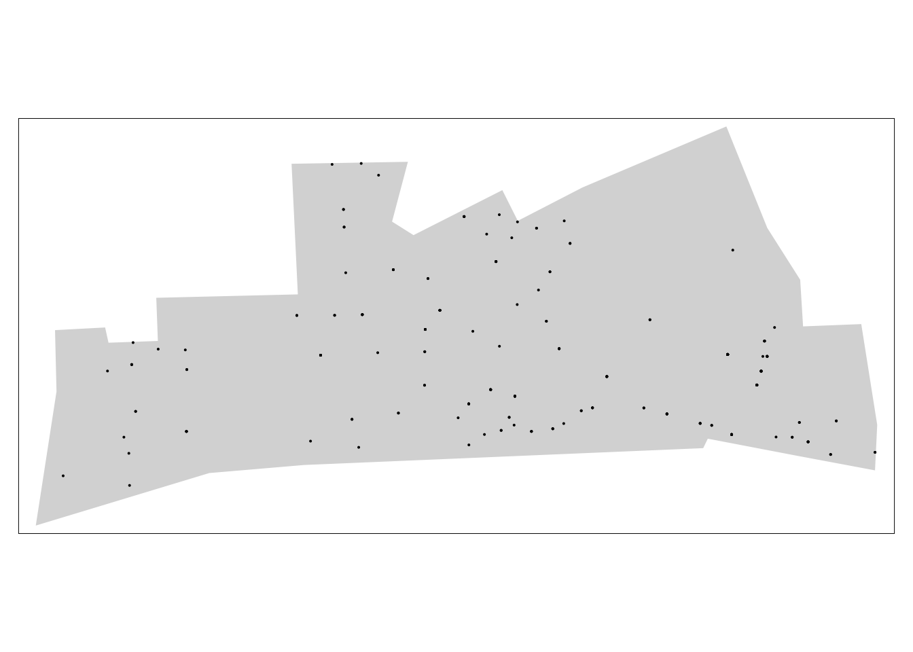
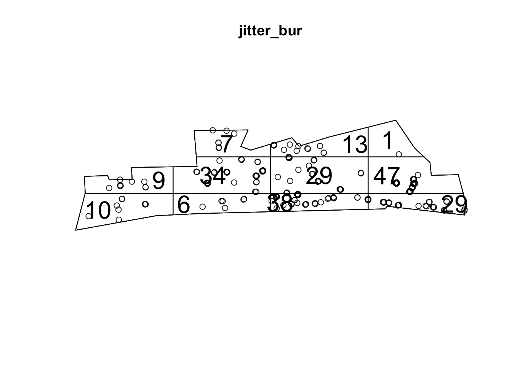
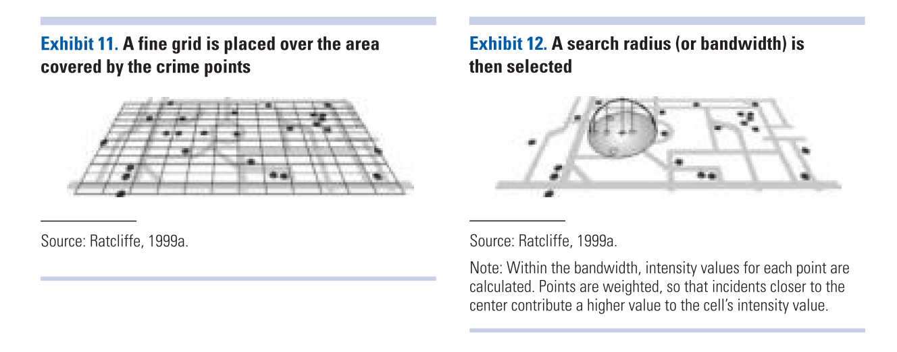
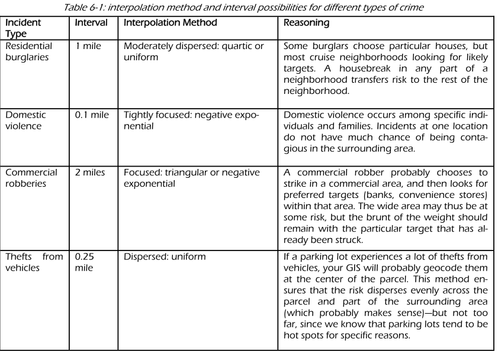
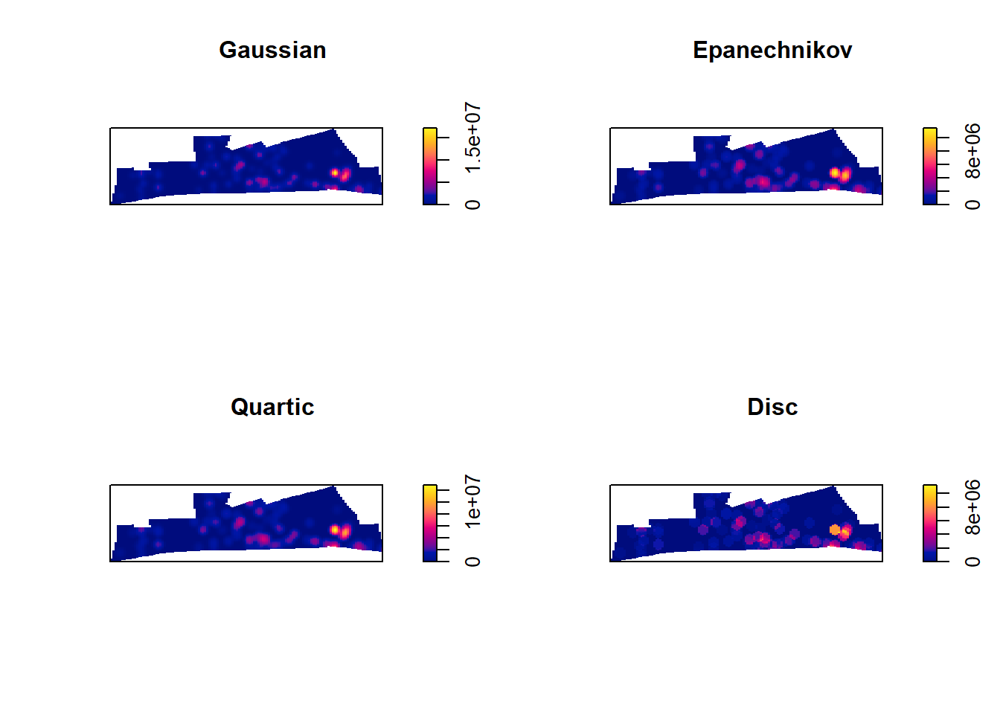
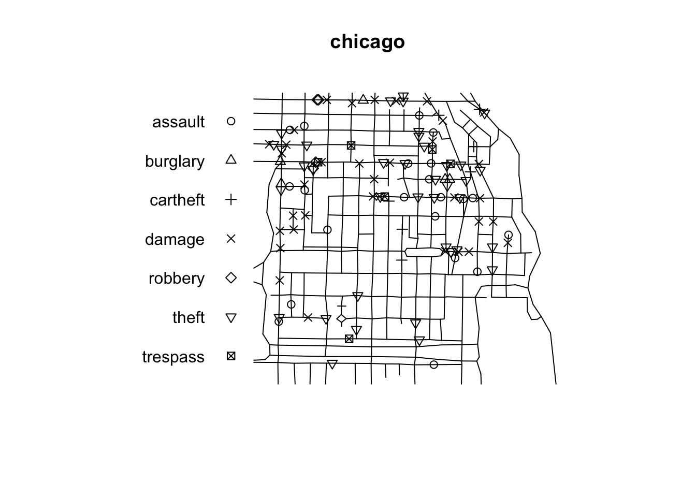
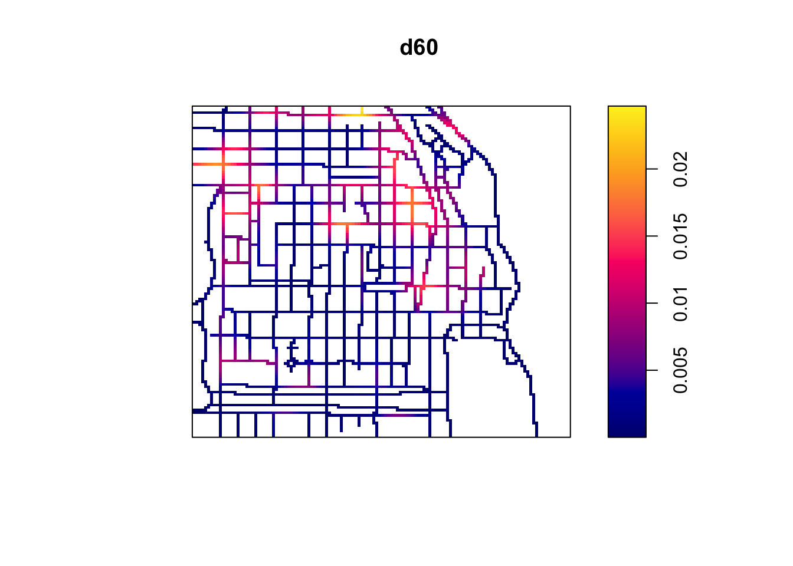
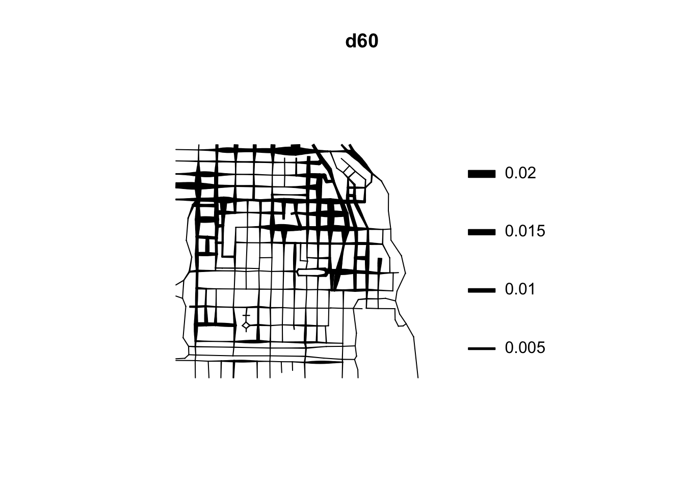

# Studying spatial point patterns


## What we'll do today

We have now covered quite a bit! You've learnt about spatial objects and various formats in which they come and are stored by R, how to produce maps using a variety of packages, and also provided you with a brief introduction to common spatial operations. In what remains of the semester we are going to shift the emphasis and start focusing a bit more on spatial statistics. First we will focus on techniques that are used to explore and analyse points in a geographical space and in subsequent sessions we will cover techniques that are used to analyse spatial data when our unit of analysis are polygons (e.g., postal code areas, census areas, police beats, etc).

We will introduce a new R package called `spatstat`, that was developed for spatial point pattern analysis and modelling. It was written by Adrian Baddeley and Rolf Turner. There is a [webpage](http://spatstat.org) dedicated to this package. The [thickest book](https://www.crcpress.com/Spatial-Point-Patterns-Methodology-and-Applications-with-R/Baddeley-Rubak-Turner/p/book/9781482210200) in my library, at 810 pages, is dedicated to this package. So as you can imagine the theory and practice of spatial pattern analysis is something one could devote an entire course to. You can get a pdf document used in a course the authors of this package develop [here](https://research.csiro.au/software/wp-content/uploads/sites/6/2015/02/Rspatialcourse_CMIS_PDF-Standard.pdf). In our course we are only going to provide you with an introductory practical entry into this field of techniques. If this package is not installed in your machine, make sure you install it before we carry on.


```r
library(sf)
library(tmap)
library(dplyr)
library(spatstat)
```

## Getting the data

We will be using the crime data from Greater Manchester police we have been using so far. Let's focus on burglary in the Fallowfield area. The code below has already been explained and used in previous sessions, so we won't go over the detail again. But rather than cut and paste automatically, try to remember what each line of code is doing.

By the way, the police data for Manchester we have used in previous sessions correspond to only one month of the year. Here we are using a full year worth of data, so the data import will take a bit longer.


```r
#Read a geojson file with Manchester wards (remember we learned about geojson files in week 4)
manchester_ward <- st_read("https://raw.githubusercontent.com/RUMgroup/Spatial-data-in-R/master/rumgroup/data/wards.geojson")
```

```
## Reading layer `wards' from data source `https://raw.githubusercontent.com/RUMgroup/Spatial-data-in-R/master/rumgroup/data/wards.geojson' using driver `GeoJSON'
## Simple feature collection with 215 features and 12 fields
## geometry type:  POLYGON
## dimension:      XY
## bbox:           xmin: 351664 ymin: 381168.6 xmax: 406087.5 ymax: 421039.8
## epsg (SRID):    27700
## proj4string:    +proj=tmerc +lat_0=49 +lon_0=-2 +k=0.9996012717 +x_0=400000 +y_0=-100000 +ellps=airy +towgs84=446.448,-125.157,542.06,0.15,0.247,0.842,-20.489 +units=m +no_defs
```

```r
#Create a new object that only has the fallowfield ward
df1 <- manchester_ward %>%
  filter(wd16nm == "Fallowfield")

#Change coordinate systems
fallowfield <- st_transform(df1, 4326)

#Get rid of objects we no longer need
rm(manchester_ward)
rm(df1)

#Read Greater Manchester police data
crimes <- read.csv("https://raw.githubusercontent.com/jjmedinaariza/CrimeMapping/master/gmpcrime.csv")

burglary <- filter(crimes, crime_type == "Burglary")

#Transform the dataframe with crime information into a sf object
burglary_spatial = st_as_sf(burglary, coords = c("long", "lat"), 
                 crs = 4326, agr = "constant")

#Select only the crimes that take place within the space defined by the Ward boundaries
# intersection
bur_fal <- st_intersects(fallowfield, burglary_spatial)
```

```
## although coordinates are longitude/latitude, st_intersects assumes that they are planar
```

```r
# subsetting
bur_fal <- burglary_spatial[unlist(bur_fal),]
#again remove things we don't need
rm(crimes)
rm(burglary)
```

Now we have all our data cleaned and all our files prepared. Let's see the results!


```r
tm_shape(fallowfield) + 
  tm_fill() +
  tm_shape(bur_fal) +
  tm_dots()
```



In the point pattern analysis literature each point is often referred to as an **event** and these events can have **marks**, attributes or characteristics that are also encoded in the data. In our spatial object one of these *marks* is the type of crime (altough in this case it's of little interest since we have filtered on it).

## Getting the data into spatstat: the problem with duplicates

So let's start using spatstat.The first thing we need to do is to transform our `sf` object into a `ppp` object which is how `spatstat` likes to store its point patterns. Unfortunately, spatstat and many other packages for analysis of spatial data precede sf, so the transformation is a bit awkard. Also before we do that, it is important to realise that a point pattern is defined as a series of events in a given area, or window, of observation. It is therefore extremely important to precisely define this window. In `spatstat` the function `owin()` is used to set the observation window. However, the standard function takes the coordinates of a rectangle or of a polygon from a matrix, and therefore it may be a bit tricky to use. Luckily the package `maptools` provides a way to transform a `SpatialPolygons` into an object of class `owin`, using the function `as.owin()`. Here are the steps: 


First we transform our Falllowfield polygon into a sp object:


```r
fallowfield_sp <-as(fallowfield, "Spatial")
```


Then we use the as.owin function to define the window. Note that by adding two colons (`::`) we can reference a function in a library explicitly without loading the library. So if you receive an error message, make sure you have the relevant package installed.


```r
window <- maptools::as.owin.SpatialPolygons(fallowfield_sp)
```


Now, use the class function and print the window object to check that this worked:


```r
class(window)
```

```
## [1] "owin"
```

```r
window
```

```
## window: polygonal boundary
## enclosing rectangle: [-2.2581074, -2.2141921] x [53.43904, 53.45145] units
```

Now that we have created the window as an `owin` object let's get the points. First we will extract the coordinates from our sf point data into a matrix:


```r
sf_bur_fal_coords <- matrix(unlist(bur_fal$geometry), ncol = 2, byrow = T)
```

Then we use the `ppp` function to create the object using the information from our matrix and the window that we created.


```r
bur_ppp <- ppp(x = sf_bur_fal_coords[,1], y = sf_bur_fal_coords[,2],
                   window = window, check = T)
```

```
## Warning: data contain duplicated points
```

```r
plot(bur_ppp)
```


Notice the warning message about duplicates. In spatial point pattern analysis an issue of significance is the presence of duplicates. The statistical methodology used for spatial point pattern processes is based largely on the assumption that processes are *simple*, that is, that the points cannot be coincident. That assumption may be unreasonable in many contexts (for example, the literature on repeat victimisation indeed suggests that we should expect the same households to be at a higher risk of being hit again). Even so the point (no pun intended) is that *"when the data has coincidence points, some statistical procedures will be severely affected. So it is always strongly advisable to check for duplicate points and to decide on a strategy for dealing with them if they are present"* (Baddeley et al., 2016: 60).

We can check the duplication in a `ppp` object with the following syntax:


```r
any(duplicated(bur_ppp))
```

```
## [1] TRUE
```

To count the number of coincidence points we use the `multiplicity()` function. This will return a vector of integers, with one entry for each observation in our dataset, giving the number of points that are identical to the point in question (including itself).


```r
multiplicity(bur_ppp)
```

If you want to know how many locations have more than one event you can use:


```r
sum(multiplicity(bur_ppp) > 1)
```

```
## [1] 190
```

That's quite something. 190 points out of 223 here share coordinates.


```r
tm_shape(fallowfield) + 
  tm_fill() +
  tm_shape(bur_fal) +
  tm_dots(alpha=0.4, size=1)
```


In the case of crime, as we have hinted some of this may be linked to the nature of crime itself. Hint: repeat victimisation. However, this pattern of duplication is fairly obvious across all crime categories in the police.uk website.

This is due to the way in which spatial anonymisation of police.uk data is carried out. This is done using geomasking, whereby there exist a pre-determined list of points that each crime event gets "snapped" to its nearest one. So, the coordinates provided in the open data are not the exact locations of crimes, but they come from a list of points generated for purposes of data publication. You can see the details [here](https://data.police.uk/about/#anonymisation). This process is likely inflating the amount of duplication we observe, because each snap point might have many crimes near it, resulting in those crimes being geo-coded to the same exact location. So keep in mind when analysing and working with this data set that it is not the same as working with the real locations. If you are interested in the effects of this read the paper [Lisa Tompson, Shane Johnson, Matthew Ashby, Chloe Perkins & Phillip Edwards (2015) UK open source crime data: accuracy and possibilities for research, Cartography and Geographic Information Science, 42:2, 97-111, DOI: 10.1080/15230406.2014.972456](https://www.tandfonline.com/doi/abs/10.1080/15230406.2014.972456).

What to do about duplicates in spatial point pattern analysis is not always clear. You could simply delete the duplicates, but of course that may ignore issues such as repeat victimisation. You could also use jittering, which will add a small perturbation to the duplicate points so that they do not occupy the exact same space. Which again, may ignore things like repeat victimisation. Another alternative is to make each point "unique" and then attach the multiplicites of the points to the patterns as *marks*, as attributes of the points. Then you would need analytical techniques that take into account these marks.

If you were to be doing this for real you would want access to the real thing, not this public version of the data and then go for the latter solution suggested above. We don't have access to the source data, so for the sake of simplicity and so that we can illustrate how `spatstat` works we will instead add some jittering to the data. The first argument for the function is the object, `retry` asks whether we want the algorithm to have another go if the jittering places a point outside the window (we want this so that we don't loose points), and the `drop` argument is used to ensure we get a `ppp` object as a result of running this function (which we do).


```r
jitter_bur <- rjitter(bur_ppp, retry=TRUE, nsim=1, drop=TRUE)
plot(jitter_bur)
```


Notice the difference with the original plot. Can you see how the circumferences do not overlap perfectly now?

## Inspecting our data with spatstat

This package supports all kind of exploratory point pattern analysis. One example of this is **quadrant counting**. One could divide the window of observation into quadrants and count the number of points into each of these quadrants. For example, if we want four quadrants along the X axis and 3 along the Y axis we could used those parameters in the `quadratcount()` function. Then we just use standard plotting functions from R base.


```r
Q <- quadratcount(jitter_bur, nx = 4, ny = 3)
plot(jitter_bur)
plot(Q, add = TRUE, cex = 2)
```



In the video lectures for this week, Luc Anselin  introduced the notion of **complete spatial randomness** (CSR for short). When we look at a point pattern process the first step in the process is to ask whether it has been generated in a random manner. Under CSR, points are independent of each other and have the same propensity to be found at any location. We can generate data that conform to complete spatial randomness using the *rpoispp()* function. The r at the beginning is used to denote we are simulating data (you will see this is common in R) and we are using a Poisson point process, a good probability distribution for these purposes. Let's generate 223 points in a random manner:


```r
plot(rpoispp(223))
```


You will notice that the points in a homogeneous Poisson process are not ‘uniformly spread’: there are empty gaps and clusters of points. Run the previous command a few times. You will see the map generated is different each time.

In classical literature, the *homogeneous Poisson process* (CSR) is usually taken as the appropriate ‘null’ model for a point pattern. Our basic task in analysing a point pattern is to find evidence against CSR. We can run a Chi Square test to check this. So, for example:


```r
quadrat.test(jitter_bur, nx = 3, ny = 2)
```

```
## 
## 	Chi-squared test of CSR using quadrat counts
## 	Pearson X2 statistic
## 
## data:  jitter_bur
## X2 = 113.09, df = 5, p-value < 2.2e-16
## alternative hypothesis: two.sided
## 
## Quadrats: 6 tiles (irregular windows)
```

Observing the results we see that the p value is well below convential standards for rejection of the null hypothesis. Observing our data of burglary in Fallowfield would be extremely rare if the null hypothesis was true. We can then conclude that the burglary data is not randomly distributed in the observed space. But no cop nor criminologist would really question this. They would rarely be surprised by your findings! We do know that crime is not randomly distributed in space. 

## Density estimates

In the presentations by Luc Anselin and the recommended reading materials we introduced the notion of density maps. **Kernel density estimation** involves applying a function (known as a “kernel”) to each data point, which averages the location of that point with respect to the location of other data points.  The surface that results from this model allows us to produce **isarithmic maps**, also referred to in common parlor as heatmaps. Beware though, cartographers [really dislike](http://cartonerd.blogspot.com/2015/02/when-is-heat-map-not-heat-map.html) this common parlor. We saw this kind of maps when covering the various types of thematic maps. 

Kernel density estimation maps are very popular among crime analysts. According to Chainey (2012), 9 out of 10 intelligence professionals prefer it to other techniques for hot spot analysis. As compared to visualisations of crime that relies on point maps or thematic maps of geographic administrative units (such as LSOAs), kernel density estimation maps are considered best for location, size, shape and orientation of the hotspot (Chainey, 2012). [Spencer Chainey and his colleagues (2008)](http://discovery.ucl.ac.uk/112873/1/PREPRINT_-_Chainey%2C_Tompson_%26_Uhlig_2008.pdf) have also suggested that this method produces some of the best prediction accuracy. The areas identified as hotspots by KDE (using historical data) tend to be the ones that better identify the areas that will have high levels of crime in the future. Yet, producing these maps (as with any map, really) requires you to take a number of decisions that will significantly affect the resulting product and the conveyed message. Like any other data visualisation technique they can be powerful, but they have to be handled with great care.

Essentially this method uses a statistical technique (kernel density estimation) to generate a smooth continuous surface aiming to represent the density or volume of crimes across the target area. The technique, in one of its implementations (quartic kernel), is described in this way by Eck and colleagues (2005):

+ *“a fine grid is generated over the point distribution;*
+ *a moving three-dimensional function of a specified radius visits each cell and calculates weights for each point within the kernel’s radius. Points closer to the centre will receive a higher weight, and therefore contribute more to the cell’s total density value;*
+ *and final grid cell values are calculated by summing the values of all kernel estimates for each location”*


(Reproduced from Eck et al. 2012)

The values that we attribute to the cells in crime mapping will typically refer to the number of crimes within the area’s unit of measurement. We don’t have the time to elaborate further on this technique now, but if you did the required reading you should have at least a notion of how this works.

Let's produce one of this density maps:


```r
ds <- density(jitter_bur)
class(ds)
```

```
## [1] "im"
```

```r
plot(ds, main='Burglary density in Fallowfield')
```


The density function is estimating a kernel density estimate. Density is nothing but the number of points per unit area. This method computes the intensity continuously across the study area and the object returns a raster image. 

To perform this analysis in R we need to define the **bandwidth** of the density estimation, which basically determines the area of influence of the estimation. There is no general rule to determine the correct bandwidth; generally speaking if the bandwidth is too small the estimate is too noisy, while if bandwidth is too high the estimate may miss crucial elements of the point pattern due to oversmoothing (Scott, 2009). 

The key argument to pass to the density method for point patterm objects is `sigma=`, which determines the bandwidth of the kernel. In spatstat the functions `bw.diggle()`, `bw.ppl()`, and `bw.scott()` can be used to estimate the bandwidth according to difference methods. The helpfiles recommend the use of the first two. These functions run algorithms that aim to select an appropriate bandwith.


```r
bw.diggle(jitter_bur)
```

```
##        sigma 
## 4.249614e-05
```

```r
bw.ppl(jitter_bur)
```

```
##        sigma 
## 0.0003932636
```

```r
bw.scott(jitter_bur)
```

```
##      sigma.x      sigma.y 
## 0.0040694500 0.0008424793
```

You can see the Diggle algorithm gives you the narrower bandwith. We can test how they work with our dataset using the following code:


```r
par(mfrow=c(2,2))
plot(density.ppp(jitter_bur, sigma = bw.diggle(jitter_bur),edge=T),
     main = paste("h = 0.000003"))

plot(density.ppp(jitter_bur, sigma = bw.ppl(jitter_bur),edge=T),
     main=paste("h =0.0005"))

plot(density.ppp(jitter_bur, sigma = bw.scott(jitter_bur)[2],edge=T),
     main=paste("h = 0.0008"))

plot(density.ppp(jitter_bur, sigma = bw.scott(jitter_bur)[1],edge=T),
     main=paste("h = 0.004"))
```


Baddeley et (2016) suggest the use of the `bw.ppl()` algorithm because in their experience it tends to produce the more appropriate values when the pattern consists predominantly of tight clusters. But they also insist that if your purpose it to detect a single tight cluster in the midst of random noise then the `bw.diggle()` method seems to work best.

Apart from selecting the bandwidth we also need to specify the particular kernel we will use. In density estimation there are different types of kernel (as illustrated below):


Source: wikepedia

You can read more about kernel types in the Wikipedia [entry](https://en.wikipedia.org/wiki/Kernel_(statistics)). This relates to the type of kernel drawn around each point in the process of counting points around each point. The use of these functions will result in slightly different estimations. They relate to the way we weight points within the radius: *“The normal distribution weighs all points in the study area, though near points are weighted more highly than distant points.  The other four techniques use a circumscribed circle around the grid cell.    The uniform distribution weighs all points within the circle equally.  The quartic function weighs near points more than far points, but the fall off is gradual. The triangular function weighs near points more than far points within the circle, but the fall off is more rapid. Finally, the negative exponential weighs near points much more highly than far points within the circle and the decay is very rapid.”* (Levine, 2013: 10.10).

Which one to use? Levine (2013) produces the following guidance: *“The use of any of one of these depends on how much the user wants to weigh near points relative to far points.  Using a kernel function which has a big difference in the weights of near versus far points (e.g., the negative exponential or the triangular) tends to produce finer variations within the surface than functions which weight more evenly (e.g., the normal distribution, the quartic, or the uniform); these latter ones tend to smooth the distribution more*. However, Silverman (1986) has argued that it does not make that much difference as long as the kernel is symmetrical. Chainey (2013) suggest that in his experience most crime mappers prefer the quartic function, since it applies greater weight to crimes closer to the centre of the grid. The authors of the CrimeStat workbook (Smith and Bruce, 2008), on the other hand, suggest that the choice of the kernel should be based in our theoretical understanding of the data generating mechanisms. By this they mean that the processes behind spatial autocorrelation may be different according to various crime patterns and that this is something that we may want to take into account when selecting a particular function. They provide a table with some examples that may help you to understand what they mean:


(Source: Smith and Bruce, 2008.)

The default kernel in `density.ppp()` is the `gaussian`. But there are other options. We can use the `epanechnikov`, `quartic` or `disc`. There are also further options for customisation. We can compare these kernels:


```r
par(mfrow=c(2,2))
plot(density.ppp(jitter_bur, sigma = bw.ppl(jitter_bur),edge=T),
     main=paste("Gaussian"))
plot(density.ppp(jitter_bur, kernel = "epanechnikov", sigma = bw.ppl(jitter_bur),edge=T),
     main=paste("Epanechnikov"))
plot(density.ppp(jitter_bur, kernel = "quartic", sigma = bw.ppl(jitter_bur),edge=T),
     main=paste("Quartic"))
plot(density.ppp(jitter_bur, kernel = "disc", sigma = bw.ppl(jitter_bur),edge=T),
     main=paste("Disc"))
```



When reading these maps you need to understand you are only looking at counts of crime in a smooth surface. Nothing more, nothing less. Unlike with choropleth maps we are not normalising the data. We are simply showing the areas where there is more crime, but we are not adjusting for anything (like number of people in the area, or number of houses to burgle). So, it is important you keep this in the back of your mind. As [this comic](https://xkcd.com/1138/) suggests you may end up reading too much into it if you don’t remember this. There are ways to produce density maps adjusting for a second variable, such as population size, but we do not have the time to cover this. 


There are also general considerations to keep in mind. Hot spots of crime are a simply a convenient perceptual construct. As Ned Levine (2013: 7.1) highlights *“Hot spots do not exist in reality, but are areas where there is sufficient clustering of certain activities (in this case, crime) such that they get labeled such. There is not a border around these incidents, but a gradient where people draw an imaginary line to indicate the location at which the hot spot starts.”*  Equally, there is not a unique solution to the identification of hot spots. Different techniques and algorithms will give you different answers. As Levine (2013: 7.7) emphasises: *“It would be very naive to expect that a single technique can reveal the existence of hot spots in a jurisdiction that are unequivocally clear. In most cases, analysts are not sure why there are hot spots in the first place. Until that is solved, it would be unreasonable to expect a mathematical or statistical routine to solve that problem.”* So, as with most data analysis exercises one has to try different approaches and use professional judgement to select a particular representation that may work best for a particular use. Equally, we should not reify what we produce and, instead, take the maps as a starting point for trying to understand the underlying patterns that are being revealed. Critically you want to try several different methods. You will be more persuaded a location is a hot spot if several methods for hot spot analysis point to the same location.

## Adding some context

Often it is convenient to use a basemap to provide context. In order to do that we first need to turn the image object generated by the `spatstat` package into a raster object, a more generic format for raster image used in R. Remember rasters from the first week? Now we finally get to use them a bit!


```r
library(raster)
dmap1 <- density.ppp(jitter_bur, sigma = bw.ppl(jitter_bur),edge=T)
r1 <- raster(dmap1)
#remove very low density values
r1[r1 < 0.0001 ] <- NA
class(r1)
```

```
## [1] "RasterLayer"
## attr(,"package")
## [1] "raster"
```

Now that we have the raster we can add it to a basemap. 

Two-dimensional `RasterLayer` objects (from the `raster` package) can be turned into images and added to `Leaflet` maps using the `addRasterImage()` function.

The `addRasterImage()` function works by projecting the `RasterLayer` object to EPSG:3857 and encoding each cell to an RGBA color, to produce a PNG image. That image is then embedded in the map widget.

It’s important that the `RasterLayer` object is tagged with a proper coordinate reference system. Many raster files contain this information, but some do not. Here is how you’d tag a raster layer object “r” which contains WGS84 data:


```r
library(leaflet)

#make sure we have right CRS. We need the sp package for setting CRS to this raster: 
library(sp)
crs(r1) <- sp::CRS("+proj=longlat +ellps=WGS84 +datum=WGS84 +no_defs")

#we also create a colour palet
pal <- colorNumeric(c("#0C2C84", "#41B6C4", "#FFFFCC"), values(r1),
  na.color = "transparent")

#and then make map!
leaflet() %>% 
  setView(lng = -2.225814, lat = 53.441315, zoom = 14) %>% 
  addTiles() %>%
  addRasterImage(r1, colors = pal, opacity = 0.8) %>%
  addLegend(pal = pal, values = values(r1),
    title = "Burglary map")
```

<!--html_preserve--><div id="htmlwidget-03903d5285986189246b" style="width:672px;height:480px;" class="leaflet html-widget"></div>
<script type="application/json" data-for="htmlwidget-03903d5285986189246b">{"x":{"options":{"crs":{"crsClass":"L.CRS.EPSG3857","code":null,"proj4def":null,"projectedBounds":null,"options":{}}},"setView":[[53.441315,-2.225814],14,[]],"calls":[{"method":"addTiles","args":["//{s}.tile.openstreetmap.org/{z}/{x}/{y}.png",null,null,{"minZoom":0,"maxZoom":18,"tileSize":256,"subdomains":"abc","errorTileUrl":"","tms":false,"noWrap":false,"zoomOffset":0,"zoomReverse":false,"opacity":1,"zIndex":1,"detectRetina":false,"attribution":"&copy; <a href=\"http://openstreetmap.org\">OpenStreetMap<\/a> contributors, <a href=\"http://creativecommons.org/licenses/by-sa/2.0/\">CC-BY-SA<\/a>"}]},{"method":"addRasterImage","args":["data:image/png;base64,iVBORw0KGgoAAAANSUhEUgAAAIAAAACACAYAAADDPmHLAAAgAElEQVR4nO19XYhly3Xet6pqn9M9c+eOfmzFiVBsyXozV5ZNnB9D4tiEQN7zljzGxvghBGOS2IY85UpYxhLJQ/CD3xIMBr0HAoH4wRBCSGIJPwRMiJGCUCJLunfmTnefXVUrD+unau/z0+ecPn2nj6bX0DM93fvsXbtq1fr51k8RM+OR3lwKr3sAj/R66ZEB3nB6ZIA3nB4Z4A2nRwZ4w+mRAd5wemSAN5weGeANp0cGeMPpkQHecEqvewCnpk/9zd/hcVVwc1NQagUz8OLrv0mve1wPlR40Azx7510PVBABQwp48mSBYRkxrgrGVcGwiBiWESVX1CKXk14PnP/i93NwH+/yYFVA/+JGzEApFTlX1FJRK6PkijJW1MzwwNZZL3mj+RxsmpO70oOWABNigJlRSgWNhFIYtcpXzhVcGRTId/65030s9iY6GwZgiASoVZigVlaGYAAVgIozIpx7hPvDWnzgjBgAECaolUHE4MpgBriyLD+J3mdmlRavebBnQmfFALawXBm2vpUZXGXxAxEqdbbAayLbwccYbR/m7gcesBG4iRiyuP0MuRSojMr2r1z9OqhfwPtYzFPf87wkANqyBiKw7vbKAIFQZeWFSRgfOg/cdXE+7N0PnCEDEGTxQySwLrpseFEFFU1FvP8hYgCvY/FOQWelAoQIFAgxEkIgAOS2QTV1cILd/yN/7Ut73+H5577A5+p9np8EICBGQkwBzABRhVkFzCoBGOA7cMAnfua3OKX99sbHfuqLTKT8doYy4OwkABEQIiGmiBCnwA9z+zqWPv7TX2QiAhHhL/2N3955J1v8U4BPh6iQU6qbM2QAQowBcQgIMYB09m3X++4/Yoo++bO/rYsP/dq9soEIQZmFtuDPD902OEMGEAkQUkB0CaCT3y3+obP+uX/we2uLv2v9ffcHYYBzjT+cFQOQ/QnCABTsJ0IGFx+6+D/7L77Kvui4fUF/5K9+SZgliCEagkYgj3ut10pnxQAABPLViadw9533V37l3zJnyRvAXJ+T5Bf01//o3/4yW9CJCMIAdL5S4OwYQGL95KJ325zvA8P+2M9/hetNRl0VoPJU71tkubvLp3/hKxxiEOajbhx3jEIeYyecyrY4OwZwuuNu++jnv8i1VJSbgnpdUItEFCnIvS2oZAzx6V/4CpMCUMGYT+MP/v97EAGW3HJfwuV8GeAO/P/Rz3+BmRm1MPJNRrkaUbMygEqVlooEfObv/CvxLH3H24LI92YH3Msqkdg+98UBZ8cAYuhZOHg73LNLRGZNHSulIl8X5KuMsqoKLJkK0PQyUnZwG2Gq710q7FBHx5IYluRMcB88cHYMgC76x3W3yb+JCexnzHAJMF5llLGoyAeAWVIJm0pYTzkjIoTQ2QUneMV2cwtz67jugQPOigHY/lRG1TQw+9OT683ZhPUMwdB0slVBvhqRxwJmRo8FoBMGXHX9zc807JcAiqSo5OlF9S5M4hSG4NnFAiQxlBE1C3gj7Ksik8F4+513+f2v/yZtmixhgApCQSmqAoKK/QpfUFc5JnlM9XADpgST2E2bxrDLWzFMIgRCrVDb5LTA4hkyAKOWKtnApa5l/5jedFEO3rxTWLKJci5+X7sDEYFiswds4alUUNAQtGuftki7fMGjdmvnZYCBQsdB3LvoDBlAdHcZt0iADqCpPP19b92bNJekUtH/IcouNnFuSSWSfVxBJUj0sVrUSX0B1RnHSP9djEGAexnMDCpHPOAWOisboE8NL1kyg+c7gmDwrFnm1ApFZiramSkzSmXUKtfEFJAWEVFDwiYB+ucKb1j+IaMPSczpmN1vtzKvw6TR/BF3tQMeLANs0o22a2vpUsNn19juj5EQDaEzl23GAQzJIyydbgcR4hCQlgkhBlE5zgDtuR5/8BD06cWz2ZT9v6em81QBzCBbsI5skmIkpBSQwaAiK9RgY5L0McDdewbLThCjHnEREZdJSs1cBbAvBGNmHxRJRzu1gdZeCo9AkJG4b81om4SDqeULpCF6uJhACCoZJu4dukxj3cUUCHGISBcRIZHXInDPCGjegjBA9Wvu4YU7t3Mz3UUNnJ0EEBIDTHQjT4w7IkkXi0NErey1Am6p17bwABT9m4aRwxAQFhEhBk02FVVBAJjF4JN8RGEI5IqqlcgnfUuTUN2/p6azZADB5XUXMgGdexTciAuoJcg1tdkFANaMRwsFA6pvNeEEoamcfvJDAGIi1AL0JWrHZiJtfUcoBsFN3Z2aB85OBXiY1vx16tUkNWx+iO7OEYlBGOMuyLZf5KYjrAStiRgghIAYJSHFFt+Y6pQLxBAEUmDv3fc+Vg2cHwMA7nL17lH/SwrU0DnDBTSTOEbaEV3Tia7VkT+e7X5PSVNmulcbQKWPVT3dh415lgwANKy/9/EB+//cdybftSGEre6UG3pjRV0V1FwFGzDMr0PmLCPZjMTK6zGJu5IZqA1+Pj0HnKUNYLQpQibG0lRvQj2A0AVtLFbQf1AYoKKsCigSylibCjCJE9qXlKJzsxHuYYey+qv3Ve96fhLAERis62z7ufvmMnHutpla2JC8YSaWhIglRyCviohezCVL96EOCDr5GhlT2rve8oBj7ICzlQDuFs1e2TJ96lhmsYLOaOxCvv3OkthARb7J4MooY5HOI2p0CJYg37uU2TKOU70jwCCmDUHv09CDZgAz9jaJv37XGdgDyG4puSKvBLdvaKHp8RYnqN3P7Z61MMZVkVDxWCeon9cAmLHITTffk4RWyON+DEDggTNAH9dvPzIXrendfjczS+MoCsUZgDTDx3azFZbSzHJnSFwga6SxlNruj5b+zQxw4e35CLtfyfHkfT7K/tf90INmAMPvBYHr3D+Q+8gWM+cAFAdlKmiEBm6AEFoKmSGFKct1c+ltDFQ17m/3hz67TxA5yvWz8d/jrj6EHjgD6I7vrHlSBBDQIA4RKAYwmi9ujaNKMW+AfMHiEJBIAj3jSNMkCzW4SmWQPtPq/0zVAArOlC6CuOdCNrAKkFyCe1Qde9KDZoCgxlqtMlkmhn1HwlKyAwBGkfoOR+VqZ6TZz0KSotJaKsJ1BrokCxG3EmwyYxHm9hn+DExCxAfZfwZKhb6xxV1n6W70oTLApuZJc9eFCIghYLmMuLhIGMcCombsmT9vQsEqhQHGOFbAFsZEtRpRZgymISJeRNSxCCYw0to+tE0dMF2wdgEO3v2AAVIWSAK43E0GHGpPbKKTMcApy5taUkdAKQwiBcK7n5u4jylgWCZwBUIoKvaBBp6wiFsW1RGXEcPTBcpN0Ty+DhIwv55Yg0w97Gz3QgsV8GEL6O8VNgelDqGJPXQHe+IkQNCpa+B9pydq2L0md1l3ENtJcYhIy4g0BFcNlunji6PiPMSAdJGQng6IyySwsD2z44S2sDxhEDdFtoUSdr2T/hVCG//WkMSe92rBsOOLRh4oEqil13E6UdRF4qxGz9K34hDdOHTF7Ovfro0XCfFJQlzELjJIvpvWyJE+H5pDwge+UmPgeFtQao97EWnByDTJ5dDN+CAZwAywPqLXG1BeoBlEBYSFZO94Hj8m6y+fSyItwjL69baV1NZbiy34fTommNQBHMoDysAh7Q5KrX1u9r1lOAmohYPH0dNrYYB9uLRBtk3Ayc5TTN9+F0VVUNw+ocGyhJYRYQi+2u7ezzD+3iaYBpbEAPD+BN3Y9qFm25BLn30+048V6gZP73O8EjiJEWg66V4iVrb7/f9NdE5/tv0GFEis/2UExQBUBquxaBM7qb6hDh6ukPazlcUlJHQ9AfT/e9pgBGVgrzDevWiy9gRzgs0VjtSSW4RJK8qRBuVpvAAXpacLW7ZU6x4Ghhri7Aa5wbKeJLphaCFAmkotIgCgriqqBnqAafVNJYsgqqXOLHmEDEQ3ArvWMIdwgI3I/bfbLw0q5qt4uKqCApK2yOHKoOr75GAeOJEEIJcAbVfiaP/Uxa6mQhkebxzgmTpaJDqP/E2ifKYrk+herox6U1A04AM0kcrMQGm7TsYC7zzq7+L2SEAIFbWuYwk73m5vgD+QGY0kyCUzQiCkRBgWESCgZoGuj3UDTsMAOsmyVrYTj/dPLSpXs6Ft7HraYVg7MCJLAkfV6t7N4xOPgmIAjxXl1Yh8nRsDdBlEpNxj2T7iUtq4yMEfItPBAURlr/dkiyJ6jt/2D5m9MAzi4uZRxHwgUWfDhSzdiAwaj3cD92aAZ++8y9sqWc2gEWSL3GXbhXfvMgQ9M6cQam2dO0KQnWY5eFbeHaJMkOl0mj3X9DYIqGPB+MGIfNNJALvGxg3D6zFJ9DBI2U4niUNAyhU5r+UX7Xgv7uIIu6+PgbC8SBguk/Qw0J2eFhHDk8El4NyYPOScoTUGOAbU+e5//3X6+E9/kS1J0owXX4RD7qg63hBAOwjKRCFgpWGsSRsVY8gt9Evk0PHacyuj3Eg/gPGmeOWPK1AzCJVhvArYJUCLAcQkxSdlrAirgrKHAp4z9i4GsKjl8tkCy+dLhPducHOdwcxIi4jF0wE1V+Tr3A3+cHE7YYC7IHq++9D8U2Y6GO+2hbMDoaQSR8GTFD3cW2sFV0h5N0kSiNkKtGEumMXyr6uC8Tojj8WDRVPQCO7mgQHpRMx6D/JUM+tVGMci0uW2yt0ZY99WR0AAhiHi4qMXuPwLT0GBcPXeNUquSBcJw1sLlLEgvlw1mHoD3XZ4RZpfeCwFbZBQSaxukQZiVR9qCnj0DrJwoveCHA83Vlk8C/1mBlBcUsg5ArYf2j24sxfyTZGTx7hVFflO7wAnMwrbuJoECJEQFxFlpYgi5okr03fexNi7jGQiwrCMuPjEEyw/8xzMjOFbL8GcBfp+e4FwXRDS1V54wjZG2BsIuu0hgfo8fEL0vjm9w74fMbpwa5UdmRZi+MQhODxbK6NUOUauaPIGabrXHMOXPEE5Yq503UU8tczBnqlR2G6ijNLbAIuIOLR+xZO5ovU5a2O+3QYIAUgXCctPPsMPf/Y5lp98Ju8fBdCKzxaIzwbERYQN8pgdvJcRaO/x/Ce/wBeLiGcfu8Ty2QKrlyt88N4NiMRYWa3yBK4FAaHiQDcJPtlWkRtIGCBdJunnR7ZorXBTrguTZgq9eG8uozKApZRRB/botaZGOs9TTAW2MjFVAUPUhtXwLS/fUhMBHTYijC3fm3ezbb6JCMNlQvzUW/j5TwR89VNvIV0mhFcjwiIivrUApYAwxIOg4Lkxv58EIEWxbrtGUTo70SPG4LvxEDL3y/H3AGUA4Xgimrho/WJuqhZiMLhUcHfgpKgYWVmrvukPo5rHBTAfk8LQazEBUyEKW09u0kkuR5a3TSeJBPjMxxf4/A9F/PjHF0iXSaDvRUR4OiC8NSAugs/HvtSr+1sZwDjajSv/t8m4SWIEyYKJ0UZuGxxM3GEKgRCGgHghWH5v5LXS7tnO7efd3a/qqCF3z3DdzpPHbx7TTF2szxdNGlSEqRZpTLRLJhp4tYz49NOAz36E8GNPg4ewwxBATxLCkwFhiEeDQMA+KsAmlagTb7Q2wT0TWCSPuZVQHeqkmMg16ROivHiIoWO8ztjrIzk2tn6MnsdXffeZB+gJJPZ+OoAeTXQbgNHAnDytCTTGC4GQNGml1grM8g73AcgIAvl+dAn88BPCx5YApSASYIigyyRzk/aPKm6ivVQAqWXfS4A+etbXr/lnPPEhbDUEbwMp/G7up69fzv13Jlbnk6s2AJfqMPLkd7bY/Y+3iGhhAvUoxir9Cu1anZsUpTw9DcELSaaf32Mz6DsHaEGKzneIBFpEYBmBxSwH4gjaQwWITu2t/Lmc7VOkGx5PXQPF4wbn5AvIm7uD9mvf7VRXEybmOwTOXUT/vY3bpEAT0hP7xyz5saLcZGWAjvFJEMJhkZQBjnt/C3K9GBnfv5Z/mTWp9SLiYiBBrI5ceKPbJQBNXTznZt/9dnqnljB3iIq7gXdQUv2Os4rdjXV4t+hnA4J4i/vVjD9quwqdpHPNoBD0WKTPsGESeocQFLO4TEgLcduOtYHKquAbrxj/+33GN1/JHIQhIlwmPA3Uwtr1mAcI7WcEhn4xoasOl53MWpThUqBtp85WPJpsx+XrLGK3TlfQd/+mZgq2o80QrB2TYmouEMFTtuYBol4KOAR9k72CWO5BygCCWaRln3Z2AOmmKtcZf/Jexte+U/H19wvqqkgq29MBywBAVVDdxNG3kHkCO41AnxyfCBWYatyY22SNk1rUDK2Z4gnEfzUM/9Uo/f23qAGL3ffNFHqh1XsM/Ut6ggm1A6nIun7AGJhRzIdnIGt7eUEU270CCUCULhOYGTFaKfL+i2RSL19llG+8xB+9/RzlGy9RVwVJ3b9EAGtYu3dfD6Fn77zLt3oBvbq3ujhD1foS7F6PencNb7B8xOiUTOSOqwy6IoyrvBFEsedbBzEGmrbqtdBEX3fejVnvQ8SwTC7aI7fAkwg9UTEWe+jb1Yq0bOlnNVdNX5NfdolGt04JMzBeZ6y++QL/82nC+H9eoI4V8TKB3lpI9PXVKHbIHdLL9weCeulfFFItVWvXO1gVCqwU9bt3IF7Afke7cJWmzuN1Rl41kbt2XTcWm5HmsajBOvtMIKi/Lr57WkQMlwnDImr8Qb43ZNOeUyojF4GgXQFoEIxSAA1xPU+R2lf37UaqzBhvMq6//QFWf/p9XH/7FWquiJcDFpcRhYH6KrtEPE4G7JsP0LlKxv1hbpCpFCCWIFApFZTpqAra+bP7ps45l839crofNb9ckYtup/dkOQYxBDAYIQQJtFwOfp8QSVrKrwrGbMWk1qsQjn84CNXZPfPn9hBxyzvUMNLsfZiBcVVx/edXQAVWL24kCHUR8ZFEuCpAeTnNaziGbmWAqVulMXgvv2afAAttMrFLgEJ3758nEkULPrloBfDG9YcOQBjR9ToaDjFTxWL0SX4dMyOmFnOwQcchIsSM1XVGWEnPwcZsbd95I0or+3KjuHMldTyyYcglAW9KnFE74/rFClwk8SUuImiIWATgWytG+WAlXUzuSwW0HaV+tH6VrN26a2duz3agN1beo3/erWpAGSCX2pV+CdHsOp/Gbhf6dd1YLWaRUhBxn6LELhRyjioJhmcLDE8HpNSCLiYFzL4x7N/StLmqjZQrpvGFVhton5l3L5XrlPFLxepqxNWLFVZXo0YhgcxA+SCjfDBKF5M77LDbJQAwiZaJ/qsSbavT6+wbA12Alq58Ny3QG3htkfvFNang8LGjZ7ojWX/RjcV99ouEMsrLhBhAKSIMFRQDhmcLgLAx7GuSxqDvpJXHrF7LJPGUNDs5CEQMc63tXkUnT90W8aoY46qi1hEAsFS//3uZUd9fIX8waiZUe6e5v0HdDzetwe02AHfuVbXACbXFp+kjTV2YcXSK/nny+NYrx+ZpEnbtRKhHJC1XkaHYQG1glVn9avRREJvGJYdG3eJbC3BlOanUXMZm9imjWZWy5AdwBcp1Fv1sKes0DZNTlaomIog/X1ssoje4c6morC1tSgXfFFy/GFG/f6N5glMUU8bVOTs65m3xhz0kwGz3maUN1l47azygg+fOJbsjB8hA/CUYmBhaDOcBAM2li9EVrtsivcsWAiEtkxt9o9kXll20CIhPEupNbmcC6Yd7G8MKPpMmiDDLYVR51R1FQ2JsxhRApYJV+kj+gpxkRtzuZ2P1DRQ0F/LViPrn18jfu0a+GlFqVUm0viFsnLI+G+wM7OkFmFs1x/p7fTbnAfvMHQzU6Rj8L6PmdtU6u8AZoJWRS+pYY2QLrDhoU6U9HOdWNEIxgIYgbl1oRpz7F2pgmvgXBojapEo8B0tV8+el4HM1LJP3HhhXRdPpuiNiOmS1MiQJ9OWI8p0rjN+7nnoAmzYEGkNta0ixlwqY7zDAxFlAqAyMinKYCtMB+WdOxAQ9mU6V7iCGR8C53srIoWcLVesH1InaVjEc5fhYAGUsKNe5Vf92et8teXQAUtAupElcyKAMMMldBDqpFGx6MFwkhBTErQ4ZxFb4IVKEM0m7Gn1+KRXjixXi/7vC6vs3GG+Kq2JTe6QbwrzM2xpS7GUEotO/Pgkq9mphUH+YTWeA9QbbqclEuKSKE6i0iZLJljJyroycgaKWkmEItiAhBY+zA/CYQxyiB1tQ2mfMz7dMJ7f+tUU96TEzJVeU3Pf4Je9hbHkSw2VCGAKyMlyocq9BW91Pcg1IVMDqgxXouwGrFzfCYJ1B7C1s0dzP2xpS7A8EdTimi/8NVa69AbYRez8Bmfg1nQoGMrGz/WQyCvnCmys7uUnvKWjWULnWNKvC4FGCMH6YRGhWvz3LehlQ0p8bDlJbnID6a81muExiaL4cPdiWVJLYWCQrVu5RK2P1KgN0g/HV2NrYdZ6ISJgKqvIhexabgYspD+xnA6C5V65rrEJ2XuVqui4SaiXUWtafOqODU9I73Wu7fM6EfRm5xRMaXG1KQN6OSwsVl1yRY0EYpJFUvS4oN2ITmAi3vgSmHq1XQXM5pQDE7I318avEWCaEZVRvQOyZmCSSWIuoEFEfrTPpeJMBFpuhlCnDJ++XBDc+TRUyM6hT1UZ7l4Z169+hWsYRvi66MwkpRZmEQih3UAPb/NhmfRNq2ZR00QVwzXPpvAB7J87cdQafxTByRb3OqDdZYeGAyAIZm7VvvQeBZl+0QFgzgBjmjsrPLM8xDNEDRp5MYgxwI6o1xqBt7ST/QNRadcYn6HkIg2QhgYE8kjJn8M/ThnPnDi4O7dE1f0E3OVszhrQIqJmQxwoqB6aFTx64zY8lF70h1jWQRh1Y2H6fpQHIFbrjy3WWsKoljBp4VSQmX2whhuAeRlqImM6jSDhLOwfBY/RuBJOOx/IROhPdJAd1cxcvEkKpiK9G2VCLKOnsRWogaimOs1i2lp+HsIjCrCvyApaQCCGvbxKioxhAdSYruDKrciXSzl2LhBwKwopAeX3y93oWOn97XvBpY+kSVdT8kT8Vni3T+JTdBQR00VYFOZK6VAZtyzO5VNQbMQyJDA2EF6qUUhFKkxxllIeVXBsT6VhFLTQm8VhBn6VMUNUQwUWeUVPAcDmgrArGm4JxbPEQoMHJlseQFhGoIjXAdauqthk7iAHmAQ2u6ydleCvWZdTdEnD0kZebfNuNOnXirbXJ9qNc2Bcfeg+7Jpv7tyreepa0QWAtDGQpPYeKZ4LmOi4CeAUY1FhyRVBV4YUnNlhVPdZ/mPTedVXEuu/rGtUzYS08iQQsni1QrjNuXq6AK8U9wBNDPGoPpLiIYGUAP+pupqptzoJJgL2NMHODglm6U6jXPABLiGA2vNv25uHUXmCqAlyz+s/a25kRtrsKlz3VDJBdzqrfvS1LljqCmtklAFgYJMQADnLjWhk8Vt/pIgGmYzV4nLKeP5wlqdTSy/w4OsBb0QTdSIvnS+QUEL97JdJDoWXqd38SCRAXEWAZqzHbbNI6d/ZgCdACLGbQVIPhei8hqoFT+OisWHke+Uuun57dGVo8NxZ3V+H2BlnJ4uJZ42jbhYBE4+pKQKSQpMFEiDr5BhRxJ2V0LCYB5s+U00elXC6PcihFGKundcEKUs2Hj4T4ZED6yFIlUNStJGHc/vga64BibXDiEEAr80pMzbQBWSLM3gxgEyxNjuRndaMKMCkh7VP6DNuDiab9e/rGzr2Yt2vd22Sb7Da+uRAQw7BFLc0466OHPMqhETXXaQ0g2qTaGCxIBmY30Hj2QNvlHERljNdZm1tIkkuwTZWb7k6XCen5Ely4BY9segLcFbYOKEGh5jhEhJDl0VrI4hJAN1ZMR0gA+zBBcXUP0bqxezIie8mu4NOe4QygIt7nhdtuA3ZEI9WIrerGzbEEM9IEz6++u92ltPMCtNrI+hj0mMP0cS2oRtBDLa4zKARVAbJ5ShapI30MCeEiIby9QLwugjL6GJt07M8xMlQzDqEdbMXcvBI0Vz2mcESPoIlOnt5Y53VWhXPwE+wxOljyr558onuorf+dbOytp3mZgziHq9ncNU1msWPqk/Uk0meSJnxYqbelmxtjrvucyphgUCUUPZkkBHHtxP3Upk+rArCIzrCMoLcGhPdXCvOa/d5L22YsGyNYV3Sg8zg6GyBESYA9qkmUWOU0mTafVNYePlqGfScmoPUvf5rtxAp3cdY8gd4XXyOGpWIZ93AvFXJVPL86LFu1upj1QOqyVm2MBn2vr78OWp5ZipxMQkSeWVyZ5Jk3GXFYAMwIiwi6SMBgq2yTo3+58YMWDFNVEDQcXibAlMyVna880dDOVfssTjfR00kVLs6rIvpz0244kNZBnmbE9aXhk991yN9tT/fqH72+2uIrE3t621hakwn96htNWERyawaE/a6zUabNKtgRwD/+d/9o8tJkFUbbb9x0sUmB2IJc0/I1lQCLuQogbEHduvtzA1M2MQqzZPDGm9zavG0wwg6jzZ+ubC/Wb4upOL+dTHIQGFUh0wqu5IsP7lLhdcFqhRuZxoS937/tLYih5xcApQBE3efVGymKTXzt93/Rp/jn/s2/3yzMnPk0cmnGHrXII1GZGqWkIWyTAG3nU/t3y3TN8fTJC6uRU1QCZGvguHMBbiETqWs/5sbxm37vBtvu29NMhMrOZF98A5MmEqH7ftPi73pkU1+tMcU8aeZ//cd/sjb9f/grf4++/ge/NPt5g65ZYxgWxwDQjtCd6E5yCRAGkwDUJmOuZ+eDbwWY6y9qvy+lIq+UGTbEoPclX99urTeOZ8sD9n7sxLVrn/RDoUm+p1zc7SMyLwTOhMcy+nt//Bt7IyXf/i//1K/9i3/9SzJaQz2zdEHhLK6Zw+Rhenvf8NHdQEtxMnG45W1sISqDXS/z/BIHYZoOPnxqXKg4w21QSzz9OngJZgYbK7cZtOC7kyUZA8P+t96n4umu9K3/LMzwoz/3ZX/xOlZQKsqk1ErTlFzg9UigG5SELaibkLkZpHMAAAIiSURBVO048Vl5XRX47xklw121Y8l3f+dJcP/LTgQe7GocuGP/73/9Z/e+oMfSn/3hr/rYfvIf/p7MTLEM5y3D1ikTBtBrJgmJG9OIxXVyUblNULBV0vJkhx1MKkHM2FtTAb77uZMC+9P3/sevP9hFPZbMe/iJv/+7zeYDNSmnfxnekQAxRrxapUPdNpG7X0Sb7QRnihaNv4sRaL75vvT+hyB6z4H+5Ku/7PPw2b/7r7sl0HVRsC69/bl31TZcR92mThWcfWyBt3k9jA5kuZMLIPSd//bPHxf1DvSn/+EfEwA8/9wXmgatEoamZ+/8SwYkwXKxkPShkitWox7B1t2IIBJiMUTERCiZsepSn3tqWUObBzU3knZ1I3+k09Nf/ltf5icfWa4zQEoBOVesVjsYYBH1TD9hlEN9/ceFfji0Fgu4zWgzBNDx+T0e8rjgD5c6BmiWtLlfW8ly8aoEiLe1A39c+IdPGi/s3anm32/mgZbB2iOHc3pc/POg1K9yOyJtt/EucefNIMPjwp8XpQa5bm6ztpnIocSeBx4X//zIbQAPrMy6cGwiQjMEAeD9rz0u/LnSzAgk74W3iww5+uYf/drjwp85NQboIdw98Ps/+0+/+rj4PwA0UQHCBVZetZl+EAMobzJNs/Zv0f2PgZYfPJoggYzNmM6jdf+DS2t1O4+L/2bR1rqAx4V/M2iNAR4X/s2iiQp4XPw3jxLwuPBvMv1/mlGJ0qVfG10AAAAASUVORK5CYII=",[[53.4514517532155,-2.25810740373087],[53.4390428798791,-2.21419214050652]],0.8,null,null,null]},{"method":"addLegend","args":[{"colors":["#0C2C84 , #336AA2 23.4013120260545%, #41ADC0 46.802624052582%, #9DD3C8 70.2039360791094%, #EBF6CB 93.6052481056369%, #FFFFCC "],"labels":["5,000,000","10,000,000","15,000,000","20,000,000"],"na_color":null,"na_label":"NA","opacity":0.5,"position":"topright","type":"numeric","title":"Burglary map","extra":{"p_1":0.234013120260545,"p_n":0.936052481056369},"layerId":null,"className":"info legend","group":null}]}],"limits":{"lat":[53.4390428798791,53.4514517532155],"lng":[-2.25810740373087,-2.21419214050652]}},"evals":[],"jsHooks":[]}</script><!--/html_preserve-->

And there you have it. Perhaps those familiar with Fallowfield have some guesses as to what may be going on there?

### Homework 1
*Ok, so see if you can do something like what we have done today, but for violent crime in the city centre. Produce the density estimates and then plot the density plot. In addition add a layer of points with the licenced premises we looked at last week.*

### Homework 2
*Produce a kernel density estimate for burglary across the whole of the city. Where is burglary more concentrated?*

## Spatial point patterns along networks

Have a look at this maps.  Can we say that the spatial point process is random here? Can you identify the areas where we have hotspots of crime? Think about these questions for a little while.


(Source: Okabe and Sugihara, 2012)

Ok, so most likely you concluded that the process wasn't random, which it isn't in truth. It is also likely that you identified a number of potential hotspots?

Now, look at the two maps below:


(Source: Okabe and Sugihara, 2012)

We are representing the same spatial point pattern process in each of them. But we do have additional information in map B. We now know the street layout. The structure we observed in the map is accounted by the street layout. So what look like a non random spatial point process when we considered the full two dimensional space, now looks less random when we realise that the points can only appear alongside the linear network. 

This problem is common in criminal justice applications. Crime is geocoded alongside a linear street network. Even if in physical space crime can take place along a spatial continuum, once crime is geocoded it will only be possible alongside the street network used for the geocoding process. 

For exploring this kind of spatial point pattern processes along networks we need special techniques. Some researchers have developed special applications, such as [SANET](http://sanet.csis.u-tokyo.ac.jp/sub_en/manual.html). The `spatstat` package also provides some functionality for this kind of data structures.

In `spatstat` a point pattern on a linear network is represented by an object of class `lpp`. The functions `lpp()` and `as.lpp()` convert raw data into an object of class `lpp` (but they require a specification of the underlying network of lines, which is represented by an object of class `linnet`). For simplicity and illustration purposes we will use the `chicago` dataset that is distributed as part of the `spatstat` package. The `chicago` data is of class `lpp` and contains information on crime in an area of Chicago. 


```r
data("chicago")
plot(chicago)
```



```r
summary(chicago)
```

```
## Multitype point pattern on linear network
## 116 points
## Linear network with 338 vertices and 503 lines
## Total length 31150.21 feet
## Average intensity 0.003723891 points per foot
## Types of points:
##          frequency proportion    intensity
## assault         21 0.18103450 0.0006741528
## burglary         5 0.04310345 0.0001605126
## cartheft         7 0.06034483 0.0002247176
## damage          35 0.30172410 0.0011235880
## robbery          4 0.03448276 0.0001284100
## theft           38 0.32758620 0.0012198950
## trespass         6 0.05172414 0.0001926151
## Enclosing window: rectangle = [0.3894, 1281.9863] x [153.1035, 1276.5602] 
## feet
```

An `lpp` object contains the linear network information, the spatial coordinates of the data points, and any number of columns of *marks* (in this case the mark is telling us the type of crime we are dealing with). It also contains the local coordinates `seg` and `tp` for the data points. The local coordinate `seg` is an integer identifying the particular street segment the data point is located in. A segment is each of the sections of a street between two vertices (marking the intersection with another segment). The local coordinate `tp` is a real number between 0 and 1 indicating the position of the point within the segement: `tp=0` corresponds to the first endpoint and `tp=1` correspond to the second endpoint.

The visual inspection of the map suggest that the intensity of crime along the network is not spatially uniform. Crime seems to be concentrated in particular segments. Like we did before we can estimate the density of data points along the networks using Kernel estimation (with the `density.lpp()` function), only now we only look at the street segments (rather than areas of the space that are outside the segments). The authors of the package are planning to introduce methods for automatic bandwidth selection but for now this is not possible, so we have to select a bandwidth. We could for example select 60 feet.


```r
d60 <- density.lpp(unmark(chicago), 60)
```

We use `unmark()` to ignore the fact the data points are marked (that is they provide marks with informtation, in this case about the crime type). By using `unmark()` in this example we will run density estimation for all crimes (rather than by type of crime). We can see the results below:
 

```r
plot(d60)
```


 
If rather than colour you want to use the thickness of the street segment to identify hotpspots you would need to modify the code as shown below:
 

```r
plot(d60, style="width", adjust=2.5)
```




This is very important for crime research, as offending will be constrained by all sorts of networks. Traditionally, hotspot analysis has been directed at crimes that are assumed to be situated across an infinite homogeneous environment (e.g., theft of motor vehicle), we must develop an increased awareness of perceptible geographical restrictions. There has been increasing recognition in recent years that the spatial existence of many phenomena is constrained by networks. 

These networks may be roads or rail networks, but there may be many more: 

> Environmental crimes could exist along waterways such as streams, canals, and rivers; and thefts of metal could occur along utility networks such as pipelines. Those
sociologically inclined might be able to offer more examples in the way of interpersonal networks. 

- [Tompson, Lisa, Henry Partridge, and Naomi Shepherd. "Hot routes: Developing a new technique for the spatial analysis of crime." Crime Mapping: A Journal of Research and Practice 1, no. 1 (2009): 77-96.](http://discovery.ucl.ac.uk/20057/)


While sometimes there may be issues with linking points to routes due to problems such as bad geocoding, as we had discusses in great detail in week 4, there are obivious advantages to considering crime as distributed along networks, rather than continuous space. 

