# Regression analysis (a refresher)


## Introduction

In this session we are going to cover regression analysis or, rather, we are beginning to talk about regression modelling. This form of analysis has been one the main technique of data analysis in the social sciences for many years and it belongs to a family of techniques called generalised linear models. Regression is a flexible model that allows you to "explain" or "predict" a given outcome (Y), variously called your outcome, response or dependent variable, as a function of a number of what is variously called inputs, features or independent, explanatory, or predictive variables (X1, X2, X3, etc.). Following Gelman and Hill (2007), I will try to stick for the most part to the terms outputs and inputs.

Today we will cover something that is called linear regression or ordinary least squares regression (OLS), which is a technique that you use when you are interested in explaining variation in an interval level variable. First we will see how you can use regression analysis when you only have one input and then we will move to situations when we have several explanatory variables or inputs. For those of you already familiar with regression analysis this session can be a it of a refresher, for those that aren't a bit of an introduction. Today we will cover regression models more generally and in the next lab we will discuss adaptations to the regression model that are necessary when you have spatial autocorrelation.

We will use a dataset that includes information about homicide in the US, as well as information in a number of sociodemographic variables that are often thought of as associated with the geographical distribution of homicides.


```r
##R in Windows have some problems with https addresses, that's why we need to do this first:
urlfile<-'https://s3.amazonaws.com/geoda/data/ncovr.zip'
download.file(urlfile, 'ncovr.zip')
#Let's unzip and create a new directory (ncovr) in our working directory to place the files
unzip('ncovr.zip', exdir = 'ncovr')
```

There is quite a few files and folders here. We don't need all of it. If you look inside the newly created folder you will find two subdirecoties MACOSX and ncovr. Look in the latter. You will see a pdf file called codebook.pdf. Read this file. It provides information on the variables and data that is included here. We are now going to read the main data file into R. This is the NAT.csv file.


```r
ncovr <- read.csv('ncovr/ncovr/NAT.csv')
```

The dataset contains information about 3085 counties in the US and if you view it you will see it has information about several decades, the 60s, 70s, 80s, and 90s. The number at the end of the variable names denotes the relevant decade and you will see that for each decade we have the same variables.

The purpose of this and next session is to help you choose a model to represent the relationship between homicide and various predictors. You can think of a model as a map. A map aims to represent a given reality, but as you may have already discovered there are many ways of presenting the same information through a map. As an analyst you decide what the most appropriate representation for your needs is. Each representation you choose will involve an element of distortion. Maps (and models) are not exact representations of the real word, they are simply good approximations that may serve well a particular functional need. Look at the map of the metro in London that we reproduce below:


London doesn’t quite look like this. Yet, if you want to use the Metro system, this map will be extremely helpful to you. It serves a need in a good way. Same happens with models. They may not be terribly good reflections of the world, but may give us approximations that allows us to develop useful insights.

Choosing a good model is like choosing a good way for displaying quantitative information in a map. Decisions, decisions, decisions. There are many parameters and options one can choose from. This can be overwhelming, particularly as you are learning how to model and map phenomena. How to make good decisions is something that you learn on earnest by practice, practice, practice. Nobody expects you to get the maps you are doing as you are learning, and the models you are developing as you are learning spot on. So please do not stress out about this. All we can do here is to learn some basic principles and start getting some practice, which you will be able to further develop in aprofessional context or in further training.

The first step in any analysis is to develop some familiarity with the data you are going to be working with. We have been here before. Read the codebook. Run summary statistics for your quantitative variables, frequency distributions for your categorical variables, and visualise your variables. This will help you to detect any anomalies and give you a sense for what you have. If, for example, you run a histogram for the homicide rate for 1990 (HR90), you will get a sense of the distribution form –which of course is skewed.


```r
library(ggplot2)
qplot(x = HR90, data = ncovr)
```

```
## `stat_bin()` using `bins = 30`. Pick better value with `binwidth`.
```

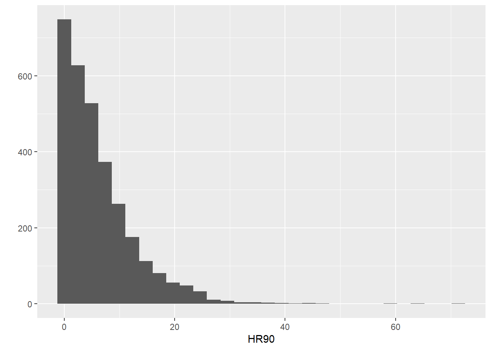

Once one has gone through the process of exploring the data in this way for all the variables you want to work, you can start exploring bivariate associations with your dependent, response or outcome variable. So, as an illustration, you could explore the association with resource deprivation (RD90), a measure of the level of concentrated disadvantge or social exclusion in an area, via a scatterplot:


```r
ggplot(ncovr, aes(x = RD90, y = HR90)) +
  geom_point(alpha=.2) 
```

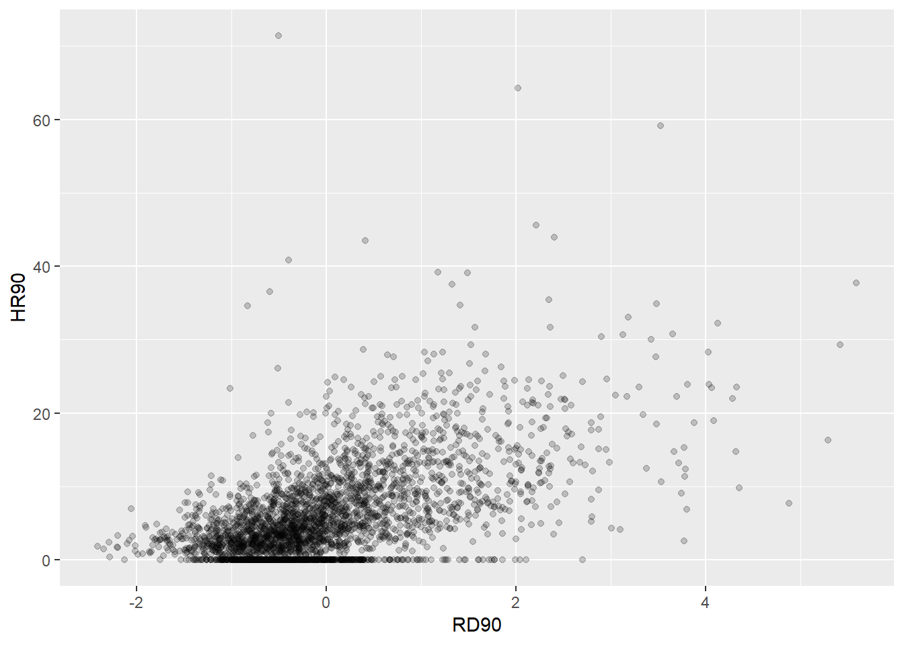

What do you think when looking at this scatterplot? Is there a relationship between the variables? Does it look as if individuals that have a high score on the X axis  also have a high score on the Y axis? Or viceversa? 

## Motivating regression

Now, imagine that we play a game. Imagine I have all the respondents waiting in a room, and I randomly call one of them to the stage. You're sitting in the audience, and you have to guess the level of fear ('tcviolent') for that respondent. Imagine that I pay £150 to the student that gets the closest to the right value. What would you guess if you only have one guess and you knew (as we do) how fear of violent crime is distributed? 


```r
ggplot(ncovr, aes(x = HR90)) + 
  geom_density() +
  geom_vline(xintercept = 4.377, linetype = "dashed", size = 1, color="red") +
  geom_vline(xintercept = 6.183, linetype = "dashed", size = 1, color="blue") +
  ggtitle("Density estimate, mean and median of homicide rate 1990")
```

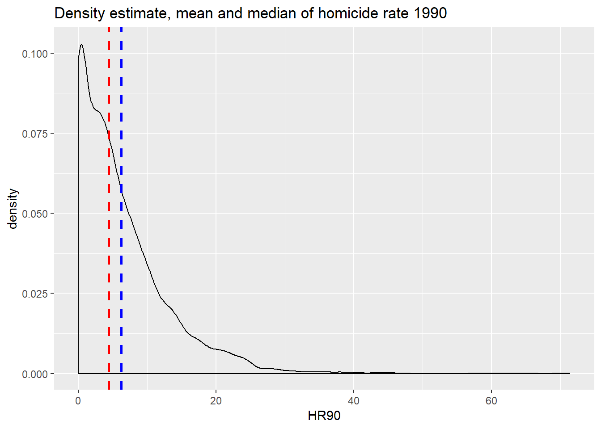


```r
summary(ncovr$HR90)
```

```
##    Min. 1st Qu.  Median    Mean 3rd Qu.    Max. 
##   0.000   1.334   4.377   6.183   8.938  71.378
```

If I only had one shot, you could go for the median, in red, (given the skew) but the mean, in blue, perhaps would be your second best. Most of the areas here have values clustered around those values, which is another way of saying they are bound to be not too far from them.

Imagine, however, that now when someone is called to the stage, you are told the level of resource deprivation in the county - so the value of the `RD90` variable for the individual that has been selected (for example 4). Imagine as well that you have the scatterplot that we produced earlier in front of you. Would you still go for the value of "4.377" as your best guess for the value of the selected county? 

I certainly would not go with the overall mean or median as my prediction anymore. If somebody said to me, the value 'RD90' for the selected respondent is 4, I would be more inclined to guess the mean value for the level of homicide with that level of resource deprivation (the conditional mean), rather than the overall mean across all the counties. Wouldn't you? 

If we plot the conditional means we can see that the mean of homicide rate for counties that report a value of 4 in `RD90` is around 22. So you may be better off guessing that.


```r
library(grid)
ggplot() +
  geom_point(data=ncovr, aes(x = RD90, y = HR90), alpha=.2) +
geom_line(data=ncovr, aes(x = round(RD90/0.12)*0.12, y = HR90), 
          stat='summary',
          fun.y=mean,
          color="red",
          size=1) +
  annotate("segment", x=3, xend = 4, y = 25, yend= 22, color = "blue", size = 2, arrow = arrow()) +
  annotate("text", x = 3, y = 29, label = "Pick this one!", size =7, colour = "blue")
```

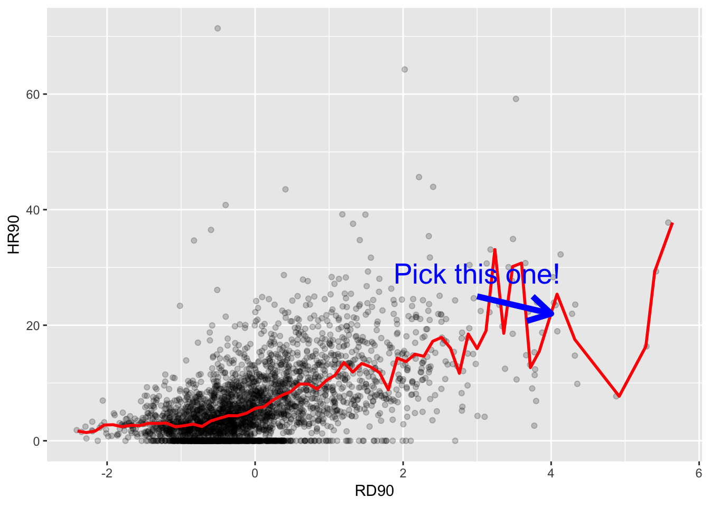

Linear regression tackles this problem using a slightly different approach. Rather than focusing on the conditional mean (smoothed or not), it draws a straight line that tries to capture the trend in the data. If we focus in the region of the scatterplot that are less sparse we see that this is an upward trend, suggesting that as resource deprivation increases so does the homicide rate. 

Simple linear regression draws a single straight line of predicted values as the model for the data. This line would be a **model**, a *simplification* of the real world like any other model (e.g., a toy pistol, an architectural drawing, a subway map), that assumes that there is approximately a linear relationship between X and Y. Let's draw the regression line:


```r
ggplot(data = ncovr, aes(x = RD90, y = HR90)) +
  geom_point(alpha = .2) +
  geom_smooth(method = "lm", se = FALSE, color = "red", size = 1) #This ask for a geom with the regression line, method=lm asks for the linear regression line, se=FALSE ask for just the line to be printed, the other arguments specify the color and thickness of the line
```

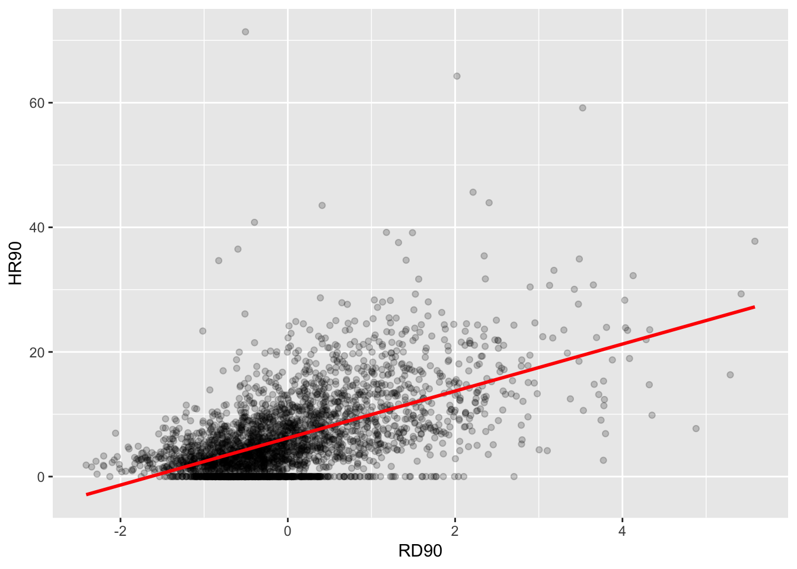

What that line is doing is giving you guesses (predictions) for the values of homicide based in the information that we have about the level of resource deprivation. It gives you one possible guess for the value of homicide for every possible value of resource deprivation and links them all together in a straight line. 

Another way of thinking about this line is as the best possible summary of the cloud of points that are represented in the scatterplot (if we can assume that a straight line would do a good job doing this). If I were to tell you to draw a straight line that best represents this pattern of points the regression line would be the one that best does it (if certain assumptions are met).

The linear model then is a model that takes the form of the equation of a straight line through the data. The line does not go through all the points. In fact, you can see is a slightly less accurate representation than the (smoothed) conditional means:

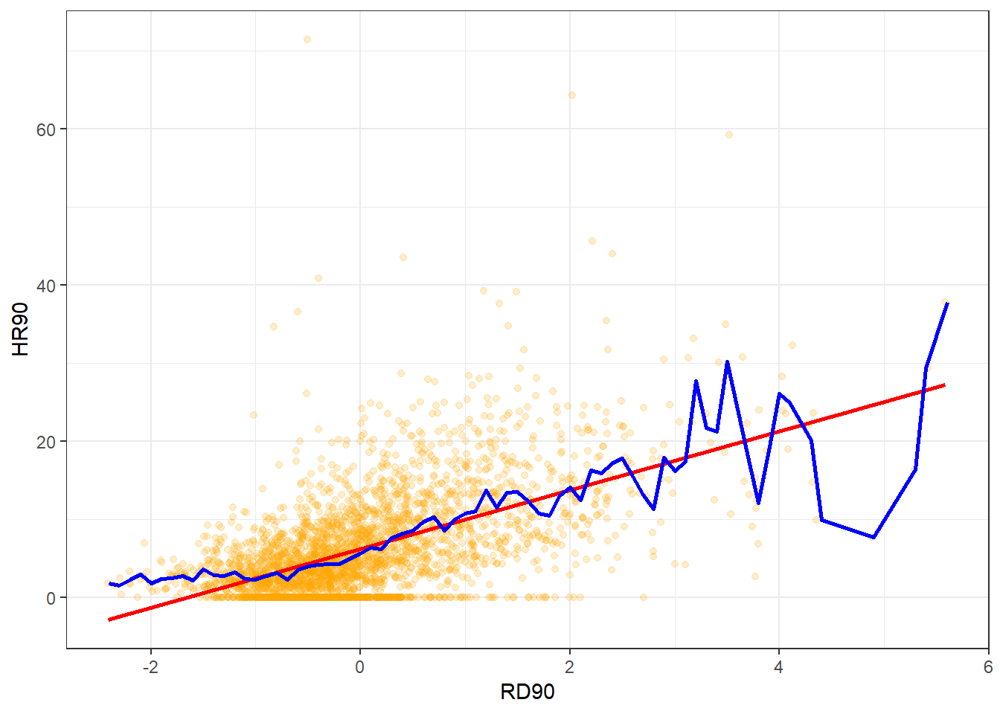

Our regression line underpredicts at low levels of resource deprivation and does not seem to capture well the variability at higher levels of resource deprivation. But imperfect as a model as it might be it simplifies well the overall growing trend for homicide as resource deprivation increases.

As De Veaux et al (2012: 179) highlight: "like all models of the real world, the line will be wrong, wrong in the sense that it can't match reality exactly. But it can help us understand how the variables are associated". A map is never a perfect representation of the world, the same happens with statistical models. Yet, as with maps, models can be helpful.

## Fitting a simple regression model

In order to draw a regression line we need to know two things: 
(1) We need to know where the line begins, what is the value of Y (our dependent variable) when X (our independent variable) is 0, so that we have a point from which to start drawing the line. The technical name for this point is the **intercept**.
(2) And we need to know what is the **slope** of that line, that is, how inclined the line is, the angle of the line.

If you recall from elementary algebra (and you may not), the equation for any straight line is:
 y = mx + b 
In statistics we use a slightly different notation, although the equation remains the same:
y = b0 + b1x

We need the origin of the line (b0) and the slope of the line (b1). How does R get the intercept and the slope for the green line? How does R know where to draw this line? We need to estimate these **parameters** (or **coefficients**) from the data. How? We don't have the time to get into these more mathematical details now. You should study the [required reading](http://link.springer.com/chapter/10.1007/978-1-4614-7138-7_3) to understand this (*required means it is required, it is not optional*)[^2]. For now, suffice to say that for linear regression modes like the one we cover here, when drawing the line, R tries to minimise the distance from every point in the scatterplot to the regression line using a method called **least squares estimation**.

In order to fit the model we use the `lm()` function using the formula specification `(Y ~ X)`. Typically you want to store your regression model in a "variable", let's call it `fit_1`:


```r
fit_1 <- lm(HR90 ~ RD90, data = ncovr)
```

You will see in your R Studio global environment space that there is a new object called `fit_1` with 12 elements on it. We can get a sense for what this object is and includes using the functions we introduced in previous weeks:


```r
class(fit_1)
```

```
## [1] "lm"
```

```r
attributes(fit_1)
```

```
## $names
##  [1] "coefficients"  "residuals"     "effects"       "rank"         
##  [5] "fitted.values" "assign"        "qr"            "df.residual"  
##  [9] "xlevels"       "call"          "terms"         "model"        
## 
## $class
## [1] "lm"
```

R is telling us that this is an object of class `lm` and that it includes a number of attributes. One of the beauties of R is that you are producing all the results from running the model, putting them in an object, and then giving you the opportunity for using them later on. If you want to simply see the basic results from running the model you can use the `summary()` function.


```r
summary(fit_1)
```

```
## 
## Call:
## lm(formula = HR90 ~ RD90, data = ncovr)
## 
## Residuals:
##     Min      1Q  Median      3Q     Max 
## -17.796  -3.415  -0.719   2.540  67.103 
## 
## Coefficients:
##             Estimate Std. Error t value Pr(>|t|)    
## (Intercept)  6.18286    0.09844   62.81   <2e-16 ***
## RD90         3.77121    0.09846   38.30   <2e-16 ***
## ---
## Signif. codes:  0 '***' 0.001 '**' 0.01 '*' 0.05 '.' 0.1 ' ' 1
## 
## Residual standard error: 5.468 on 3083 degrees of freedom
## Multiple R-squared:  0.3224,	Adjusted R-squared:  0.3222 
## F-statistic:  1467 on 1 and 3083 DF,  p-value: < 2.2e-16
```

Or if you prefer more parsimonious presentation you could use the `display()` function of the `arm` package:


```r
library(arm)
```

```
## Loading required package: MASS
```

```
## Loading required package: Matrix
```

```
## Loading required package: lme4
```

```
## 
## arm (Version 1.10-1, built: 2018-4-12)
```

```
## Working directory is /Users/reka/Dropbox (The University of Manchester)/crimemapping_textbook_bookdown
```

```r
display(fit_1)
```

```
## lm(formula = HR90 ~ RD90, data = ncovr)
##             coef.est coef.se
## (Intercept) 6.18     0.10   
## RD90        3.77     0.10   
## ---
## n = 3085, k = 2
## residual sd = 5.47, R-Squared = 0.32
```

```r
detach(package:arm) #This will unload the package
```

For now I just want you to focus on the numbers in the "Estimate" (or coef.est) column. The value of 6.18 estimated for the **intercept** is the "predicted" value for Y when X equals zero. This is the predicted value of the fear of crime score *when resource deprivation has a value of zero*. 


```r
summary(ncovr$RD90)
```

```
##    Min. 1st Qu.  Median    Mean 3rd Qu.    Max. 
## -2.4103 -0.6667 -0.2016  0.0000  0.4393  5.5831
```

RD90 is a variable that has been centered in ). It has been created by the researchers in such a way that is has a mean value of 0. Since we only have one explanatory variable in the model this corresponds to the mean of the homicide rate, 6.18. In many other contexts the intercept has less of a meaning.

We then need the b1 regression coefficient for for our independent variable, the value that will shape the **slope** in this scenario. This value is 3.77. This estimated regression coefficient for our independent variable has a convenient interpretation. When the value is positive, it tells us that *for every one unit increase in X there is a b1 increase on Y*. If the coefficient is negative then it represents a decrease on Y. Here, we can read it as "for every one unit increase in the resource deprivation score, there is a 3.77 unit increase in the homicide rate."

Knowing these two parameters not only allows us to draw the line, we can also solve for any given value of X. Let's go back to our guess-the-homicide-rate game. Imagine I tell you the level of resource deprivation is 1. What would be your best bet now? We can simply go back to our regression line equation and insert the estimated parameters:

y = b0 + b1x   
y = 6.18 + 3.77 (1)  
y = 9.95

Or if you don't want to do the calculation yourself, you can use the `predict` function (differences are due to rounding error):


```r
predict(fit_1, data.frame(RD90 = c(1))) #First you name your stored model and then you identify the new data (which has to be in a data frame format and with a variable name matching the one in the original data set)
```

```
##        1 
## 9.954065
```

This is the expected value of Y, homicide rate, when X, resource deprivation is 1 **according to our model** (according to our simplification of the real world, our simplification of the whole cloud of points into just one straight line). Look back at the scatterplot we produced earlier with the red line. Does it look as if the green line when X is 1 corresponds to a value of Y of 9.95?

## Residuals revisited: R squared

In the output above we saw there was something called the residuals. The residuals are the differences between the observed values of Y for each case minus the predicted or expected value of Y, in other words the distances between each point in the dataset and the regression line (see the visual example below). 

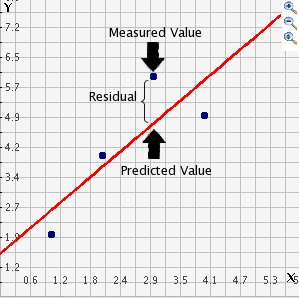


You see that we have our line, which is our predicted values, and then we have the black dots which are our actually observed values. The distance between them is essentially the amount by which we were wrong, and all these distances between observed and predicted values are our residuals. Least square estimation essentially aims to reduce the squared average of all these distances: that's how it draws the line.

Why do we have residuals? Well, think about it. The fact that the line is not a perfect representation of the cloud of points makes sense, doesn't it? You cannot predict perfectly what the value of Y is for every observation just by looking ONLY at their level of resource deprivation! This line only uses information regarding resource deprivation. This means that there's bound to be some difference between our predicted level of homicide given our knowledge of deprivation (the regression line) and the actual level of homicide (the actual location of the points in the scatterplot). There are other things that matter not being taken into account by our model to predict the values of Y. There are other things that surely matter in terms of understanding homicide. And then, of course, we have measurement error and other forms of noise.

We can re-write our equation like this if we want to represent each value of Y (rather than the predicted value of Y) then: 
y = b0 + b1x + residuals

The residuals capture how much variation is unexplained, how much we still have to learn if we want to understand variation in Y. A good model tries to maximise explained variation and reduce the magnitude of the residuals. 

We can use information from the residuals to produce a measure of effect size, of how good our model is in predicting variation in our dependent variables. Remember our game where we try to guess homicide (Y)? If we did not have any information about X our best bet for Y would be the mean of Y. The regression line aims to improve that prediction. By knowing the values of X we can build a regression line that aims to get us closer to the actual values of Y (look at the Figure below). 


The distance between the mean (our best guess without any other piece of information) and the observed value of Y is what we call the **total variation**. The residual is the difference between our predicted value of Y  and the observed value of Y. This is what we cannot explain (i.e, variation in Y that is *unexplained*). The difference between the mean value of Y and the expected value of Y (the value given by our regression line) is how much better we are doing with our prediction by using information about X (i.e., in our previous example it would be variation in Y that can be *explained* by knowing about resource deprivation). How much closer the regression line gets us to the observed values. We can then contrast these two different sources of variation (explained and unexplained) to produce a single measure of how good our model is. The formula is as follows:


All this formula is doing is taking a ratio of the explained variation (the squared differences between the regression line and the mean of Y for each observation) by the total variation (the squared differences of the observed values of Y for each observation from the mean of Y). This gives us a measure of the **percentage of variation in Y that is "explained" by X**. If this sounds familiar is because it is a measure similar to eta squared in ANOVA.

As then we can take this value as a measure of the strength of our model. If you look at the R output you will see that the R2 for our model was .32 (look at the multiple R square value in the output) . We can say that our model explains 32% of the variance in the fear of homicide. when doing regression, you will often find that regression models with aggregate data such as county level data will give you better results than when dealing with individuals. It is much harder understanding individual variation than county level variation.


```r
#As an aside, and to continue emphasising your appreciation of the object oriented nature of R, when we run the summary() function we are simply generating a list object of the class summary.lm.
attributes(summary(fit_1))
```

```
## $names
##  [1] "call"          "terms"         "residuals"     "coefficients" 
##  [5] "aliased"       "sigma"         "df"            "r.squared"    
##  [9] "adj.r.squared" "fstatistic"    "cov.unscaled" 
## 
## $class
## [1] "summary.lm"
```

```r
#This means that we can access its elements if so we wish. So, for example, to obtain just the R Squared, we could ask for:
summary(fit_1)$r.squared
```

```
## [1] 0.3224335
```

Knowing how to interpret this is important. R^2 ranges from 0 to 1. The greater it is the more powerful our model is, the more explaining we are doing, the better we are able to account for variation in our outcome Y with our input. In other words, the stronger the relationship is between Y and X. As with all the other measures of effect size interpretation is a matter of judgement. You are advised to see what other researchers report in relation to the particular outcome that you may be exploring. 

Weisburd and Britt (2009: 437) suggest that in criminal justice you rarely see values for R^2 greater than .40. Thus, if your R^2 is larger than .40, you can assume you have a powerful model. When, on the other hand, R^2 is lower than .15 or .2 the model is likely to be viewed as relatively weak. Our observed r squared here is rather poor. There is considerably room for improvement if we want to develop a better model to explain fear of violent crime[^3]. In any case, many people would argue that R^2 is a bit overrated. You need to be aware of what it measures and the context in which you are using it. Read [here](http://blog.minitab.com/blog/adventures-in-statistics/how-high-should-r-squared-be-in-regression-analysis) for some additional detail.

## Inference with regression

In real applications, we have access to a set of observations from which we can compute the least squares line, but the population regression line is unobserved. So our regression line is one of many that could be estimated. A different sample would produce a different regression line. The same sort of ideas that we introduced when discussing the estimation of sample means or proportions also apply here. if we estimate b0 and b1 from a particular sample, then our estimates won't be exactly equal to b0 and b1 in the population. But if we could average the estimates obtained over a very large number of data sets, the average of these estimates would equal the coefficients of the regression line in the population.

We can compute standard errors for the regression coefficients to quantify our uncertainty about these estimates. These standard errors can in turn be used to produce confidence intervals. This would require us to assume that the residuals are normally distributed. As seen in the image, and for a simple regression model, you are assuming that the values of Y are approximately normally distributed for each level of X:

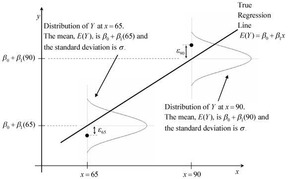

In those circumstances we can trust the confidence intervals that we can draw around the regression line as in the image below:


The dark-blue line marks the best fit. The two dark-pink lines mark the limits of the confidence interval. The light-pink lines show the sampling distributions around each of the confidence-interval limits (the many regression lines that would result from repeated sampling); notice that the best-fit line falls at the extreme of each sampling distribution.

You can also then perform standard hypothesis test on the coefficients. As we saw before when summarising the model, R will compute the standard errors and a t test for  each of the coefficients.


```r
summary(fit_1)$coefficients
```

```
##             Estimate Std. Error  t value      Pr(>|t|)
## (Intercept) 6.182860 0.09844166 62.80735  0.000000e+00
## RD90        3.771206 0.09845761 38.30283 6.535551e-263
```

In our example, we can see that the coefficient for our predictor here is statistically significant[^4].


We can also obtain confidence intervals for the estimated coefficients using the `confint()` function:


```r
confint(fit_1)
```

```
##                2.5 %   97.5 %
## (Intercept) 5.989842 6.375877
## RD90        3.578156 3.964255
```

## Fitting regression with categorical predictors

So far we have explained regression using a numeric input. It turns out we can also use regression with categorical explanatory variables. It is quite straightforward to run it. 

There is only one categorical explanatory variable in this dataset, a binary indicator that indicates whether the county is in a Southern State or not. We can also explore this relationship using regression and a regression line. This is how you would express the model:


```r
#We use the as.factor function to tell R that SOUTH is a categorical variable
fit_2 <- lm(HR90 ~ as.factor(SOUTH), data=ncovr)
```

Notice that there is nothing different in how we ask for the model. And see below the regression line:


```r
ggplot(data=ncovr, aes(x=as.factor(SOUTH), y=HR90)) +
  geom_point(alpha=.2, position="jitter", color="orange") +
  geom_abline(intercept = fit_2$coefficients[1],
    slope = fit_2$coefficients[2], color="red", size=1) +
  theme_bw()
```

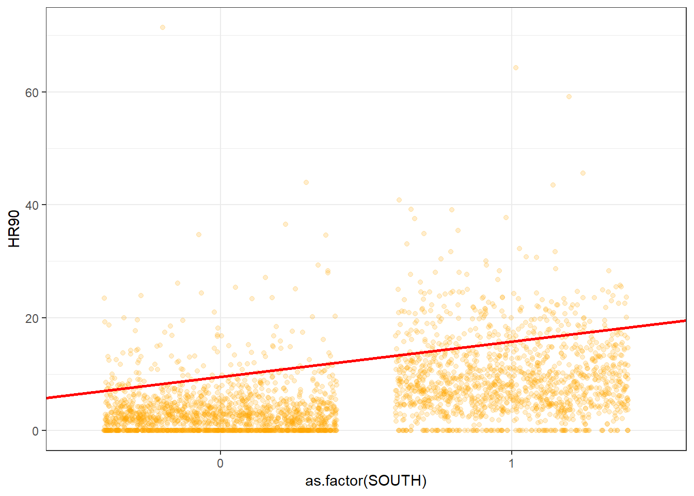

Let's have a look at the results:


```r
summary(fit_2)
```

```
## 
## Call:
## lm(formula = HR90 ~ as.factor(SOUTH), data = ncovr)
## 
## Residuals:
##    Min     1Q Median     3Q    Max 
## -9.549 -3.342 -1.172  1.931 68.036 
## 
## Coefficients:
##                   Estimate Std. Error t value Pr(>|t|)    
## (Intercept)         3.3416     0.1437   23.25   <2e-16 ***
## as.factor(SOUTH)1   6.2077     0.2124   29.22   <2e-16 ***
## ---
## Signif. codes:  0 '***' 0.001 '**' 0.01 '*' 0.05 '.' 0.1 ' ' 1
## 
## Residual standard error: 5.878 on 3083 degrees of freedom
## Multiple R-squared:  0.2169,	Adjusted R-squared:  0.2167 
## F-statistic:   854 on 1 and 3083 DF,  p-value: < 2.2e-16
```

As you will see the output does not look too different. But notice that in the print out you see how the row with the coefficient and other values for our input variable `SOUTH` we see that R is printing `1`. What does this mean?

It turns out that a linear regression model with just one dichotomous categorical predictor is just the equivalent of a t test. When you only have one predictor the value of the intercept is the mean value of the **reference category** and the coefficient for the slope tells you how much higher (if it is positive) or how much lower (if it is negative) is the mean value for the other category in your factor.

The reference category is the one for which R does not print the *level* next to the name of the variable for which it gives you the regression coefficient. Here we see that the named level is "1". That's telling you that the reference category here is "0". If you look at the codebook you will see that 1 means the county is in a Southern state. Therefore the Y intercept in this case is the mean value of fear of violent crime for the northern counties, whereas the coefficient for the slope is telling you how much higher (since it is a positive value) the mean value is for the southern counties. Don't believe me?


```r
mean(ncovr$HR90[ncovr$SOUTH == 0], na.rm=TRUE)
```

```
## [1] 3.341614
```

```r
mean(ncovr$HR90[ncovr$SOUTH == 1], na.rm=TRUE) - mean(ncovr$HR90[ncovr$SOUTH == 0], na.rm=TRUE)
```

```
## [1] 6.207679
```

So, to reiterate, for a binary predictor, the coefficient is nothing else than the difference between the mean of the two levels in your factor variable, between the averages in your two groups.

With categorical variables encoded as **factors** you always have a situation like this: a reference category and then as many additional coefficients as there are additional levels in your categorical variable. Each of these additional categories is included into the model as **"dummy" variables**. Here our categorical variable has two levels, thus we have only one dummy variable. There will always be one fewer dummy variable than the number of levels. The level with no dummy variable, northern counties in this example, is known as the **reference category** or the **baseline**.

It turns out then that the regression table is printing out for us a t test of statistical significance for every input in the model. If we look at the table above this t value is 29.22 and the p value associated with it is near 0. This is indeed considerably lower than the conventional significance level of 0.05. So we could conclude that the probability of obtaining this value if the null hypothesis is true is very low. The r squared is not too bad either, although lower than we saw when using resource deprivation.

## Motivating multiple regression

So we have seen that we can fit models with just one predictor.  We can build better models by expanding the number of predictors (although keep in mind you should also aim to build models as parsimonious as possible).

Another reason why it is important to think about additional variables in your model is to control for spurious correlations (although here you may also want to use your common sense when selecting your variables!). You must have heard before that correlation does not equal causation. Just because two things are associated we cannot assume that one is the cause for the other. Typically we see how the pilots switch the secure the belt button when there is turbulence. These two things are associated, they tend to come together. But the pilots are not causing the turbulences by pressing a switch! The world is full of **spurious correlations**, associations between two variables that should not be taking too seriously. You can explore a few [here](http://tylervigen.com/). It's funny. 

Looking only at covariation between pair of variables can be misleading. It may lead you to conclude that a relationship is more important than it really is. This is no trivial matter, but one of the most important ones we confront in research and policy[^5]. 

It's not an exaggeration to say that most quantitative explanatory research is about trying to control for the presence of **confounders**, variables that may explain explain away observed associations. Think about any criminology question: Does marriage reduces crime? Or is it that people that get married are different from those that don't (and are those pre-existing differences that are associated with less crime)? Do gangs lead to more crime? Or is it that young people that join gangs are more likely to be offenders to start with? Are the police being racist when they stop and search more members of ethnic minorities? Or is it that there are other factors (i.e., offending, area of residence, time spent in the street) that, once controlled, would mean there is no ethnic dis-proportionality in stop and searches? Does a particular program reduces crime? Or is the observed change due to something else?

These things also matter for policy. Wilson and Kelling, for example, argued that signs of incivility (or antisocial behaviour) in a community lead to more serious forms of crime later on as people withdraw to the safety of their homes when they see those signs of incivilities and this leads to a reduction in informal mechanisms of social control. All the policies to tackle antisocial behaviour in this country are very much informed by this model and were heavily influenced by broken windows theory.

But is the model right? Sampson and Raudenbush argue it is not entirely correct. They argue, and tried to show, that there are other confounding (poverty, collective efficacy) factors that explain the association of signs of incivility and more serious crime. In other words, the reason why you see antisocial behaviour in the same communities that you see crime is because other structural factors explain both of those outcomes. They also argue that perceptions of antisocial behaviour are not just produced by observed antisocial behaviour but also by stereotypes about social class and race. If you believe them, then the policy implications are that only tackling antisocial behaviour won't help you to reduce crime (as Wilson and Kelling have argued) . So as you can see this stuff matters for policy not just for theory. 

Multiple regression is one way of checking the relevance of competing explanations. You could set up a model where you try to predict crime levels with an indicator of broken windows and an indicator of structural disadvantage. If after controlling for structural disadvantage you see that the regression coefficient for broken windows is still significant you may be into something, particularly if the estimated effect is still large. If, on the other hand, the t test for the regression coefficient of your broken windows variable is no longer significant, then you may be tempted to think that perhaps Sampson and Raudenbush were into something. 

## Fitting and interpreting a multiple regression model

It could not be any easier to fit a multiple regression model. You simply modify the formula in the `lm()` function by adding terms for the additional inputs.


```r
ncovr$SOUTH_f <- as.factor(ncovr$SOUTH)
fit_3 <- lm(HR90 ~ RD90 + SOUTH_f, data=ncovr)
summary(fit_3)
```

```
## 
## Call:
## lm(formula = HR90 ~ RD90 + SOUTH_f, data = ncovr)
## 
## Residuals:
##     Min      1Q  Median      3Q     Max 
## -16.480  -2.996  -0.576   2.216  68.151 
## 
## Coefficients:
##             Estimate Std. Error t value Pr(>|t|)    
## (Intercept)   4.7270     0.1394   33.90   <2e-16 ***
## RD90          2.9649     0.1108   26.77   <2e-16 ***
## SOUTH_f1      3.1809     0.2223   14.31   <2e-16 ***
## ---
## Signif. codes:  0 '***' 0.001 '**' 0.01 '*' 0.05 '.' 0.1 ' ' 1
## 
## Residual standard error: 5.295 on 3082 degrees of freedom
## Multiple R-squared:  0.3647,	Adjusted R-squared:  0.3642 
## F-statistic: 884.4 on 2 and 3082 DF,  p-value: < 2.2e-16
```

With more than one input, you need to ask yourself whether all of the regression coefficients are zero. This hypothesis is tested with a F test. Again we are assuming the residuals are normally distributed, though with large samples the F statistics approximates the F distribution.

You see the F test printed at the bottom of the summary output and the associated p value, which in this case is way below the conventional .05 that we use to declare statistical significance and reject the null hypothesis. At least one of our inputs must be related to our response variable. 

Notice that the table printed also reports a t test for each of the predictors. These are testing whether each of these predictors is associated with the response variable when adjusting for the other variables in the model. They report the "partial effect of adding that variable to the model" (James et al. 2014: 77). In this case we can see that both variables seem to be significantly associated with the response variable.

If we look at the r squared we can now see that it is higher than before. r squared will always increase as a consequence of adding new variables, even if the new variables added are weakly related to the response variable. 

We see that the coefficients for the predictors change somehow, it goes down a bit for `RD90` and it halvesfor `SOUTH`. **But their interpretation now changes**. A common interpretation is that now the regression for each variable tells you about changes in Y related to that variable **when the other variables in the model are held constant**. So, for example, you could say the coefficient for `RD90` represents the increase in hommicide for every one-unit increase in the measure of resource deprivation *when holding all other variables in the model constant* (in this case that refers to holding constant `SOUTH`). But this terminology can be a bit misleading.

Other interpretations are also possible and are more generalizable. Gelman and Hill (2007: p. 34) emphasise what they call the *predictive interpretation* that considers how "the outcome variable differs, on average, when comparing two groups of units that differ by 1 in the relevant predictor while being identical in all the other predictors". So [if you're regressing y on u and v, the coefficient of u is the average difference in y per difference in u, comparing pairs of items that differ in u but are identical in v](http://andrewgelman.com/2013/01/05/understanding-regression-models-and-regression-coefficients/).

So, for example, in this case we could say that comparing counties that have the same level of resource deprivation but that differed in whether they are South or North, the model predicts a expected difference of 3.18 in their homicide rate. And that respondents that do not vary in whether they are South or North, but that differ by one point in the level of resource deprivation, we would expect to see a difference of 2.96 in their homicide rate. So we are interpreting the regression slopes **as comparisons of cases that differ in one predictor while being at the same levels of the other predictors**.

As you can see, interpreting regression coefficients can be kind of tricky[^6]. The relationship between the response y and any one explanatory variable can change greatly depending on what other explanatory variables are present in the model. 

For example, if you contrast this model with the one we run with only `SOUTH` as a predictor you will notice the intercept has changed. You cannot longer read the intercept as the mean value of homicide rate for Northern counties. *Adding predictors to the model changes their meaning*. Now the intercept index the value of homicide for southern counties that score 0 in `RD90`. In this case you have cases that meet this condition (equal zero in all your predictors), but often you may not have any case that does meet the definition of the intercept. More often than not, then, there is not much value in bothering to interpret the intercept.

Something you need to be particularly careful about is to interpret the coefficients in a causal manner.  At least your data come from an experiment this is unlikely to be helpful. With observational data regression coefficients should not be read as indexing causal relations. This sort of textbook warning is, however, often neglectfully ignored by professional researchers. Often authors carefully draw sharp distinctions between causal and correlational claims when discussing their data analysis, but then interpret the correlational patterns in a totally causal way in their conclusion section. This is what is called the [causation](http://junkcharts.typepad.com/numbersruleyourworld/2012/07/the-causation-creep.html) or [causal](http://www.carlislerainey.com/2012/12/05/another-example-of-causal-creep/) creep. Beware. Don't do this tempting as it may be.

Comparing the simple models with this more complex model we could say that adjusting for `SOUTH` does not change much the impact of `RD90` in homicide, but that adjusting for resource deprivation halves the impact of the regional effect on homicide. 

## Presenting your regression results.

Communicating your results in a clear manner is incredibly important. We have seen the tabular results produced by R. If you want to use them in a paper you may need to do some tidying up of those results. There are a number of packages (`textreg`, `stargazer`) that automatise that process. They take your `lm` objects and produce tables that you can put straight away in your reports or papers. One popular trend in presenting results is the **coefficient plot** as an alternative to the table of regression coefficients. There are various ways of producing coefficient plots with R for a variety of models. See [here](http://www.carlislerainey.com/2012/06/30/coefficient-plots-in-r/) and [here](http://www.carlislerainey.com/2012/07/03/an-improvement-to-coefficient-plots/), for example.

We are going to use instead the `plot_model()` function of the `sjPlot` package, that makes it easier to produce this sort of plots. You can find a more detailed tutorial about this function [here](https://strengejacke.wordpress.com/2017/10/23/one-function-to-rule-them-all-visualization-of-regression-models-in-rstats-w-sjplot/). See below for an example:


```r
library(sjPlot)
```

```
## Warning in checkMatrixPackageVersion(): Package version inconsistency detected.
## TMB was built with Matrix version 1.2.15
## Current Matrix version is 1.2.14
## Please re-install 'TMB' from source using install.packages('TMB', type = 'source') or ask CRAN for a binary version of 'TMB' matching CRAN's 'Matrix' package
```

Let's try with a more complex example:


```r
fit_4 <- lm(HR90 ~ RD90 + SOUTH_f + DV90 + MA90 + PS90, data=ncovr)
plot_model(fit_4, breakLabelsAt = 30)
```

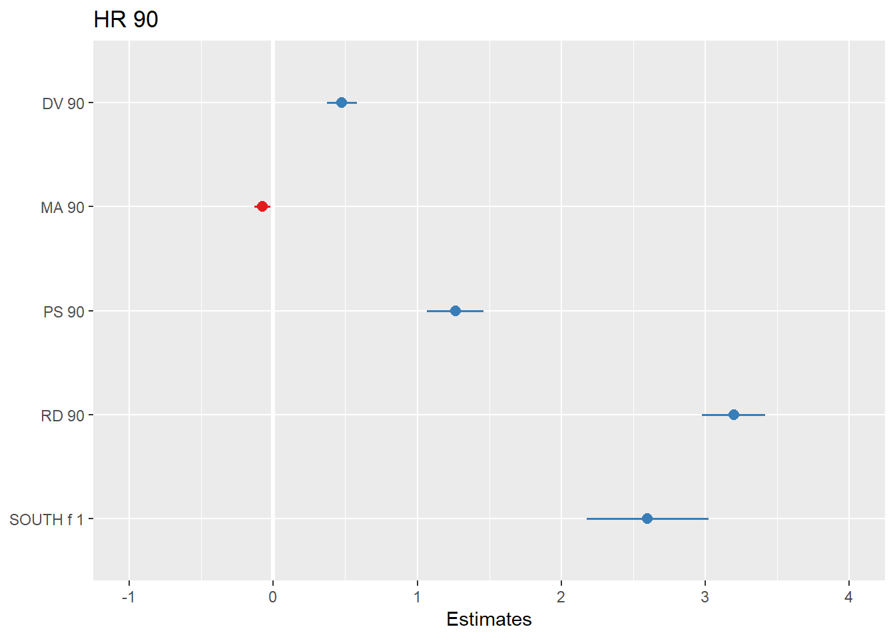


Visual display of the effects of the variables in the model are particularly helpful. The `effects` package allows us to produce plots to visualise these relationships (when adjusting for the other variables in the model). Here's an example going back to our model fit_3 which contained SOUTH and RD90 predictor variables:


```r
library(effects)
```

```
## Loading required package: carData
```

```
## lattice theme set by effectsTheme()
## See ?effectsTheme for details.
```

```r
plot(allEffects(fit_3), ask=FALSE)
```


Notice that the line has a confidence interval drawn around it and that the predicted means for southern and northern counties (when controlling for `RD90`) also have a confidence interval.

## Rescaling input variables to assist interpretation

The interpretation or regression coefficients is sensitive to the scale of measurement of the predictors. This means one cannot compare the magnitude of the coefficients to compare the relevance of variables to predict the response variable. Let's look at the more recent model, how can we tell what predictors have a stronger effect?


```r
summary(fit_4)
```

```
## 
## Call:
## lm(formula = HR90 ~ RD90 + SOUTH_f + DV90 + MA90 + PS90, data = ncovr)
## 
## Residuals:
##     Min      1Q  Median      3Q     Max 
## -15.740  -2.588  -0.678   1.708  69.180 
## 
## Coefficients:
##             Estimate Std. Error t value Pr(>|t|)    
## (Intercept)  4.20350    0.98475   4.269 2.03e-05 ***
## RD90         3.19923    0.11167  28.648  < 2e-16 ***
## SOUTH_f1     2.59975    0.21557  12.060  < 2e-16 ***
## DV90         0.47594    0.05308   8.967  < 2e-16 ***
## MA90        -0.07609    0.02743  -2.774  0.00557 ** 
## PS90         1.26451    0.10047  12.587  < 2e-16 ***
## ---
## Signif. codes:  0 '***' 0.001 '**' 0.01 '*' 0.05 '.' 0.1 ' ' 1
## 
## Residual standard error: 5.035 on 3079 degrees of freedom
## Multiple R-squared:  0.4262,	Adjusted R-squared:  0.4252 
## F-statistic: 457.3 on 5 and 3079 DF,  p-value: < 2.2e-16
```

We just cannot. One way of dealing with this is by rescaling the input variables. A common method involves subtracting the mean and dividing by the standard deviation of each numerical input. The coefficients in these models is the expected difference in the response variable, comparing units that differ by one standard deviation in the predictor while adjusting for other predictors in the model. 

Instead, [Gelman (2008)](http://www.stat.columbia.edu/~gelman/research/published/standardizing7.pdf) has proposed dividing each numeric variables *by two times its standard deviation*, so that the generic comparison is with inputs equal to plus/minus one standard deviation. As Gelman explains the resulting coefficients are then comparable to untransformed binary predictors. The implementation of this approach in the `arm` package subtract the mean of each binary input while it subtract the mean and divide by two standard deviations for every numeric input.

The way we would obtain these rescaled inputs uses the `standardize()` function of the `arm` package, that takes as an argument the name of the stored fit model.


```r
library(arm)
```

```
## 
## arm (Version 1.10-1, built: 2018-4-12)
```

```
## Working directory is /Users/reka/Dropbox (The University of Manchester)/crimemapping_textbook_bookdown
```

```r
standardize(fit_4)
```

```
## 
## Call:
## lm(formula = HR90 ~ z.RD90 + c.SOUTH_f + z.DV90 + z.MA90 + z.PS90, 
##     data = ncovr)
## 
## Coefficients:
## (Intercept)       z.RD90    c.SOUTH_f       z.DV90       z.MA90  
##      6.1829       6.3985       2.5998       1.6497      -0.5478  
##      z.PS90  
##      2.5290
```

Notice the main change affects the numerical predictors. The unstandardised coefficients are influenced by the degree of variability in your predictors, which means that typically they will be larger for your binary inputs. With unstandardised coefficients you are comparing complete change in one variable (whether one is a Southern county or not) with one-unit changes in your numerical variable, which may not amount to much change. So, by putting in a comparable scale, you avoid this problem.

Standardising in the way described here will help you to make fairer comparisons. This standardised coefficients are comparable in a way that the unstandardised coefficients are not. We can now see what inputs have a comparatively stronger effect. It is very important to realise, though, that one **should not** compare standardised coefficients *across different models*.

## Testing conditional hypothesis: interactions

In the social sciences there is a great interest in what are called conditional hypothesis or interactions. Many of our theories do not assume simply **additive effects** but **multiplicative effects**.For example, [Wikstrom and his colleagues (2011)](http://euc.sagepub.com/content/8/5/401.short) suggest that the threat of punishment only affects the probability of involvement on crime for those that have a propensity to offend but are largely irrelevant for people who do not have this propensity. Or you may think that a particular crime prevention programme may work in some environments but not in others. The interest in this kind of conditional hypothesis is growing.

One of the assumptions of the regression model is that the relationship between the response variable and your predictors is additive. That is, if you have two predictors `x1` and `x2`. Regression assumes that the effect of `x1` on `y` is the same at all levels of `x2`. If that is not the case, you are then violating one of the assumptions of regression. This is in fact one of the most important assumptions of regression, even if researchers often overlook it.

One way of extending our model to accommodate for interaction effects is to add additional terms to our model, a third predictor `x3`, where `x3` is simply the product of multiplying `x1` by `x2`. Notice we keep a term for each of the **main effects** (the original predictors) as well as a new term for the interaction effect. "Analysts should include all constitutive terms when specifying multiplicative interaction models except in very rare circumstances" (Brambor et al., 2006: 66).

How do we do this in R? One way is to use the following notation in the formula argument. Notice how we have added a third term `RD90:SOUTH_f`, which is asking R to test the conditional hypothesis that resource deprivation may have a different impact on homicide for soutern and northern counties.


```r
fit_5 <- lm(HR90 ~ RD90 + SOUTH_f + RD90:SOUTH_f , data=ncovr)
# which is equivalent to: 
# fit_5 <- lm(HR90 ~ RD90 * SOUTH_f , data=ncovr)
summary(fit_5)
```

```
## 
## Call:
## lm(formula = HR90 ~ RD90 + SOUTH_f + RD90:SOUTH_f, data = ncovr)
## 
## Residuals:
##     Min      1Q  Median      3Q     Max 
## -17.055  -2.998  -0.566   2.227  68.136 
## 
## Coefficients:
##               Estimate Std. Error t value Pr(>|t|)    
## (Intercept)     4.5477     0.1586  28.675   <2e-16 ***
## RD90            2.5814     0.1963  13.148   <2e-16 ***
## SOUTH_f1        3.2612     0.2247  14.515   <2e-16 ***
## RD90:SOUTH_f1   0.5622     0.2377   2.365   0.0181 *  
## ---
## Signif. codes:  0 '***' 0.001 '**' 0.01 '*' 0.05 '.' 0.1 ' ' 1
## 
## Residual standard error: 5.292 on 3081 degrees of freedom
## Multiple R-squared:  0.3658,	Adjusted R-squared:  0.3652 
## F-statistic: 592.4 on 3 and 3081 DF,  p-value: < 2.2e-16
```

You see here that essentially you have only two inputs (resource deprivation and south) but several regression coefficients. Gelman and Hill (2007) suggest reserving the term input for the variables encoding the information and to use the term predictor to refer to each of the terms in the model. So here we have two inputs and three predictors (one for SOUTH, another for resource deprivation, and a final one for the interaction effect).

In this case the test for the interaction effect is significant, which suggests there is such an interaction.  Let's visualise the results with the `effects` package:


```r
plot(allEffects(fit_5), ask=FALSE)
```

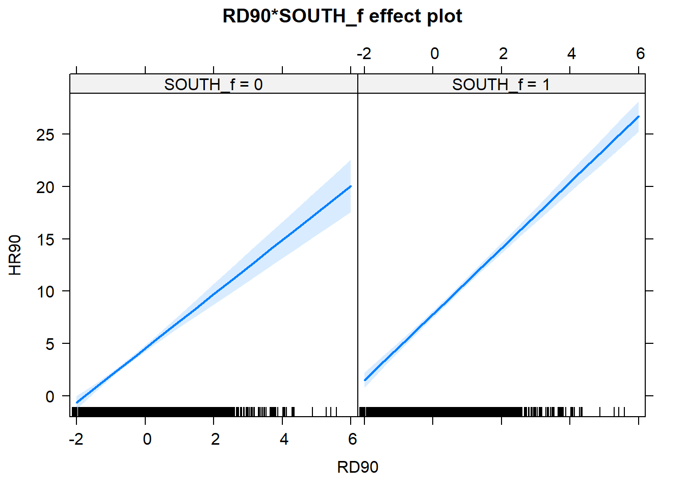

Notice that essentially what we are doing is running two regression lines and testing whether the slope is different for the two groups. The intercept is different, we know that Southern counties are more violent, but what we are testing here is whether the level of homicide goes up in a steeper fashion (and in the same direction) for one or the other group as the level of resource deprivation goes up. We see that's the case here. The estimated lines are almost parallel, but the slopw is a bit more steep in the Southern counties. In southern counties resource deprivation seems to have more of an impact on homicide than in northern counties.

A word of warning, the moment you introduce an interaction effect the meaning of the coefficients for the other predictors changes (what it is often referred as to the "main effects" as opposed to the interaction effect). You cannot retain the interpretation we introduced earlier. Now, for example, the coefficient for the `SOUTH` variable relates the marginal effect of this variable when `RD90` equals zero. The typical table of results helps you to understand whether the effects are significant but offers little of interest that will help you to meaningfully interpret what the effects are. For this is better you use some of the graphical displays we have covered.

Essentially what happens is that the regression coefficients that get printed are interpretable only for certain groups. So now:

+ The intercept still represents the predicted score of homicide for southern counties and have a score of 0 in resurce deprivation (as before).

+ The coefficient of `SOUTH_f1` now can be thought of as the difference between the predicted score of homicide rate for northern counties *that have a score of 0 in resource deprivation* and northern counties *that have a score of 0 in resource deprivation*.

+ The coefficient of `RD90` now becomes the comparison of mean homicide rate *for southern* counties who differ by one point in resource deprivation.

+ The coefficient for the interaction term represents the difference in the slope for `RD90` comparing southern and northern counties, the difference in the slope of the two lines that we visualised above.

Models with interaction terms are too often misinterpreted. I strongly recommend you read this piece by [Brambor et al (2005)](https://files.nyu.edu/mrg217/public/pa_final.pdf) to understand some of the issues involved. When discussing logistic regression we will return to this and will consider tricks to ease the interpretation.

Equally, [John Fox (2003)](http://www.jstatsoft.org/v08/i15/paper) piece on the `effects` package goes to much more detail that we can here to explain the logic and some of the options that are available when producing plots to show interactions with this package.

## Model building and variable selection

How do you construct a good model? This partly depends on your goal, although there are commonalities. You do want to start with theory as a way to select your predictors and when specifying the nature of the relationship to your response variable (e.g., additive, multiplicative). Gelman and Hill (2007) provide a series of general principles[^7]. I would like to emphasise at this stage two of them:

+ Include all input variables that, for substantive reasons, might be expected to be important in predicting the outcome.

+ For inputs with large effects, consider including their interactions as well.

It is often the case that for any model, the response variable is only related to a subset of the predictors. There are some scenarios where you may be interested in understanding what is the best subset of predictors. Imagine that you want to develop a risk assessment tool to be used by police officers that respond to a domestic violence incident, so that you could use this tool for forecasting the future risk of violence. There is a cost to adding too many predictors. A police officer time should not be wasted gathering information on predictors that are not associated with future risk. So you may want to identify the predictors that will help in this process.

Ideally, we would like to perform variable selection by trying out a lot of different models, each containing a different subset of the predictors. There are various statistics that help in making comparisons across models. Unfortunately, as the number of potentially relevant predictors increases the number of potential models to compare increases exponentially. So you need methods that help you in this process. There are a number of tools that you can use for **variable selection** but this goes beyond the aims of this introduction. If you are interested you may want to read [this](http://link.springer.com/chapter/10.1007/978-1-4614-7138-7_6).

## Regression assumptions

Although so far we have discussed the practicalities of fitting and interpreting regression models, in practical applications you want to first check your model and proceed from there. Not much point spending time interpreting your model until you know that the model reasonably fits your data.

In previous data analysis modules we surely covered assumptions made by various statistical tests. The regression model also makes assumptions of its own. In fact, there are so many that we could spend an entire class discussing them. Gelman and Hill (2007) point out that the most important regression assumptions by decreasing order of importance are:

+ **Validity**. The data should be appropriate for the question that you are trying to answer:

> "Optimally, this means that the outcome measure should accurately reflect the phenomenon of interes, the model should include all relevant predictors, and the model should generalize to all cases to which it will be applied... Data used in empirical research rarely meet all (if any) of these criteria precisely. However, keeping these goals in mind can help you be precise about the types of questions you can and cannot answer reliably"

+ **Additiviy and linearity**. These are the most important mathematical assumptions of the model. We already talked about additivity in previous sessions and discussed how you can include interaction effects in your models if the additivity assumption is violated. We will discuss problems with non-linearities today as well as ways to diagnose and solve this problem. If the relationship is non linear (e.g, it is curvilinear) predicted values will be wrong in a biased manner, meaning that predicted values will systematically miss the true pattern of the mean of y (as related to the x-variables).

+ **Independence of errors**. Regression assumes that the errors from the prediciton line (or hyperplane) are independent. If there is dependency between the observations (you are assessing change across the same units, working with spatial units, or with units that are somehowed grouped such as students from the same class), you may have to use models that are more appropriate (e.g., multilevel models, spatial regression, etc.).

+ **Equal variances of errors**. When the variance of the residuals is unequal, you may need different estimation methods. This is, nonetheless, considered a minor issue. There is a small effect on the validity of t-test and F-test results, but generally regression inferences are robust with regard to the variance issue.

+ **Normality of errors**. The residuals should be normally distributed. Gelman and Hill (2007: 46) discuss this as the least important of the assumptions and in fact "do *not* recommend diagnostics of the normality of the regression residuals". If the errors do not have a normal distribution, it usually is not particularly serious. Regression inferences tend to be robust with respect to normality (or nonnormality of the errors). In practice, the residuals may appear to be nonnormal when the wrong regression equation has been used. So, I will show you how to inspect normality of the residuals not because this is a problem on itself, but because it may be give you further evidence that there is some other problem with the model you are applying to your data.

Apart from this, it is convenient to diagnose multicollinearity (this affects interpretation) and influential observations.

So these are the assumptions of linear regression, and today we will go through how to test for them, and also what are some options that you can consider if you find that your model violates them. While finding that some of the assumptions are violated do not necessarily mean that you have to scrap your model, it is important to use these diagnostics to illustrate that you have considered what the possible issues with your model is, and if you find any serious issues that you address them. 

You may have noticed the second of this assumption is independence of errors. This is an issue with spatial data. If you have spatial autocorrelation basically you are syaing that your observations are not independent. What happens in area X is likely to be similar to what happens in its surrounding neighbors (if you have positive spatial autocorrelation). What do you do? Well, that's what we will cover next week. We will learn how to fit regression models where you have spatial dependency.

### HOMEWORK
Fit a regression model with a few relevant explanatory variables for the homicide rate in 1970. Make sure you interpret your results.


[^1]: CAUTION! These variables were created by ESDS to aid in teaching. They are the result of running factor analysis in a number of categorical measures to create scalar variables. For any other purposes you should aim to use the original BCS data.
[^2]: [This](http://link.springer.com/chapter/10.1007/978-1-4614-9170-5_15) is a fine chapter too if you struggle with the explanations in the required reading. Many universities, like the University of Manchester, have full access to Springer ebooks. You can also have a look at [these notes](http://people.stern.nyu.edu/wgreene/Statistics/MultipleRegressionBasicsCollection.pdf).
[^3]: [This](http://blog.minitab.com/blog/adventures-in-statistics/regression-analysis-how-do-i-interpret-r-squared-and-assess-the-goodness-of-fit) is a reasonable explanation of how to interpret R-Squared.
[^4]: [This blog post](http://www.sumsar.net/blog/2013/12/an-animation-of-the-construction-of-a-confidence-interval/) provides a nice animation of the confidence interval and hypothesis testing.
[^5]: [This](http://vudlab.com/simpsons/) is a nice illustration of the Simpon's Paradox, a well known example of ommitted variable bias.
[^6]: I recommend reading chapter 13 "Woes of regression coefficients" of an old book Mostseller and Tukey (1977) Data Analysis and Regression. Reading: Addison-Wesley Publishing.
[^7]: Look at [this](
http://www.r-bloggers.com/stop-using-bivariate-correlations-for-variable-selection/) too.
