# Time matters


This week we consider another important factor that is present in our data that we don't always talk about, and that is the importance of *time*. The importance of place in criminology and crime analysis is widely discussed. We know certain areas can be crime hotspots, and we know that whether you come from a well of or depreived area you have different access to resources, and therefore your outcomes in terms of involvement with criminal justica system also differs. However time is just as important as place. We often hear that crime is "going up" or "going down" over time. It is very important, that as well-rounded criminologists, you are able to talk about these concepts with appropriate knowledge and understanding. 

When violence increases bewteen March and August, is that because we are seeing an increase in crime and offending? Or is it possible that the time of year has something to do with this? How much must crime increase and over how long of a time, in order to be able to confidently say that crime is on the increase? These are important, and not always easy questions to answer, and this week we will begin to think about this. 

All crimes occur at a specific date and time, however such definite temporal information is only available when victims or witnesses are present, alarms are triggered, etc., at the time of occurrence. This specific temporal data is most often collected in crimes against persons. In these cases, cross-tabulations or histogram of weekday and hour by count will suffice. The great majority of reported events are crimes against property. In these cases, there are seldom victims or witnesses present. These events present the analyst with ‘ranged’ temporal data, that is, an event reported as occurring over a range of hours or even days. In the case of ranged temporal data, analysis is possible through use of equal chance or probability methods. If an event was reported as having occurred from Monday to Tuesday, in the absence of evidence to the contrary, it is assumed the event had an equal chance or probability of occurring on each of the two days, or .5 (%50). In the same manner, if an event was reported as having occurred over a 10 hour span there is a 10% chance the event occurred during any one of the hours. This technique requires a reasonable number of events in the data set to be effective. The resulting probabilities are totalled in each category and graphed or cross-tabulated. This produces a comparison of relative frequency, by weekday or hour [source](http://cradpdf.drdc-rddc.gc.ca/PDFS/unc76/p530054.pdf).


**Temporal crime analysis** looks at trends in crime or incidents. A crime or incident trend is a broad direction or pattern that specific types or general crime and/or incidents are following.

Three types of trend can be identified:

- overall trend – highlights if the problem is getting worse, better or staying the same over a period of time
- seasonal, monthly, weekly or daily cycles of offences – identified by comparing previous time periods with the same period being analysed
- random fluctuations – caused by a large number of minor influences, or a one-off event, and can include displacement of crime from neighbouring areas due to partnership activity or crime initiatives.

Decomposing these trends is an important part of what **time series** analysis is all about. Let's see some examples.

## Getting time series data into R and plotting it

We are going to start with fairly simple data. We are just going to look at monthly counts of crime for Greater Manchester obtained from the Police.UK website. We have aggregated 36 months of data into a file for you to use. Grab the data using the following code:


```r
data_url <-"https://raw.githubusercontent.com/maczokni/crimemapping_textbook_bookdown/master/data/gmp_month.csv"
gmp_month <- read.csv(url(data_url))
```

If you view the data you will see it has two columns, the date and the count of crimes for that month. Once you have read the time series data into R, the next step is to store the data in a time series object in R, so that you can use R’s many functions for analysing time series data. To store the data in a time series object, we use the `ts()` function in R. 


```r
library(dplyr)
#First we select the relevant column
gmp_month_c <- select(gmp_month, count)
#Then we create the time series object
gmp_timeseries <- ts(gmp_month_c)
```

You can autoprint to see the result:


```r
gmp_timeseries
```

Sometimes the time series data set that you have may have been collected at regular intervals that were less than one year, for example, monthly or quarterly. In this case, you can specify the number of times that data was collected per year by using the `frequency` parameter in the `ts()` function. For monthly time series data, you set `frequency=12`, while for quarterly time series data, you set `frequency=4.`

You can also specify the first year that the data was collected, and the first interval in that year by using the `start` parameter in the `ts()` function. So, in our case, we would do as follows:


```r
gmp_timeseries <- ts(gmp_month_c, frequency=12, start=c(2016,2))
gmp_timeseries
```

```
##        Jan   Feb   Mar   Apr   May   Jun   Jul   Aug   Sep   Oct   Nov
## 2016       26422 28516 28258 30722 30111 31255 30850 31064 34709 31122
## 2017 31670 30784 35094 34878 35890 36397 37480 35658 32768 35990 34052
## 2018 31774 29609 33434 34120 35478 34386 35333 32184 30956 32838 32672
## 2019 31063                                                            
##        Dec
## 2016 32079
## 2017 31233
## 2018 30377
## 2019
```

Once you have read a time series into R, the next step is usually to make a plot of the time series data, which you can do with the `plot.ts()` function in R.


```r
plot.ts(gmp_timeseries)
```


We can of course also use `ggplot2`to plot a time series like the one we just did but here we would need a variable encoding the date (and preferably a full date, not just month and year as here). If you look a "gmp_month" you will see the name of the variables are not optimal, so we will rename them first.


```r
library(ggplot2)
gmp_month <- rename(gmp_month, date = as.factor.Month., crime = count)
ggplot(data=gmp_month, aes(x=date, y=crime, group=1)) +
  geom_line()+
  geom_point()+
  theme(axis.text.x = element_text(angle = 90, hjust = 1))
```


If we had a date vector rather than a factor encoding our date we would need to adapt our code. See [here](http://www.sthda.com/english/articles/32-r-graphics-essentials/128-plot-time-series-data-using-ggplot/) for further details.

Alternatively we can use `ggfortify`, an extension to `ggplot2` that would allow us to use `ts` objects as inputs. For this we use the `autoplot` function.


```r
library(ggfortify)
autoplot(gmp_timeseries)
```


## Lubridate: your guardian angel when it comes to working with temporal data

As you saw, the data from Police.Uk is aggregated by months. We do not know when the offences happened, only the month, but nothing more granular than that. American police data on the other hand is much more granular. 

Cities release their own data. Here, we will be looking at crimes from New York City on aggravated assult. The data from an open source initiative maintained by Matt Ashby [here](https://osf.io/zyaqn/).  I have filter and selected the data so that we are only working with aggravated assaults from New York for a period of five years. 


```r
library(readr)
agassault_ny<-read_csv("https://raw.githubusercontent.com/maczokni/crimemapping_textbook_bookdown/master/data/agassault.csv")
```

```
## Parsed with column specification:
## cols(
##   uid = col_double(),
##   date_single = col_datetime(format = ""),
##   longitude = col_double(),
##   latitude = col_double(),
##   location_type = col_character(),
##   location_category = col_character(),
##   census_block = col_double(),
##   date_start = col_datetime(format = ""),
##   date_end = col_datetime(format = "")
## )
```

When you read the data into R, you will see that there is a column for date called **date_single**. The date is in the format dd/mm/yyyy and h/m/s. So the first date on there you can see is  2014-01-01 00:03:00. What kind of variable is this?


```r
class(agassault_ny$date_single)
```

```
## [1] "POSIXct" "POSIXt"
```

Our date and time variables are of class `POSIXct` and `POSIXt`.  These are the two basic classes of date/times. Class "POSIXct" represents the (signed) number of seconds since the beginning of 1970 as a numeric vector. Class "POSIXlt" is a named list of vectors representing seconds (0–61), minutes (0–59), hours (0–23), day of the month (1–31), months after the first of the year (0–11), years since 1900, day of the week, starting on Sunday (0–6), and a flag for whether it is daylight savings time or not (positive if in force, zero if not, negative if unknown). 


Let's plot this data:


```r
agassault_ny %>% 
  ggplot(aes(date_single)) + 
  geom_freqpoly(binwidth = 604800) # 86400 seconds = 1 day, 604800 one week
```


Notice what `geom_freqpoly` is doing. We have a dataframe with rows for each case. The data is not aggregated in any form. But this function counts on the fly the number of cases (of rows) for each of the bins as we define them. It is, thus, a convenient function that saves us from having to first do that aggregation ourselves when we want to plot it. This may be helpful when you get your data for the assignment.

An alternative approach to plotting individual components is to round the date to a nearby unit of time, with `floor_date()`, `round_date()`, and `ceiling_date()`. Each function takes a vector of dates to adjust and then the name of the unit round down (floor), round up (ceiling), or round to.


```r
library(lubridate)
```

```
## 
## Attaching package: 'lubridate'
```

```
## The following object is masked from 'package:base':
## 
##     date
```

```r
agassault_ny %>% 
  count(month = floor_date(date_single, "month")) %>% 
  ggplot(aes(month, n)) +
    geom_line()
```


What if I asked you the question: which year had the most aggravated assaults? Or what if I want to know if aggravated assaults happen more in the weekday, when people are at work, or in the weekends, maybe when people are away for a holiday? You have the date, so you should be able to answer these questions, right? 

Well you need to be able to have the right variables to answer these questions. To know what year saw the most aggravated assaults, you need to have a variable for year. To know what day of the week has the most aggravated assaults, you need to have a variable for day of the week. So how can we extract these variables from your date column? Well luckily the `lubridate` package can help us do this.


```r
agassault_ny$year <- year(agassault_ny$date_single)
agassault_ny$month <- month(agassault_ny$date_single, label = TRUE, abbr=FALSE, locale = "UK")
agassault_ny$day <- day(agassault_ny$date_single)
agassault_ny$wday <- wday(agassault_ny$date_single, label = TRUE, abbr=FALSE, locale = "UK")
```


And as you can see now you have a set of additional variables that have extracted information from your original time of occurrence variable.

We can now look at the distribution of events per day of the week.


```r
agassault_ny %>% 
  mutate(wday = wday(date_single, label=TRUE, abbr=FALSE)) %>% 
  ggplot(aes(x = wday)) +
    geom_bar()
```

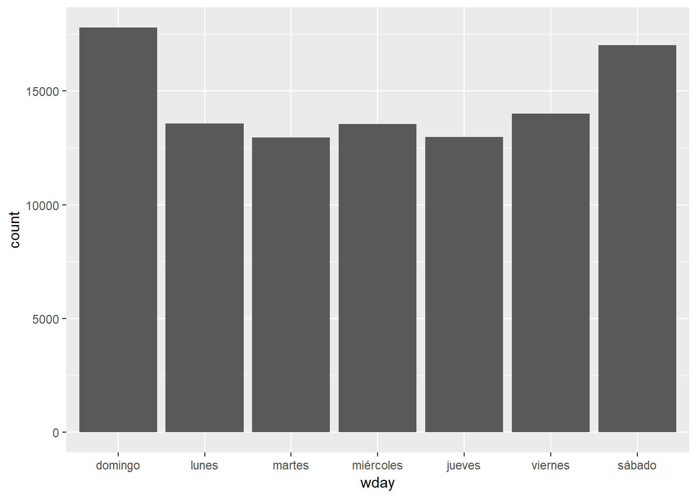

The `lubridate` package is incredibly helpful for anything date related. We don't have time to go over it on details but you can find more information on [the official page](https://lubridate.tidyverse.org/) or in [this](https://mikoontz.github.io/data-carpentry-week/lesson_lubridate.html) tutorial. The relevant chapter in [R for Data Science](https://r4ds.had.co.nz/dates-and-times.html#introduction-10) is also very helpful.


## Calendar heatmaps

We can also parse the temporal information that is available in our date variable. For the next chart we introduce we only need date, month, and year. We don't need the time.


```r
agassault_ny$date <- format(as.POSIXct(agassault_ny$date_single,format="%Y:%m:%d %H:%M:%S"),"%d:%m:%Y")
head(agassault_ny$date)
```

```
## [1] "01:01:2014" "01:01:2014" "01:01:2014" "01:01:2014" "01:01:2014"
## [6] "01:01:2014"
```

```r
class(agassault_ny$date)
```

```
## [1] "character"
```

We can now use `dplyr` to counts the evens per day.


```r
by_day <- group_by(agassault_ny, date)
agassault_ny_d <- summarise(by_day,
                          assaults = n())
```

We will now use a `ggplot2` extension that allow us to produce calendar heat visualisations.


```r
agassault_ny_d$date <- dmy(agassault_ny_d$date)
library(ggTimeSeries)
p1 <- ggplot_calendar_heatmap(
   agassault_ny_d,
   'date',
   'assaults')
#Now we customise the plot a bit more
p1 +
   xlab(NULL) +
   ylab(NULL) +
   scale_fill_continuous(low = 'green', high = 'red') +
   facet_wrap(~Year, ncol = 1)
```

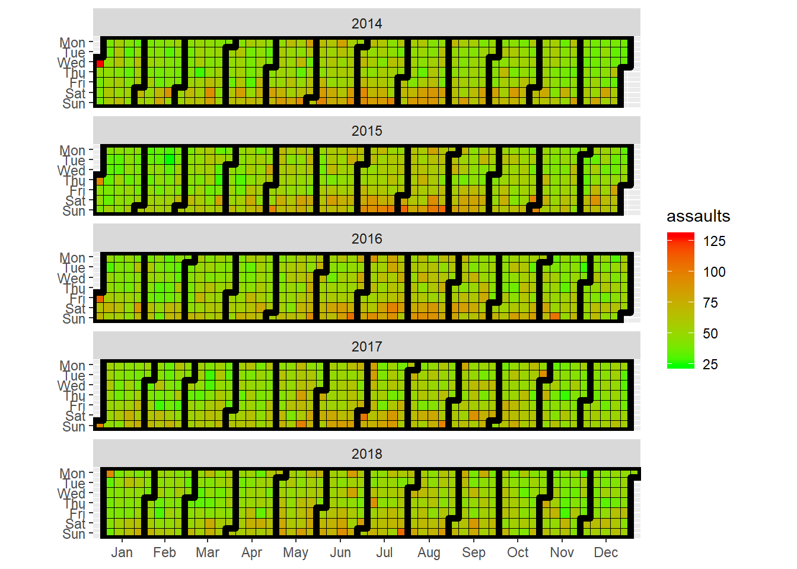

There are many things that peak on certain days of the week. If you're interested in some more examples, [read this article in the Guardian about the most dangerous days of the week](https://www.theguardian.com/lifeandstyle/2013/may/29/most-dangerous-day-of-week).

## Decomposing time series

Decomposing a time series means separating it into its constituent components, which are usually a trend component and an irregular component, and if it is a seasonal time series, a seasonal component. Let's get some fresh data. These are intimate partner femicides from Spain;


```r
fem <- read.csv("data/fem.csv")
colnames(fem)<- c("femicidios")
fem_timeseries <- ts(fem, frequency=12, start=c(2003,1))
plot.ts(fem_timeseries)
```


As you can see it is very noisy. Fortunately, the annual count for intimate partner femicides is low in Spain. There seems to be some seasonality too.

A seasonal time series consists of a trend component, a seasonal component and an irregular component. Decomposing the time series means separating the time series into these three components: that is, estimating these three components.

To estimate the trend component and seasonal component of a seasonal time series that can be described using an additive model, we can use the `decompose()` function in R. This function estimates the trend, seasonal, and irregular components of a time series that can be described using an additive model.

The function `decompose()` returns a list object as its result, where the estimates of the seasonal component, trend component and irregular component are stored in named elements of that list objects, called “seasonal”, “trend”, and “random” respectively.

To estimate the trend, seasonal and irregular components of this time series, we type:


```r
fem_timeseriescomponents <- decompose(fem_timeseries)
```

The estimated values of the seasonal, trend and irregular components are now stored in variables `fem_timeseriescomponents$seasonal`, `fem_timeseriescomponents$trend` and `fem_timeseriescomponents$random`. For example, we can print out the estimated values of the seasonal component by typing:


```r
fem_timeseriescomponents$seasonal
```

```
##              Jan         Feb         Mar         Apr         May
## 2003  0.22142094 -0.75934829 -0.07345085 -0.44845085  0.63488248
## 2004  0.22142094 -0.75934829 -0.07345085 -0.44845085  0.63488248
## 2005  0.22142094 -0.75934829 -0.07345085 -0.44845085  0.63488248
## 2006  0.22142094 -0.75934829 -0.07345085 -0.44845085  0.63488248
## 2007  0.22142094 -0.75934829 -0.07345085 -0.44845085  0.63488248
## 2008  0.22142094 -0.75934829 -0.07345085 -0.44845085  0.63488248
## 2009  0.22142094 -0.75934829 -0.07345085 -0.44845085  0.63488248
## 2010  0.22142094 -0.75934829 -0.07345085 -0.44845085  0.63488248
## 2011  0.22142094 -0.75934829 -0.07345085 -0.44845085  0.63488248
## 2012  0.22142094 -0.75934829 -0.07345085 -0.44845085  0.63488248
## 2013  0.22142094 -0.75934829 -0.07345085 -0.44845085  0.63488248
## 2014  0.22142094 -0.75934829 -0.07345085 -0.44845085  0.63488248
## 2015  0.22142094 -0.75934829 -0.07345085 -0.44845085  0.63488248
## 2016  0.22142094 -0.75934829 -0.07345085 -0.44845085  0.63488248
##              Jun         Jul         Aug         Sep         Oct
## 2003 -0.16639957  0.70860043  0.03231838 -0.18242521  0.29834402
## 2004 -0.16639957  0.70860043  0.03231838 -0.18242521  0.29834402
## 2005 -0.16639957  0.70860043  0.03231838 -0.18242521  0.29834402
## 2006 -0.16639957  0.70860043  0.03231838 -0.18242521  0.29834402
## 2007 -0.16639957  0.70860043  0.03231838 -0.18242521  0.29834402
## 2008 -0.16639957  0.70860043  0.03231838 -0.18242521  0.29834402
## 2009 -0.16639957  0.70860043  0.03231838 -0.18242521  0.29834402
## 2010 -0.16639957  0.70860043  0.03231838 -0.18242521  0.29834402
## 2011 -0.16639957  0.70860043  0.03231838 -0.18242521  0.29834402
## 2012 -0.16639957  0.70860043  0.03231838 -0.18242521  0.29834402
## 2013 -0.16639957  0.70860043  0.03231838 -0.18242521  0.29834402
## 2014 -0.16639957  0.70860043  0.03231838 -0.18242521  0.29834402
## 2015 -0.16639957  0.70860043  0.03231838 -0.18242521  0.29834402
## 2016 -0.16639957  0.70860043  0.03231838 -0.18242521  0.29834402
##              Nov         Dec
## 2003  0.39449786 -0.65998932
## 2004  0.39449786 -0.65998932
## 2005  0.39449786 -0.65998932
## 2006  0.39449786 -0.65998932
## 2007  0.39449786 -0.65998932
## 2008  0.39449786 -0.65998932
## 2009  0.39449786 -0.65998932
## 2010  0.39449786 -0.65998932
## 2011  0.39449786 -0.65998932
## 2012  0.39449786 -0.65998932
## 2013  0.39449786 -0.65998932
## 2014  0.39449786 -0.65998932
## 2015  0.39449786 -0.65998932
## 2016  0.39449786 -0.65998932
```

The estimated seasonal factors are given for the months January-December, and are the same for each year. The largest seasonal factor is for July (about 0.70), and the lowest is for February (about -0.76), indicating that there seems to be a peak in femicides in July and a trough in femicides in February each year.

We can plot the estimated trend, seasonal, and irregular components of the time series by using the `plot()` function, for example:


```r
plot(fem_timeseriescomponents)
```

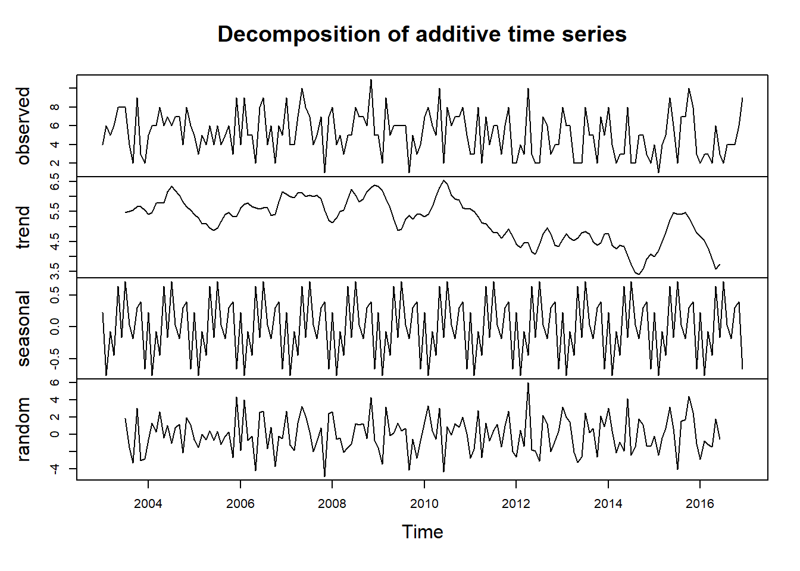

Once we remove the noise and the seasonal components, it becomes easier to see the estimated trend.

**Homework 10.1**
*Try creating a ts object using the aggassault data from New York and decompose the time series*


We can also use `ggplot2` for these purposes. In particular we can use the `ggseas` extension -see for details [here](https://github.com/ellisp/ggseas). First I use the `tsdf` function that turns the `ts` object you created for the homework into a dataframe (you may have provided this object with a different name) and then plot the series.


```r
library(ggseas)
ny_df <- tsdf(ny_timeseries)
ggsdc(ny_df, aes(x = x, y = y), method = "decompose") +
   geom_line()
```

```
## Calculating frequency of 365 from the data.
```

```
## Warning: Removed 182 rows containing missing values (geom_path).
```

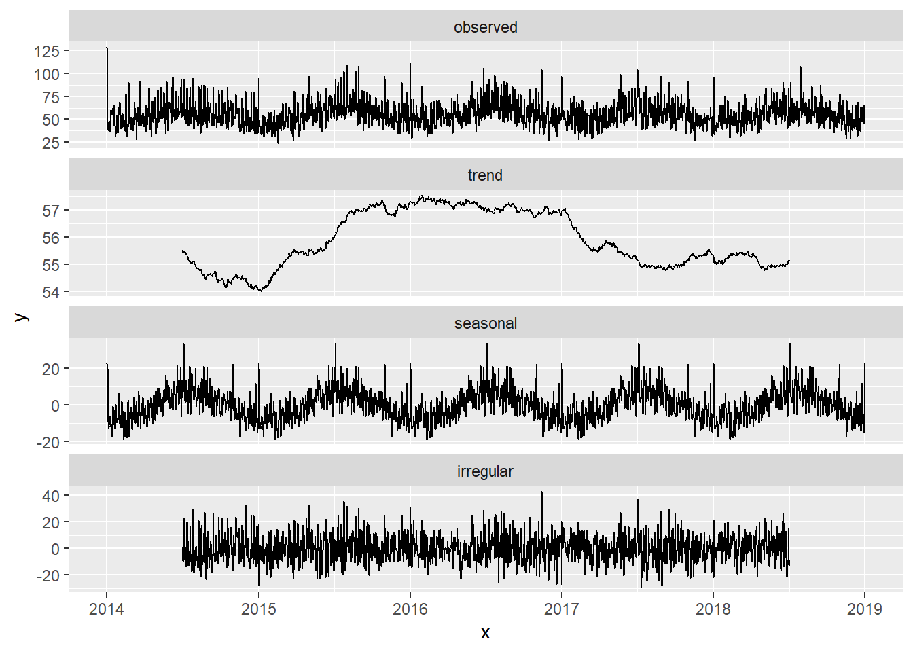


## Static maps with ggplot2

So far we have seen how we can produce maps with `tmap`for thematic maps and `leaflet` for interactive maps. But we can also use static maps with `ggplot2`. For the next set of exercises we are going to look at temporal variations on burglary across Greater Manchester. We are going to focus on wards as the unit of analysis. You will likely work with this dataset for crime for your assignment and you may use wards or smaller geographies. So we will focus on this data for this illustration of basic plotting and spatial operations (in the next section).

To load the ward shapefiles for Manchester into a `sf` object we use code we had already used in a previous session.


```r
library(sf)
```

```
## Linking to GEOS 3.6.1, GDAL 2.2.3, PROJ 4.9.3
```

```r
manchester_ward <- st_read("https://raw.githubusercontent.com/RUMgroup/Spatial-data-in-R/master/rumgroup/data/wards.geojson")
```

```
## Reading layer `wards' from data source `https://raw.githubusercontent.com/RUMgroup/Spatial-data-in-R/master/rumgroup/data/wards.geojson' using driver `GeoJSON'
## Simple feature collection with 215 features and 12 fields
## geometry type:  POLYGON
## dimension:      XY
## bbox:           xmin: 351664 ymin: 381168.6 xmax: 406087.5 ymax: 421039.8
## epsg (SRID):    27700
## proj4string:    +proj=tmerc +lat_0=49 +lon_0=-2 +k=0.9996012717 +x_0=400000 +y_0=-100000 +ellps=airy +towgs84=446.448,-125.157,542.06,0.15,0.247,0.842,-20.489 +units=m +no_defs
```

With this data in our environment we can plot a map using `ggplot2`. We use the `geom_sf` function to tell `ggplot2` we are dealing with a `sf` object.


```r
library(ggplot2)
ggplot() + geom_sf(data = manchester_ward, aes()) +
  labs(x = "Longitude", y = "Latitude") +
  theme_bw()
```

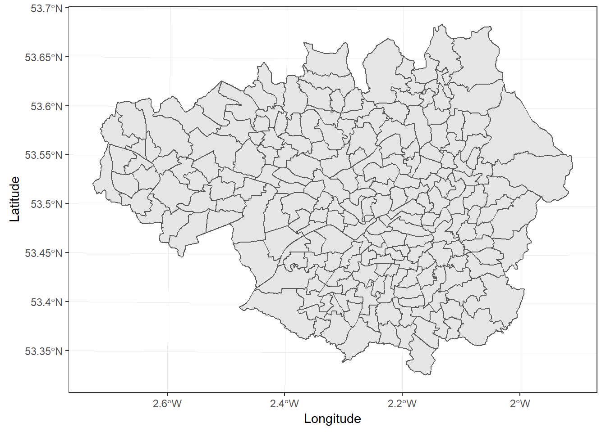

We can also plot objects that are not `sf` but have geographic coordinates.

Let's load the data with the burglaries for Greater Manchester.


```r
gmp_bur <- read_csv("https://raw.githubusercontent.com/maczokni/crimemapping_textbook_bookdown/master/data/gmp_bur.csv")
```

```
## Parsed with column specification:
## cols(
##   Month = col_character(),
##   Crime.type = col_character(),
##   Longitude = col_double(),
##   Latitude = col_double()
## )
```

You can see there is a column with the longitude and another with latitude. For this we can use the standard `geom_point` function speficying X and Y as our longitude and latitude. Given the number of points in the data I am also modifying the transparenci and size of the points to deal with overplotting.


```r
ggplot() + 
  geom_point(data = gmp_bur, aes(x = Longitude, y = Latitude), 
             alpha = 0.05, size = 0.5) + 
  labs(x = "Longitude", y = "Latitude") +
  theme_bw()
```

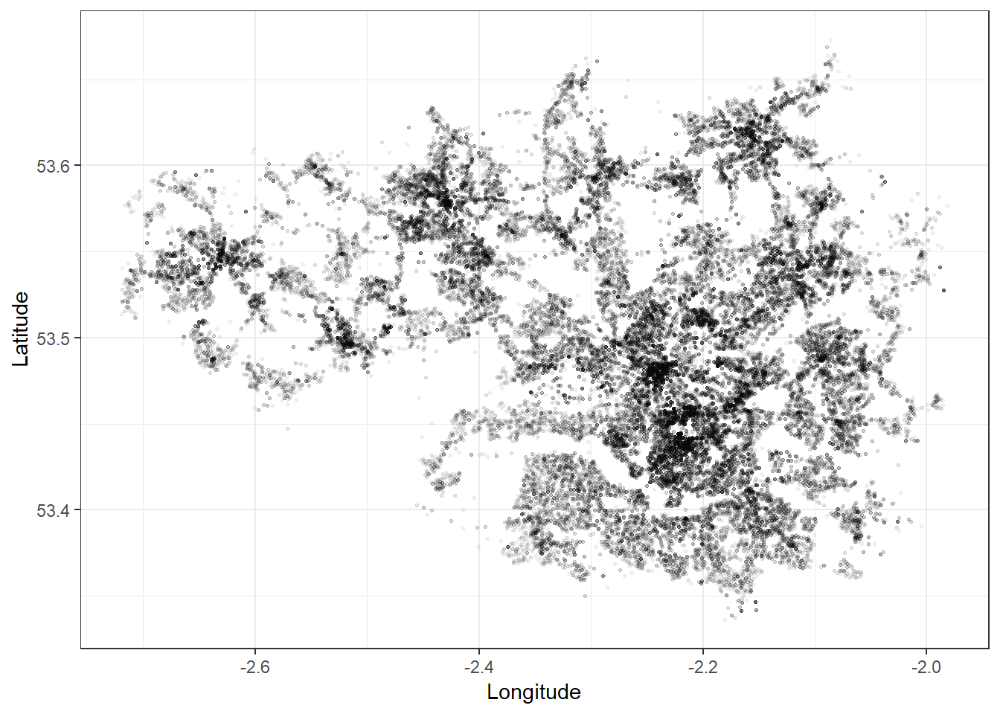

You could try to have a map with two layers, the points and the wards, so combining what we have done so far.


```r
ggplot() + geom_sf(data = manchester_ward, aes()) + 
  geom_point(data = gmp_bur, aes(x = Longitude, y = Latitude)) + 
  labs(x = "Longitude", y = "Latitude")+
  theme_bw()
```


Ooops. What happened? Can you think of what is going on here? This is something we have already covered in previous lab sessions.

In week 4  we explained how it is important to check that spatial operations that use two spatial objects rely on both objects having the same coordinate reference system, otherwise funny things may happen. We can check the coordinate reference system with the `st_crs` function from `sf`.


```r
st_crs(manchester_ward)
```

```
## Coordinate Reference System:
##   EPSG: 27700 
##   proj4string: "+proj=tmerc +lat_0=49 +lon_0=-2 +k=0.9996012717 +x_0=400000 +y_0=-100000 +ellps=airy +towgs84=446.448,-125.157,542.06,0.15,0.247,0.842,-20.489 +units=m +no_defs"
```

What is `EPGS: 27700`? You can check [here](https://epsg.io/27700). This is the British National Grid. How about the police data? Well, we don't have a `sf` object, we have a dataframe for the burglaries. But if we look at the documentation for this data from the Police.UK website we can learn that they use WGs1984 instead. What do we do? First we need to create a `sf` object for the police data specifying the coordinate system (we covered how to do this in week 3).


```r
burglary_sf <- st_as_sf(x = gmp_bur, 
                        coords = c("Longitude", "Latitude"),
                        crs = "+proj=longlat +datum=WGS84")
```

If we now check:


```r
st_crs(burglary_sf)
```

```
## Coordinate Reference System:
##   EPSG: 4326 
##   proj4string: "+proj=longlat +datum=WGS84 +no_defs"
```

```r
st_crs(manchester_ward) == st_crs(burglary_sf)
```

```
## [1] FALSE
```

We can see the code 4326, which is basically the code for WGS84. And that the coordinate system across our two `sf` objects is different. We also covered this in week 4 but take this as a helpful refresher for the kind of things it is likely you need to do for your assignment. Essentially, we need to use the `st_transform` function. We need to make sure we translate one of these layers into the other coordinate reference system.


```r
wards_WGS84 <- st_transform(manchester_ward, 4326)
st_crs(wards_WGS84) == st_crs(burglary_sf)
```

```
## [1] TRUE
```

Try now plotting the map.


```r
ggplot() + geom_sf(data = wards_WGS84, aes()) + 
  geom_point(data = gmp_bur, aes(x = Longitude, y = Latitude),
             alpha = 0.05, size = 0.5) + 
  labs(x = "Longitude", y = "Latitude")+
  theme_bw()
```

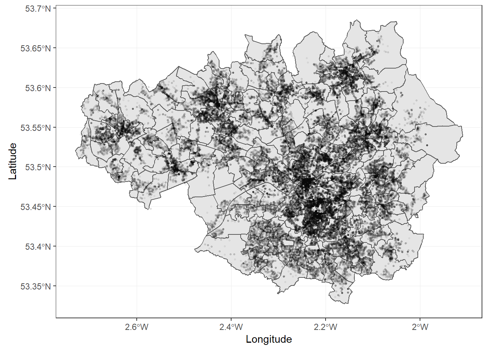


## Small multiples to show temporal variation


We have covered small multiples before. You can indeed use facets to show how things change (or don't change) across time. Let's just focus on 2018 to simplify things a bit.


```r
bur_sf_2018 <- filter(burglary_sf, Month == "2018-01" | Month == "2018-02" |
                        Month == "2018-03" | Month == "2018-04" |
                        Month == "2018-05" | Month == "2018-06" |
                        Month == "2018-07" | Month == "2018-08" |
                        Month == "2018-09" | Month == "2018-10" |
                        Month == "2018-11" | Month == "2018-12")
table(bur_sf_2018$Month)
```

```
## 
## 2018-01 2018-02 2018-03 2018-04 2018-05 2018-06 2018-07 2018-08 2018-09 
##    2649    2316    2566    2463    2534    2410    2458    2476    2450 
## 2018-10 2018-11 2018-12 
##    2582    2701    2593
```

Let's simplify further by focusing just in Manchester City.


```r
mc_wards_WGS864 <- filter(wards_WGS84, lad16nm == "Manchester")
```

Ok, let's do a point in polygon operation, count the number of burglaries per ward, so that we can display choropleth maps. Again, this is something we cover in week 4.


```r
bur_per_ward <- bur_sf_2018 %>% 
  st_join(mc_wards_WGS864, ., left = FALSE) %>% 
  count(wd16nm)
```

The code above only counts for the whole year. But if we want to have a map per month we don't need the total counts for the whole year but rather the monthly counts.


```r
bur_per_ward <- bur_sf_2018 %>% 
  st_join(mc_wards_WGS864, ., left = FALSE) %>% 
  count(wd16nm, Month)
```

We can now try to produce the small multiples.


```r
library(tmap)
tm_shape(bur_per_ward) + 
  tm_fill("n") +
  tm_borders() +
  tm_facets("Month", free.coords=FALSE)
```

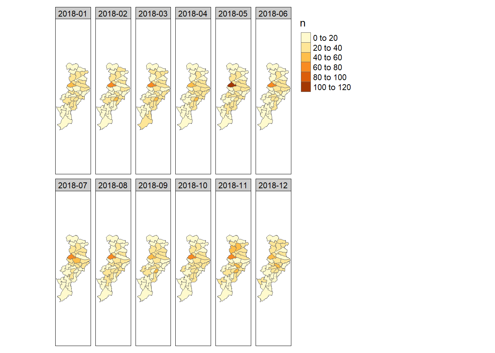

## Spaghetti plots

In longitudinal studies and in studies looking at areas over time, sometimes researchers use spaghetti plots. On their own they are not great, but they can used when one wants to put a trajectory within a broader context or when comparing different trajectores. You can read more about them [here](https://www.storytellingwithdata.com/blog/2013/03/avoiding-spaghetti-graph). Let's first get rid of the "spatial component"" for the data.


```r
spa_df <- bur_per_ward
st_geometry(spa_df) <- NULL
class(spa_df)
```

```
## [1] "tbl_df"     "tbl"        "data.frame"
```

To produce a simple spaghetti plot we can use `ggplot2`. 


```r
ggplot(spa_df, aes(x=Month, y=n, group = wd16nm)) + 
  geom_line() + guides(colour=FALSE) + xlab("Observation Time Point") +
  ylab("Y") +
  theme_bw()
```

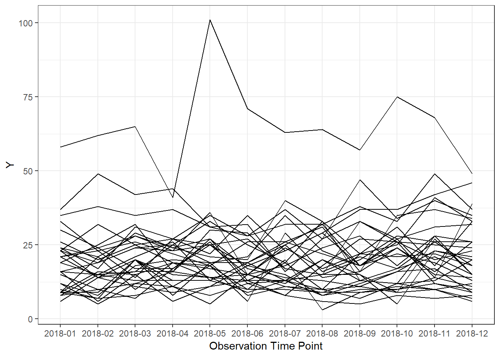

As you can see we are grouping by ward. So in this case each line is the trend in crime for a single ward. We can use some of the power of `ggplot2` for example to extract the mean of Y and plot it along the trajectories. And we can also customise the graphic a bit.


```r
ggplot(spa_df, aes(x=Month, y=n, group=wd16nm)) + 
  geom_line(color="darkgrey") + guides(colour=FALSE) + xlab("Observation Time Point") + 
  stat_summary(aes(group = 1), geom = "point", fun.y = mean, shape = 17, size = 3) +
  theme_bw()
```

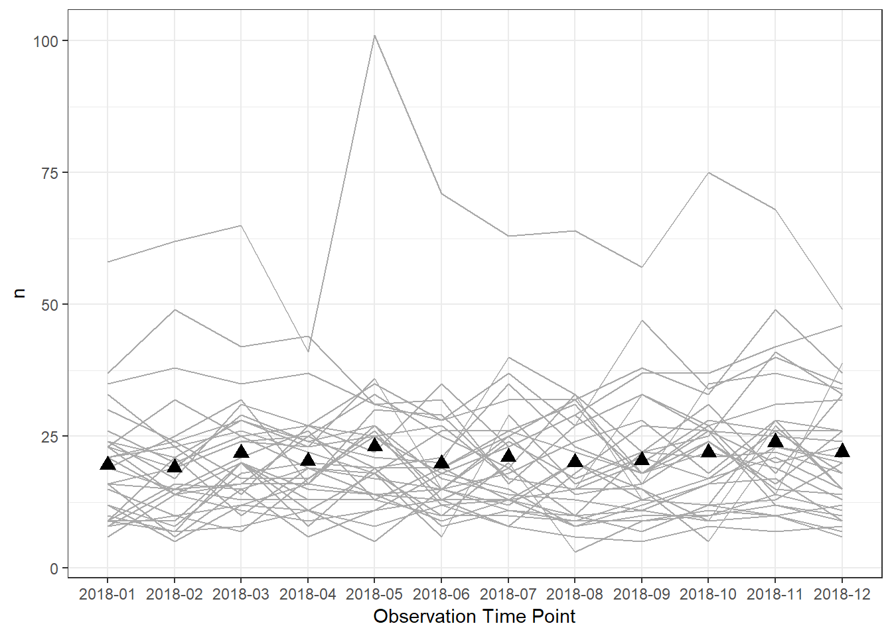

The `stat_summary` function is very helpful and we can use it to obtain other statistical summaries. See, for example, how we would plot the first and third quartile.


```r
ggplot(spa_df, aes(x=Month, y=n, group=wd16nm)) + 
  geom_line(color="darkgrey") + guides(colour=FALSE) + xlab("Observation Time Point") + 
  stat_summary(aes(group = 1), geom = "point", fun.y = quantile, 
  fun.args=(list(probs = c(0.25, 0.75))), shape = 17, size = 3) +
  theme_bw()
```

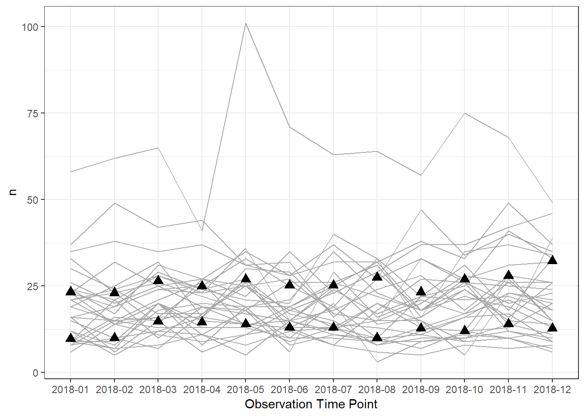

We can also obtained a smoothed representation of the average trend:


But typically you may want to use this kind of plots in different ways (see the article we linked to above). Here we are going to produce a plot higliting the trajectory in Fallowfield. Before I do that I will create a new variable identifying Fallowfield.


```r
spa_df$fallowfield <- "No"
spa_df$fallowfield[spa_df$wd16nm=="Fallowfield"] <- "Yes"
table(spa_df$fallowfield)
```

```
## 
##  No Yes 
## 372  12
```

Now I can use this variable to plot the distinct trajectory of Fallowfield.


```r
ggplot() + 
  geom_line(data= spa_df, aes(x=Month, y=n, group=wd16nm), color="darkgrey") +
   geom_line(data= subset(spa_df, fallowfield=="Yes"), aes(x=Month, y=n, group=1),
             colour="blue", size =2) +
  guides(colour=FALSE) + xlab("Observation Time Point") + 
  theme_bw()
```

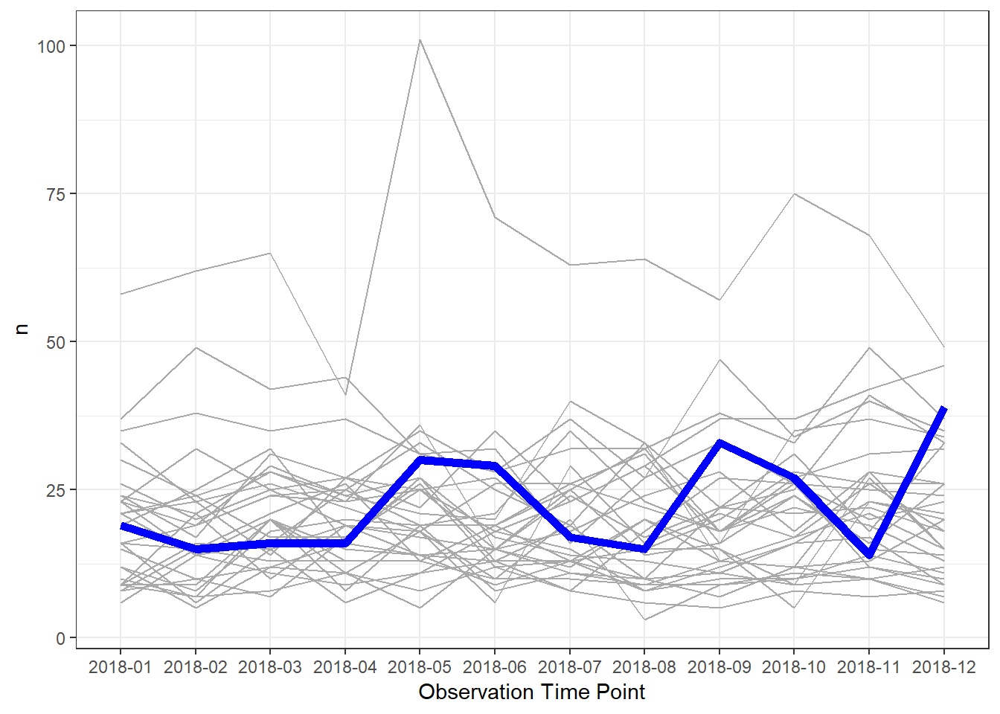

Cool! Well, you haven't seen it all yet.

## Animations!!!

You want a data viz person get excited? Mention animations! Now they are brought to `ggplot2` thanks to the `gganimate` extension.

The next one is a non-spatial plot, in that we do not show a map. However we will show the varying rate of burglaries per month within each ward. It is interesting to see this as an animation over time, rather than in the small multiples format, because it can better drive home the message of change (and also it looks very cool!). 


So first thing we do is to load the `gganimate` package: 


```r
library(gganimate)
```


Then, we need to make sure that our temporal variable is a date object. We can use the `ymd()` function, from the fantastic lubridate package (really I cannot praise this package enough, it makes handling dates so easy...!) to make sure that our Month variable is a date object. 

But we have no day you say! Only month! How can we use `ymd()` which clearly requires *y*ear *m*onth ad *day*! Well, one approach is to make this up, and just say that everything in our data happened on the 1st of the month. We can use the `paste0()` function to do this: 


```r
bur_per_ward$date_month <- ymd(paste0(bur_per_ward$Month, "-01"))
```

Now, we can create a simple static plot, the way we already know how. Let's plot the number of burglaries per ward, and save this in an object called `anim`:


```r
anim <- ggplot(bur_per_ward, aes(x = wd16nm, y = n)) +
  geom_bar(stat = 'identity') +
  scale_y_continuous(labels = scales::comma) +
  coord_flip() +
  labs(title="Burglary counts,",
       x = "",
       y = "") 
```


Now, finally, we can animate this graph. Take the object of the static grapn (anim) and add a form of transition, which will be used to animate the graph. In this case, we can use `transition_states()`. This transition splits your data into multiple states based on the levels in a given column, much like ggplot2::facet_wrap() splits up the data in multiple panels. It then tweens between the defined states and pauses at each state. Layers with data without the specified column will be kept constant during the animation (again, mimicking facet_wrap). States are the unquoted name of the column holding the state levels in the data. You can then use the `closest_state` to dynamically label the graph:


```r
anim + transition_states(date_month, transition_length = 1, state_length = 1) +
  labs(title = "Month: {closest_state}")
```

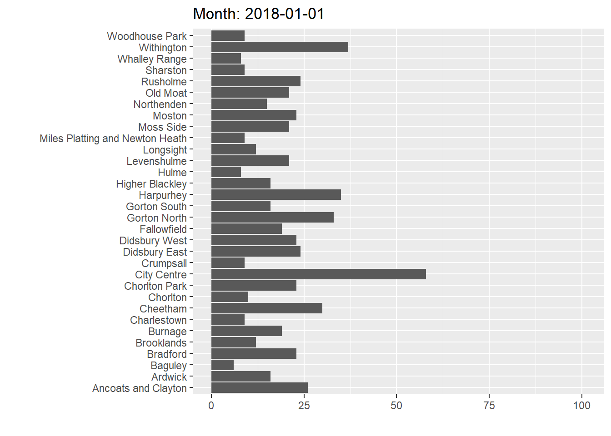<!-- -->

How cool is that!?

We can do this for maps as well. However, to apply gganimate to sf objects, you need to have a package called `transformr` installed. Install this package, and then we can apply `gganimate` to a map of burglaries. 

Again make a static map: 


```r
anim_map <- ggplot(bur_per_ward, aes(fill = n, color = n)) + 
  geom_sf()
```


And use `transition_states()` to animate by month. 


```r
anim_map + transition_states(date_month, transition_length = 1, state_length = 1) +
  labs(title = "Month: {closest_state}")
```

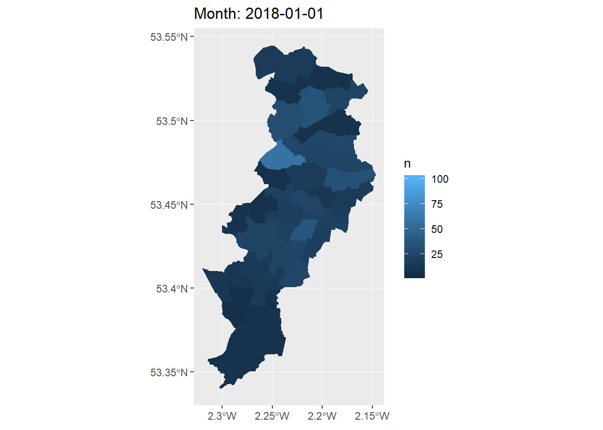<!-- -->


Ta-daaa!

What a way to end this course!


